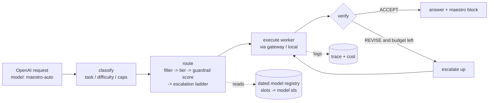

<div align="center">

# 🎼 Maestro

### The open-source orchestration brain for LLMs.

**Route any models — open *and* closed — behind one OpenAI-compatible endpoint.
Cheap-first, verify, escalate. Full cost & route transparency. Self-hostable. MIT.**

### 🐡 Maestro is the open-source version of [Sakana's Fugu](https://sakana.ai/fugu-release/) — built from the two papers: [TRINITY](papers/) (2512.04695) + [Conductor](papers/) (2512.04388).

*Open-source Fugu: open, honest, EU-clean, runs anywhere, and not locked to three closed models.*

> **The one thing no other open-source project does:** Maestro is the only open-source LLM router you can run with **zero setup — no GPU, no keys** (`npx maestro serve`) that is **both OpenAI- *and* Anthropic-compatible** (works in Claude Code *and* opencode) with **per-request cost transparency** and a **reproducible benchmark**. OpenFugu needs a GPU and ships a *mock* benchmark; LoRA-Harness ships none. See [COMPARISON.md](COMPARISON.md).

[](LICENSE)
[](package.json)
[](test)
[-orange.svg)](#roadmap)

</div>

---

Modern LLM stacks have a problem: **the best model for a one-line translation is not the best model for a distributed-systems design — but you pay frontier prices for both.** Routers exist (Sakana's Fugu is the famous one), but they're closed, opaque about cost, region-locked, and limited to a fixed pool.

**Maestro is just the routing brain.** It doesn't host models or run a GPU. It sits in front of an AI gateway (OpenRouter, the Vercel AI Gateway, or your local Ollama/vLLM) and, for every request, decides *which model, at what effort, in how many turns* — trying a cheap model first, **verifying** the answer, and **escalating** to a stronger one only when needed. Then it tells you exactly what it did.

```jsonc
// every response carries a `maestro` block — this is the whole point
"maestro": {
  "route": [
    { "turn": 1, "model": "deepseek/deepseek-v4",      "verdict": "REVISE" },
    { "turn": 2, "model": "anthropic/claude-opus-4.8", "verdict": "ACCEPT" }
  ],
  "classify": { "task": "code", "difficulty": 0.78, "confidence": 0.85 },
  "cost_usd": 0.0182,
  "cost_vs_frontier_only_usd": 0.0241,
  "savings_pct": 24
}
```

## 30-second quickstart

Maestro runs with **zero API keys** out of the box (built-in mock provider), so you can see it work instantly:

```bash
npx maestro serve            # or: docker run -p 8080:8080 ghcr.io/youruser/maestro
```

```bash
curl -s localhost:8080/v1/chat/completions \
  -H 'content-type: application/json' \
  -d '{"model":"maestro-auto","messages":[{"role":"user","content":"Translate good morning to Spanish"}]}' \
  | jq .maestro
```

Add a real key and it routes to real models — **your existing OpenAI code doesn't change**, just the base URL:

```python
from openai import OpenAI
client = OpenAI(base_url="http://localhost:8080/v1", api_key="unused")

client.chat.completions.create(
    model="maestro-auto",                       # or maestro-fugu, or a real model id (passthrough)
    messages=[{"role": "user", "content": "Design a multi-region rate limiter."}],
)
```

```bash
export OPENROUTER_API_KEY=sk-or-...     # open + closed models, BYOK
# or AI_GATEWAY_API_KEY=...             # Vercel AI Gateway (0% markup, also serves Fugu)
# or LOCAL_OPENAI_BASE_URL=http://localhost:11434/v1   # Ollama / vLLM / llama.cpp — 100% offline
```

Want the full demo with **real prices but no spend**? `MAESTRO_FORCE_MOCK=true npx maestro serve` routes over the priced registry and executes on the mock provider.

## Use it in your coding agent

Maestro speaks **both** the OpenAI *and* the Anthropic wire formats, so it drops into the popular agents:

**Claude Code** (Maestro exposes `/v1/messages`):
```bash
ANTHROPIC_BASE_URL=http://localhost:8080 ANTHROPIC_API_KEY=unused claude
```

**opencode / Cursor / Continue / any OpenAI-compatible tool** — point the base URL at Maestro and use model `maestro-auto`:
```jsonc
// opencode.json
{ "provider": { "maestro": { "npm": "@ai-sdk/openai-compatible",
  "options": { "baseURL": "http://localhost:8080/v1" },
  "models": { "maestro-auto": {} } } } }
```

Your agent now routes every call across your whole pool, cheap-first, with the cost shown — no code change.

## Swap in your own models

The model pool is **100% yours** — it's just a dated JSON registry of `ModelSpec`s. Copy [`maestro.config.example.json`](maestro.config.example.json), edit it, and run with `MAESTRO_REGISTRY=./maestro.config.json`. Slot labels are abstract and remappable (the key lesson from Fugu): the router reasons over slots/tiers, you map them to any model id on any provider — **no retraining, no code change.** Mix open + closed + your local Ollama models freely, and only ship the **newest** models (the defaults track the current frontier and are dated so `maestro registry check` nags when they go stale).

## Why Maestro

| | **Maestro** | Sakana Fugu | Raw gateway (OpenRouter/Vercel) |
|---|---|---|---|
| Open source / self-host | ✅ MIT | ❌ closed API | ⚠️ hosted |
| Model pool | **any** (open + closed, BYOK) | 3 closed models | any (but no routing) |
| Routing brain | ✅ cheap→verify→escalate | ✅ (learned) | ❌ you pick |
| Cost transparency | ✅ per-request, per-model | ❌ undisclosed | ⚠️ totals only |
| Refuses to overspend | ✅ confidence/verify gate | ⚠️ | ❌ |
| Run 100% locally | ✅ local-openai adapter | ❌ | ❌ |
| EU / region control | ✅ region filter | ❌ EU-blocked | ⚠️ |
| Drop-in OpenAI API | ✅ | ✅ | ✅ |

## How it works



1. **Classify** — a fast, zero-cost heuristic tags the task (code/math/reasoning/…), estimates difficulty, and required capabilities.
2. **Route** — filter the registry by capability/policy/region/budget → pick a starting tier by difficulty → rank with a guardrail score → build an **escalation ladder** of `(model, effort)`.
3. **Execute** — call the chosen model through the provider adapter (streaming supported).
4. **Verify** — a verifier judges the answer. `ACCEPT` stops; `REVISE` escalates to the next rung (bounded by `maxTurns`). For code/tools, a real executable check is on the roadmap.
5. **Report** — the answer ships with the full route, per-model tokens, cost, and a "what frontier-only would have cost" comparison.

> **We make no dishonest claims.** Maestro does *not* promise it always beats a single frontier model. It promises to try cheaper first, verify, escalate when needed, and **show you the receipts**.

## Benchmarks

Reproduce locally — `npm run eval` (runs **offline**, deterministic, free; routes over the *priced* registry while executing on the mock provider, graded against ground-truth difficulty with oracle-route regret):

```
strategy             pass%      mean $      pass/$    regret $   fails
----------------------------------------------------------------------
maestro                94%     0.00128       731.0     0.00046       1
best-single           100%     0.01509        66.3     0.01317       0
cheapest-single        38%     0.00030      1239.1     0.00000      10
random-route           88%     0.00133       658.5     0.00044       2

calibration (classifier confidence vs first-rung-correct):
  Brier = 0.181   ECE = 0.116   (lower is better)
```

**Read:** Maestro reaches **94%** of best-single quality at **91% lower mean cost** — **~11× more successful answers per dollar** (731 vs 66). The 6-point gap and 1 failure are *real* (the heuristic classifier sometimes mis-estimates); we show them on purpose. This is a routing benchmark on a small fixture set, not a leaderboard claim.

## Endpoints

| Method | Path | Purpose |
|---|---|---|
| `POST` | `/v1/chat/completions` | OpenAI-compatible (+ `stream`). `model` selects the mode. |
| `POST` | `/v1/messages` | **Anthropic-compatible** (+ stream) — drop-in for Claude Code. |
| `GET` | `/v1/models` | `maestro-auto/fugu/ultra` + every registry model. |
| `POST` | `/v1/route` | **Dry-run** the router: see the decision, no model call. |
| `GET` | `/v1/traces/:id` | Inspect a past request's full trace. |
| `GET` | `/healthz` | Liveness + which providers are configured. |

**Modes** (the `model` field): `maestro-auto` (classify + route + verify) · `maestro-fugu` (single worker + verify, low-latency) · `maestro-ultra` (multi-step decompose — *roadmap*, falls back to fugu) · any real model id → **passthrough** (no routing, always a safe drop-in).

## Configuration

All via env (zero-config defaults shown):

| Variable | Default | Meaning |
|---|---|---|
| `MAESTRO_PORT` | `8080` | server port |
| `MAESTRO_DEFAULT_MODE` | `fugu` | mode when `model` is `maestro` |
| `MAESTRO_MAX_TURNS` | `3` | max escalation turns |
| `MAESTRO_DIFFICULTY_LOW` / `_HIGH` | `0.33` / `0.7` | tier thresholds |
| `MAESTRO_VERIFY` | `true` | enable the verify/escalate loop |
| `MAESTRO_REGISTRY` | *(built-in)* | path to your own model registry JSON |
| `OPENROUTER_API_KEY` / `AI_GATEWAY_API_KEY` / `LOCAL_OPENAI_BASE_URL` | — | providers (BYOK) |
| `MAESTRO_FORCE_MOCK` | `false` | demo: route priced registry, execute mock |
| `MAESTRO_TRACE_FILE` | — | append every trace as JSONL |

Per-request overrides via the `maestro` field: `{ "budget": 0.02, "maxTurns": 2, "verify": true, "region": "eu", "pin": "anthropic/claude-opus-4.8" }`.

**Bring your own models** — point `MAESTRO_REGISTRY` at a JSON file of `ModelSpec`s. Slot labels are abstract and remappable (the key lesson from OpenFugu): the router reasons over slots/tiers; you map them to concrete gateway ids. `maestro registry check` warns when prices are stale.

## CLI

```bash
maestro serve [--port N]      # start the OpenAI-compatible server
maestro route "<prompt>"      # dry-run the router (no model call)
maestro registry check        # report registry staleness
```

## Roadmap

- [x] **v0** — OpenAI-compatible gateway · heuristic classify → route → verify/escalate · OpenRouter / Vercel / local + mock adapters · transparency · offline eval.
- [ ] **v1** — executable verifier for code (run the tests) · semantic cache · prompt/version registry · a tiny trace-viewer UI.
- [ ] **v2** — the **learned router** (TRINITY-style: frozen Qwen3-0.6B + a tiny head, CPU-only, trained offline) as a drop-in for the heuristic classifier.
- [ ] **v3** — `maestro-ultra`: multi-step decomposition (Conductor-style) for the hardest tasks, behind a quality gate.

## FAQ

**Isn't this just a wrapper?** The wrapper part (gateways, OpenAI serving) is *deliberately* not reinvented — that's solved. The value is the **routing policy + verify/escalate loop + transparency + a reproducible eval**. The roadmap's learned router is where it stops being "just a wrapper".

**Does it really save money?** On the bundled eval, ~91% vs always-frontier, ~11× better cost-per-success. Your mileage depends on your traffic mix and registry — which is why the eval is in the repo and the cost is on every response.

**Can I run it fully offline?** Yes — set `LOCAL_OPENAI_BASE_URL` to your Ollama/vLLM/llama.cpp server. Maestro never hosts a model itself.

**Is it better than \<top single model\>?** Maestro isn't a model — it's the router. It *uses* the best models (including frontier ones) and reaches **frontier-level results at a fraction of the cost** by sending only the hard requests to the expensive models. The honest claim is "frontier-quality routing, open-source, far cheaper" — reproduce it yourself with `npm run eval` (offline) or `bash scripts/verify.sh` with your own keys.

## Acknowledgements

Maestro is an **open-source implementation of the ideas in [Sakana's Fugu](https://sakana.ai/fugu-release/)**, described in two papers included in [`papers/`](papers): **TRINITY** ([arXiv 2512.04695](papers/TRINITY-fugu-2512.04695v3.pdf), the route→verify loop) and **Conductor** ([arXiv 2512.04388](papers/Conductor-fugu-ultra-2512.04388v5.pdf), multi-step decomposition). The cheap→escalate pattern descends from [FrugalGPT](https://arxiv.org/abs/2305.05176); community reverse-engineering: [OpenFugu](https://github.com/trotsky1997/OpenFugu). Full design notes + our analysis (with corrections against Sakana's official report) are in [`docs/`](docs).

**Maestro is not affiliated with Sakana AI.** "Fugu" is Sakana AI's product/research; Maestro contains no Sakana code or weights — it's an independent open-source build from the public papers.

## License

[MIT](LICENSE).
