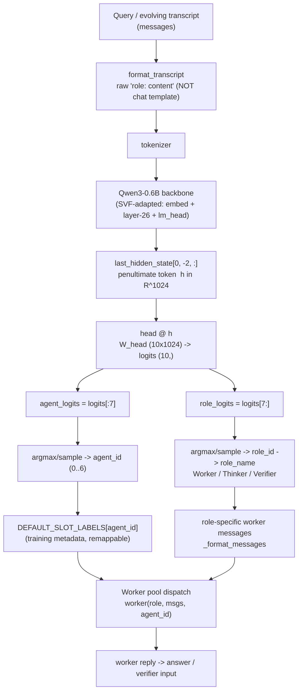
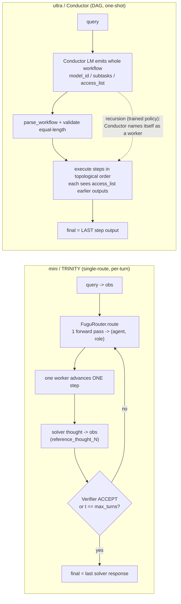

# OpenFugu — Runtime Architecture

> Independent, open reimplementation of Sakana AI's "Fugu" orchestrator family
> (TRINITY, arXiv:2512.04695; Conductor, arXiv:2512.04388). This document covers
> the **inference / serving runtime only** — how a query becomes a routing
> decision and an answer at serving time. Training is covered separately.
> All file references are to `OpenFugu/`.

---

## 1. Overview

OpenFugu turns a tiny frozen backbone (Qwen3-0.6B) plus a single 19,456-float
vector (`model_iter_60.npy`) into a **learned coordinator** that, in one forward
pass, maps the penultimate-token hidden state to `(worker, role)` logits and
dispatches the chosen turn to a heterogeneous worker LLM pool (via `litellm`).
Two lines exist: **mini / TRINITY** (`openfugu/mini.py`) re-routes one
`(worker, role)` action per turn over an evolving transcript until a verifier
accepts; **ultra / Conductor** (`openfugu/ultra.py`) instead has a large LM emit
an entire multi-step workflow DAG in one shot and executes it topologically.
`openfugu/serve.py` exposes the mini coordinator as a single
OpenAI-compatible `/v1/chat/completions` model — "one model to command them all"
— while hiding the worker pool from the caller.

---

## 2. The routing decision (TRINITY) — how a query becomes a route

The router is `FuguRouter` in `openfugu/mini.py` (`mini.py:100`). It is a
Qwen3-0.6B backbone with **SVF (Singular-value fine-tuning) adaptation** applied
in place, plus a **bias-free linear head**. The backbone's *text output is never
used*; only the head logits matter, which is what makes a routing decision
≈ one forward pass (`mini.py:104-106`).

### 2.1 Construction (`FuguRouter.__init__`, `mini.py:108-132`)

1. Load the vector: `vec = np.load(vector_path)` and assert
   `vec.shape == (19456,)` (`VEC_LEN`). It is split into two parts:
   - `vec[:9216]` → SVF offsets (`SVF_LEN = 9 * HIDDEN`)
   - `vec[9216:]` → head, reshaped to `(10, 1024)` (`HEAD_ROWS × HIDDEN`).
2. `_apply_svf(vec[:9216])` rewrites 9 backbone weight matrices in place.
3. `self.head = vec[9216:].reshape(10, 1024)`.

### 2.2 SVF (`FuguRouter._apply_svf`, `mini.py:137-157`)

Scales **only the singular values** of selected 2-D matrices, freezing U/V, with
an energy-preserving renormalization. The selected matrices are, in `state_dict`
order, the **9 matrices** that pass `ndim==2 and min(shape)>1` and are either
non-layer matrices or belong to layer 26 (`OPT_LAYER = 26`, from
`es_log.json opt_layer_indices=[26]`):

```
embed_tokens, layer-26 {q, k, v, o, gate, up, down}, lm_head   → 9 matrices
```

Each contributes `min(shape) = 1024` singular values → `9 × 1024 = 9216` offsets.
Per matrix:

```python
U, S, Vh = svd(W)                      # full_matrices=False
scale    = offsets[off:off+n] + 1.0    # offset is a delta around 1.0
sS       = S * scale
newW     = (U @ diag(sS) @ Vh) * (S.sum() / sS.sum())   # energy-preserving renorm
```

A hard assert (`off == 9216`) guards against the wrong backbone.

### 2.3 Features: which input, which layer, which token

- **Input text**: the transcript is formatted as **raw `"role: content\n"`**, NOT
  a chat template (`FuguRouter.format_transcript`, `mini.py:160-162`). This is
  proven decisive: **95% vs 11%** agent accuracy (raw vs chat template — see
  §6 and `docs/HOW_FUGU_IS_IMPLEMENTED.md:429-430`).
- **Forward pass uses the backbone only**: `out = self.model.model(**ids)` — the
  LM head is bypassed (`FuguRouter._hidden`, `mini.py:164-170`).
- **Token position**: `HIDDEN_POS = -2`, the **penultimate-token** hidden state
  (`mini.py:46`, `mini.py:170`): `out.last_hidden_state[0, -2, :]` → `h ∈ ℝ^1024`.
- **Layer**: the final hidden layer's output at position −2 (SVF having adapted
  layer 26 plus embed/lm_head).

### 2.4 Head → role/worker (`FuguRouter.route`, `mini.py:179-191`)

```python
h      = self._hidden(messages)        # (1024,)
logits = self.head @ h                 # (10,)  =  W_head (10×1024) · h
agent_logits = logits[:7]              # N_AGENTS = 7
role_logits  = logits[7:]              # N_ROLES  = 3
agent_id = pick(agent_logits)          # argmax (eval) or softmax-sample (train)
role_id  = pick(role_logits)
```

So the 10 head rows are **two independent classifiers stacked**: rows 0–6 score
the 7 worker slots, rows 7–9 score the 3 roles. `_pick` (`mini.py:172-177`) does
`argmax` when `sample=False` (eval) and softmax-weighted `rng.choice` when
`sample=True` (training behavior). `route()` returns
`{agent_id, role_id, role_name, agent_logits, role_logits}`.

`role_id → role_name` via `ROLE_NAMES = ["Worker", "Thinker", "Verifier"]`
(`mini.py:49`; index order = solver/thinker/verifier).

### Routing flowchart



---

## 3. The worker pool

A worker is **any callable** `WorkerFn = (role_name, messages, agent_id) -> str`
(`mini.py:196-200`). There are 7 agent slots (`N_AGENTS = 7`).

- **Slot labels** (`DEFAULT_SLOT_LABELS`, `mini.py:202-206`) come from the
  checkpoint's `es_log.json llm_names`:
  `["gpt-5", "claude-sonnet-4", "gemini-2.5-pro", "deepseek-r1-distill-qwen-32b",
  "gemma-3-27b-it", "qwen3-32b-reasoning", "qwen3-32b-direct"]`. These are
  **training metadata only — freely remappable** to any provider (the product's
  "swap providers / dodge export controls" angle, `mini.py:197-199`).

- **`MockWorker`** (`mini.py:209-228`): offline, deterministic; lets the full
  loop run with no API keys. Thinker emits `<suggestion>`+`<suggested_role>`;
  Verifier returns `REJECT` first then `ACCEPT` on the **2nd** verification (so
  the loop demonstrably terminates by ACCEPT, not only by max-turns); Worker
  returns `"[slot] concrete work…"`.

- **`LiteLLMWorker`** (`mini.py:231-261`): the real pool. `litellm.completion()`
  speaks one API to every backend, so each of the 7 slots can be a different
  provider with no per-vendor code (`mini.py:232-235`). It dispatches via
  `model = self.slot_models[agent_id % len(self.slot_models)]` (`mini.py:254`),
  rebuilds messages, and passes `api_key`/`api_base` if set. Defaults: every
  slot → `FUGU_WORKER_MODEL` (fallback `openai/gpt-4o-mini`),
  `max_tokens=1024`, `temperature=0.2`. Returns
  `r.choices[0].message.content` (`mini.py:260-261`).

`--live` (in `mini.py`) and presence of `--slot-models` (in `serve.py`) select
`LiteLLMWorker`; otherwise `MockWorker`.

---

## 4. mini (TRINITY single-route) vs ultra (Conductor recursion)

### 4.1 mini — the per-step Coordinator loop (`Coordinator`, `mini.py:280-413`)

Faithful to TRINITY's `step_trinity`. Each turn re-routes ONE `(worker, role)`
action over a **single evolving user message** (`obs`), not a stack of turns
(`mini.py:307-321`):

- The router sees `[ROUTER_SYSTEM_PROMPT, {user: obs}]`. `obs` starts as the
  query and accumulates `<reference_thought_N>` blocks from prior **solver**
  turns only (`mini.py:344-348`).
- Per turn: `route()` → `(agent_id, role_id)`. A **Thinker** `<suggested_role>`
  from the previous turn *overrides* the head's role for this turn
  (`mini.py:324-325`).
- **Cold-verifier suppression** (deliberate deviation, `mini.py:328-333`): a
  Verifier picked before any solver response is a no-op that would end the run at
  turn 0; it is re-routed to Worker (`suppress_cold_verifier=True`). Set False to
  reproduce raw `step_trinity` (terminate with `verifier_no_response`).
- Role behaviors (`mini.py:342-357`):
  - **Worker / solver** (role 0): full reply = answer / verifier input;
    `<think>` content is appended to `obs` as `<reference_thought_N>`.
  - **Thinker** (role 1): parses `<suggested_role>` + `<suggestion>`; does NOT
    update `obs`.
  - **Verifier** (role 2): `ACCEPT` (string starts with stop token) terminates
    with `terminated_by="verifier_accept"`; does NOT update `obs`.
- Termination: Verifier ACCEPT **or** `max_turns` (`MAX_TURNS = 5`). Stopping
  time $\tau = \min\{t \le 5 : \rho_t=\text{Verifier} \wedge u_t=\texttt{ACCEPT}\}$;
  else returns the last response at $t=5$ (`docs/HOW_FUGU_IS_IMPLEMENTED.md:325-333`).

Role-specific worker messages are built by `_format_messages` (`mini.py:374-394`):
a **shared** `SYSTEM_PROMPT` plus a role-built user message
(`THINKER_PROMPT` / `VERIFICATION_PROMPT` / raw query, optionally with a
`<suggestion>`). Parsing helpers: `_extract_thought` (`<think>…</think>`,
`mini.py:364-372`), `_parse_thinker` (`mini.py:396-409`), `_parse_verification`
(`mini.py:411-413`).

### 4.2 ultra — the Conductor (`openfugu/ultra.py`)

Instead of one route per turn, a **Conductor LM emits an entire workflow in one
shot** as three equal-length lists forming a DAG (`ultra.py:6-10`):

```
model_id    = [int, ...]    # which worker (0-indexed) runs each step
subtasks    = [str, ...]    # natural-language instruction per step
access_list = [list, ...]   # for each step, indices of EARLIER steps it may see
```

Provenance note (`ultra.py:12-19`): the execution **engine** is a faithful
reimplementation; the GRPO-trained 7B Conductor weights are not public, so here
the Conductor is a **prompted off-the-shelf model** (`conductor_prompt`,
`ultra.py:122-139`) — reproduces the mechanism, not the trained policy.

- **Parsing** (`parse_workflow` → `extract_list` → `_balanced_list`,
  `ultra.py:44-90`): find `label: [ … ]`, extract the first balanced bracketed
  list (quote/escape-aware), parse via `ast.literal_eval` → `json.loads` → CSV
  fallback. Smart-quotes are normalized (`_SMART`, `ultra.py:35`).
- **Validation** (`ConductorExecutor.validate`, `ultra.py:172-181`): all three
  lists must be present and **equal length**; truncated to `MAX_STEPS = 5`.
- **Visibility / DAG order** (`visible_indices`, `ultra.py:99-118`): step 0 sees
  nothing; `"all"` → every earlier step; otherwise the listed integer indices.
  **Forward references are rejected** (`pos >= step` raises `ValueError` — it must
  be a topological order).
- **Execution** (`ConductorExecutor.execute`, `ultra.py:183-207`): steps run in
  order; each step's prompt is its subtask plus the outputs of its visible steps,
  injected as `<Subtask assigned to Agent N>…</…>` and
  `<Agent N response>…</…>` blocks. `model_id` is taken mod pool size. The
  **last step's output is the final answer** (`ultra.py:206`).

Workers run through the same `LiteLLMWorker` middle layer; the Conductor call
itself uses `conduct()` with a larger 2048 `max_tokens` budget (`ultra.py:233-238`).

**Recursion (Fugu-Ultra's test-time-scaling axis):** at the runtime level,
recursion = the Conductor **naming itself as a worker** so a later step re-invokes
the Conductor to revise across rounds. The *shipped* `ultra.py` executor runs a
single workflow DAG; the recursive-Conductor *behavior* is a trained-policy
property — `train/train_recursion_real.py` GRPO-finetunes the Conductor so it can
name itself and revise (`results/README.md:103-125`). That real finetune runs and
saves a model but shows **no recursion gain here** (reward saturated:
`reward_std=0`, `loss≈0`); the mock harness shows a **+9%** recursion lift because
it starts from a non-saturated toy policy.

### mini vs ultra contrast



---

## 5. serve.py — OpenAI-compatible endpoint

`openfugu/serve.py` exposes the **mini coordinator** as one OpenAI-compatible
model using stdlib `http.server` only (no FastAPI/uvicorn — `serve.py:14-15`). It
reuses `FuguRouter`, `Coordinator`, `LiteLLMWorker`, `MockWorker` from `mini`
(`serve.py:31`).

- **Startup** (`main`, `serve.py:98-120`): loads the router
  `FuguRouter(args.model, args.vector, seed=0)`; if `--slot-models` is given →
  `LiteLLMWorker`, else `MockWorker`. Serves with `ThreadingHTTPServer` on
  `0.0.0.0:port` (default 8088).
- **Routes** (`Handler`, `serve.py:55-95`):
  - `GET /v1/models` → lists the single model `"fugu"` (`owned_by: openfugu`).
  - `GET /health` or `/` → `{"status":"ok"}`.
  - `POST /v1/chat/completions` → the orchestration.
- **POST flow** (`do_POST`, `serve.py:75-92`):
  1. Parse JSON body; require `messages` (400 if empty).
  2. **query = last user message** content
     (`next(... reversed(messages) if role=="user")`, `serve.py:85-86`).
  3. `coord = Coordinator(ROUTER, WORKER, max_turns=MAX_TURNS, sample=True)`;
     `res = coord.run(query, verbose=False)` (`serve.py:87-88`).
  4. Respond via `_chat_response` (`serve.py:39-52`): standard
     `chat.completion` object with `choices[0].message.content = res.final`,
     `finish_reason="stop"`, and **`usage: {"fugu_turns": len(res.turns)}`**.
- **What is hidden from the caller**: the whole worker pool. The response surfaces
  only the orchestration depth (`fugu_turns`) and *never* exposes which workers
  ran (`serve.py:50-51`). The caller sees one model named `"fugu"`.

### Sequence: one /v1/chat/completions request

```mermaid
sequenceDiagram
    participant Client
    participant Server as serve.py Handler
    participant Coord as Coordinator (mini)
    participant Router as FuguRouter (Qwen3-0.6B + head)
    participant Pool as Worker pool (LiteLLM / Mock)

    Client->>Server: POST /v1/chat/completions {messages}
    Server->>Server: query = last user message
    Server->>Coord: run(query, sample=True)
    loop turn t < max_turns (=5)
        Coord->>Router: route([ROUTER_SYSTEM_PROMPT, {user: obs}])
        Router->>Router: forward pass -> hidden[-2] -> head@h -> logits(10)
        Router-->>Coord: (agent_id, role_id/role_name)
        Note over Coord: thinker suggested_role can override<br/>cold verifier -> re-routed to Worker
        Coord->>Pool: worker(role, role-specific msgs, agent_id)
        Pool-->>Coord: reply
        alt role == Worker (solver)
            Coord->>Coord: last_response=reply; append <reference_thought_N> to obs
        else role == Thinker
            Coord->>Coord: parse <suggested_role>/<suggestion>
        else role == Verifier
            Coord->>Coord: if ACCEPT -> final=last_response; break
        end
    end
    Coord-->>Server: RunResult(final, turns, terminated_by)
    Server->>Server: _chat_response(final, usage={fugu_turns: len(turns)})
    Server-->>Client: 200 chat.completion (workers hidden)
```

---

## 6. Key data structures, shapes & params

Structural constants (`mini.py:38-49`):

| Name | Value | Meaning / source |
|---|---|---|
| `HIDDEN` | 1024 | Qwen3-0.6B hidden size `[EXEC]` |
| `N_AGENTS` | 7 | worker pool size (`es_log.json`) `[DATA]` |
| `N_ROLES` | 3 | solver/thinker/verifier `[CODE]` |
| `HEAD_ROWS` | 10 | `N_AGENTS + N_ROLES` |
| `SVF_LEN` | 9216 | `9 × 1024` singular-value offsets `[EXEC]` |
| `HEAD_LEN` | 10240 | `10 × 1024` head `[EXEC]` |
| `VEC_LEN` | 19456 | exact length of `model_iter_60.npy` `[EXEC]` |
| `HIDDEN_POS` | −2 | penultimate-token hidden state `[EXEC]` |
| `OPT_LAYER` | 26 | only layer adapted by SVF (`es_log.json`) `[DATA]` |
| `MAX_TURNS` | 5 | `es_log.json max_turns=5` `[DATA]` |

Shapes: vector `(19456,)` = `[9216 SVF offsets | 10240 head]`; head reshaped
`(10, 1024)`; hidden `h (1024,)`; logits `(10,)` → `agent_logits (7,)` +
`role_logits (3,)`. Roles: `ROLE_NAMES = ["Worker","Thinker","Verifier"]`.

Dataclasses: `Turn(turn, agent_id, role_name, reply)` and
`RunResult(final, turns, terminated_by)` in mini (`mini.py:265-277`);
`Step(idx, agent_id, subtask, sees, reply)` and
`UltraResult(final, steps, workflow)` in ultra (`ultra.py:145-158`).

Coordinator defaults (`mini.py:300-305`): `max_turns=5`, `stop_token="ACCEPT"`,
`sample=True`, `suppress_cold_verifier=True`. `serve.py` constructs it with
`sample=True`.

---

## 7. Required artifacts & environment

`scripts/fetch_artifacts.py` pulls the third-party material OpenFugu does **not**
redistribute (it commits only original code — see `NOTICE`):

| Artifact | Source | License |
|---|---|---|
| `model_iter_60.npy` (router vector) | HF dataset `nshkrdotcom/trinity-coordinator-adapted-qwen3-0.6b`, paths `logs/ckpt/models/model_iter_60.npy` or `model_iter_60.npy` | MIT |
| `qwen_router_prompt_eval_cases.json` (37-case fixture) | `raw.githubusercontent.com/nshkrdotcom/trinity_coordinator/.../qwen_router_prompt_eval_cases.json` | MIT |
| `Qwen/Qwen3-0.6B` (backbone) | `huggingface_hub.snapshot_download` | Apache-2.0 |

Artifacts land in `OpenFugu/artifacts/` (`fetch_artifacts.py:18`).

Environment variables (resolved by `_resolve`, `mini.py:95-96`):

- `FUGU_MODEL` — Qwen3-0.6B dir (default `Qwen/Qwen3-0.6B`)
- `FUGU_VECTOR` — `model_iter_60.npy` (default `model_iter_60.npy`)
- `FUGU_FIXTURE` — 37-case fixture path
- `FUGU_WORKER_MODEL` — default litellm worker model (fallback `openai/gpt-4o-mini`)
- `FUGU_API_KEY` / `FUGU_BASE_URL` — worker credentials (fall back to
  `OPENAI_API_KEY` / `OPENAI_BASE_URL`); **never stored** (`NOTICE` item 5)

Runtime deps (`requirements.txt`): `torch>=2.4`, `transformers>=4.52,<5`,
`numpy`, `litellm`, `huggingface_hub` (training-only: `trl`, `peft`,
`accelerate`, `hydra-core`, `omegaconf`, `math_verify`, `cma`).

---

## 8. How to run

```bash
# 0. fetch artifacts (once)
cd OpenFugu
python scripts/fetch_artifacts.py
export FUGU_MODEL=Qwen/Qwen3-0.6B
export FUGU_VECTOR=$PWD/artifacts/model_iter_60.npy
export FUGU_FIXTURE=$PWD/artifacts/qwen_router_prompt_eval_cases.json

# 1. faithfulness self-test (re-run the 37-case fixture)
python openfugu/mini.py --self-test

# 2. one routing decision
python openfugu/mini.py --route "Implement binary search and prove it terminates."

# 3. coordination loop, offline (MockWorker, no keys)
python openfugu/mini.py --demo

# 4. coordination loop, live worker pool
export FUGU_API_KEY=...  FUGU_BASE_URL=...
python openfugu/mini.py --demo --live \
    --slot-models "openai/gpt-4o-mini,anthropic/claude-3-5-sonnet,gemini/gemini-1.5-pro"

# 5. ultra / Conductor (one-shot workflow DAG)
python openfugu/ultra.py --self-test           # offline parser + DAG executor
python openfugu/ultra.py --query "..." --conductor novita/deepseek/deepseek-v4-pro \
    --slot-models "<csv of 7 worker model ids>"

# 6. serve as one OpenAI-compatible model
FUGU_API_KEY=... FUGU_BASE_URL=... \
python openfugu/serve.py --model $FUGU_MODEL --vector $FUGU_VECTOR \
    --slot-models "<csv of litellm worker ids>" --port 8088
curl localhost:8088/v1/chat/completions -d '{"messages":[{"role":"user","content":"..."}]}'

# verification scripts
python verify/verify_37.py        # 37-case batch regression vs checkpoint
python verify/verify_trinity2.py  # single decisive case (expects agent_id=4, role_id=0)
python verify/verify_margin.py    # logit-margin analysis of the missed agent cases
python verify/probe_sep_cma.py    # sep-CMA-ES mechanism probe (no GPU)
```

---

## 9. Evidence, results & caveats

### Faithfulness (the regression guard)

`self_test` (`mini.py:418-440`) re-runs the 37-case fixture with `argmax` and
asserts ~95% agent / 100% role vs a ~51% best-constant baseline. `verify_37.py`
reports the same, plus the decisive **raw vs chat-template** comparison
(`docs/HOW_FUGU_IS_IMPLEMENTED.md:429-430`):

```
raw "role: content"   agent 95%   role 100%   both 95%
chat template         agent 41%   role  11%   both  5%
```

`verify_trinity2.py` is the single decisive case: applying SVF in `state_dict`
order must reproduce the fixture's `agent_id=4, role_id=0`. `verify_margin.py`
inspects the 2 missed agent cases — low top1−top2 margin ⇒ numeric precision,
large `logit[got]−logit[exp]` ⇒ real disagreement.

### Orchestration beats the best single model (the headline)

`eval/eval_orchestration.py` compares five strategies on held-out tasks in the
same mock world the TRINITY trainer uses (`MockWorld`, seed 42): each worker
alone, random routing, the trained coordinator (`trinity_mock.npy`, else trained
fresh via sep-CMA-ES), and an oracle ceiling. The coordinator routes
`feature → worker` via the learned head (`route`, `eval_orchestration.py:59-67`).

Headline: **the self-trained coordinator scores +107% over the best single
worker, reaching 100% of the oracle ceiling** (`results/README.md:43-48`):

> "the self-trained TRINITY coordinator scores **+107%** over the best single
> worker, reaching **100%** of the oracle ceiling … the central Fugu claim,
> reproduced on a coordinator we trained ourselves."

**Caveats (quoted / sourced):**

- The **+107% is a MOCK harness** built with sharply differentiated specialists
  (0.9 vs 0.2 per domain) — "The mock harness shows the large +107% gain
  precisely because it is built with sharply differentiated specialists"
  (`results/README.md:69-71`).
- On **real data (GSM8K)** the coordinator only **ties** the best worker:
  `coordinator = 0.917 (= best single worker)` — because GSM8K is too easy
  (two of three workers already ~92%), leaving no routing headroom
  (`results/README.md:57-74`).
- On **real multi-domain data (ToolScale)** the gain reappears but is small:
  `coordinator 0.152 > best single (qwen 0.142)` → **+7%**, from worker
  complementarity (`results/README.md:84-94`); absolute scores are low because
  tool-call matching is hard with no executable environment
  (`results/README.md:96-101`).
- **Granularity caveat (read-first, `results/README.md:3-17`):** the
  `eval_orchestration.py` mock and the `train_trinity*` per-question runs are
  **per-QUESTION** routing (one worker answers the whole question — RouterDC /
  MASRouter family), **NOT** Fugu's per-STEP coordination. The true per-step
  mechanism is `openfugu/mini.py Coordinator` (faithful to `step_trinity`); its
  real per-step training run (`train_trinity_perstep.py`) gets
  `base 0.750 → sep-CMA-trained 1.000`, but **n=8, in-sample** — "some of the
  lift is overfitting to 8 items" (`results/README.md:148-152`).
- **Conductor recursion** runs end-to-end on the real 3B model but shows no gain
  (reward saturated, `loss≈0`); the **+9%** recursion lift is mock-only
  (`results/README.md:117-122`).
- **sep-CMA-ES** at Fugu scale (N=19456) behaves nearly isotropically: only the
  scalar `sigma` moves materially; per-coordinate diagonal adaptation is
  negligible in 60 iters (`verify/probe_sep_cma.py:9-21`). sep is required for
  feasibility, not for its diagonal capability.
```
