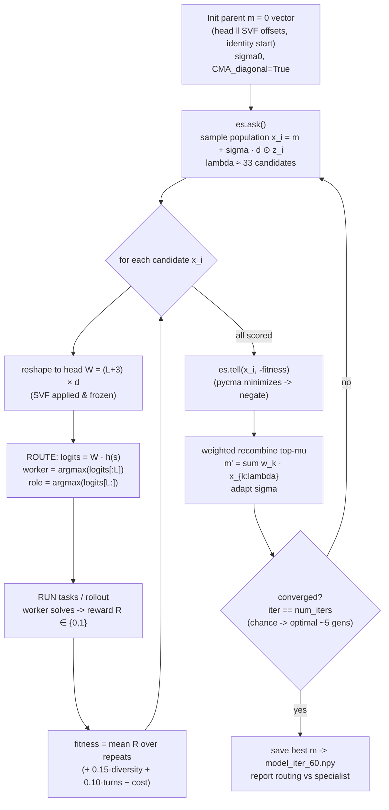
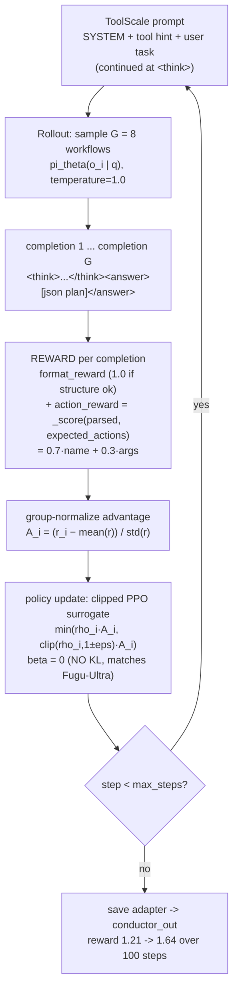
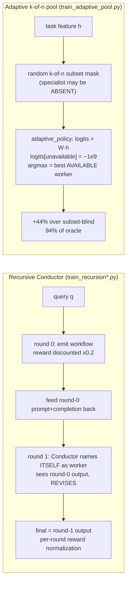

# OpenFugu — Training Pipelines

*Architecture & mechanism doc for the **training** side of OpenFugu, an
independent, open reverse-engineering of Sakana AI's Fugu / Fugu-Ultra
orchestrator family (not affiliated with Sakana AI). All references are to files
under `OpenFugu/train/`, `OpenFugu/results/`, and `OpenFugu/docs/`.*

Source-of-truth for the math: `docs/HOW_FUGU_IS_IMPLEMENTED.md`.
Claim grading reused from that doc: **[EXEC]** = ran real weights · **[CODE]** =
read author source · **[DATA]** = from a released artifact · **[DOC]** = stated in
report · **[INFER]** = reconstructed · **[DARK]** = structurally unavailable ·
**[MOCK]** = OpenFugu's synthetic harness (no GPU/API).

---

## 1. Overview

Fugu is **not a model, it is a policy over models**. A ~0.6B Qwen3 backbone never
answers the user; it produces one penultimate-token hidden state, a bias-free
linear head turns that into per-worker (and, in TRINITY, per-role) logits, and
the top-scoring frozen frontier LLM does the actual work. The only learnable
surface is ~19.5K numbers: a head `W_head ∈ ℝ^{(L+3)×d}` plus SVF (singular-value
fine-tuning) offsets on 9 backbone matrices (`docs/HOW_FUGU_IS_IMPLEMENTED.md`
§2.3). No worker weights are ever touched.

There are **two product lines**, each with its own training method, and OpenFugu
reimplements the training for both:

| Line | Selector | Training method | OpenFugu trainers |
|---|---|---|---|
| **Fugu / TRINITY** | per-turn linear head over hidden state → (worker, role) | gradient-free **sep-CMA-ES** on terminal task reward | `train_trinity.py`, `train_trinity_real.py`, `train_trinity_toolscale.py`, `train_trinity_perstep.py`, `recovered_training_loop.py` |
| **Fugu-Ultra / Conductor** | 7B LM emitting a whole workflow DAG | **GRPO** (TRL) on a tool-call/format reward | `train_conductor.py`, `grpo_smoke.py`, `train_recursion.py`, `train_recursion_real.py`; data+reward in `toolscale_data.py` / `toolscale.yaml` |
| (axis) **adaptive pool** | subset-conditioned routing | gradient-free CEM over the head, random k-of-n subsets | `train_adaptive_pool.py` |

The design philosophy across all trainers is **mock-first**: every learning
mechanism has a synthetic, backbone-free, API-free version that proves the loop
converges on a CPU in seconds, then a real-data/real-GPU upgrade layered on the
same loop. The relationship to the papers: TRINITY = arXiv:2512.04695 (the
sep-CMA-ES coordinator), Conductor = arXiv:2512.04388 (GRPO workflow planner, §3.2
recursion + adaptive pool). SVF (singular-value fine-tuning) is the backbone
adaptation that makes the ~19.5K-param surface small enough for gradient-free
optimization; the real trainers (`train_trinity_real.py`, `_toolscale.py`) freeze
SVF and optimize only the head, while `train_trinity_perstep.py` loads a base
vector with SVF applied-and-frozen and trains the head on top.

---

## 2. Per-trainer breakdown

### 2.1 `train_trinity.py` — self-train the TRINITY coordinator (sep-CMA-ES, MOCK)

The reference loop. Proves sep-CMA-ES can self-train a coordinator from chance to
optimal routing with **no GPU, no API**.

- **What is optimized** (`train_trinity.py:train`, `:route`): a flat vector
  `head_vec ∈ ℝ^{PARAM_DIM}`, `PARAM_DIM = HEAD_ROWS * FEAT_DIM = (N_WORKERS+N_ROLES)*FEAT_DIM = (4+3)*16 = 112`.
  This is the mock analogue of the real 19456-D vector (the doc's head is 10240,
  SVF 9216). It reshapes to `W ∈ ℝ^{(L+3)×d}` and routes `worker = argmax(logits[:N_WORKERS])`,
  `role = argmax(logits[N_WORKERS:])` — bias-free linear head, faithful to `mini.py`.
- **Fitness / reward** (`train_trinity.py:evaluate`): mean terminal reward over
  `n_tasks` (default 64). Each task has a domain; worker `d` is the specialist for
  domain `d` (`MockWorld.competence[w,d]`, specialist ≈0.85–0.97, others ≈0.15–0.35);
  reward is a Bernoulli `1.0 if rng.random() < competence[worker,domain]`. This is
  `J(θ) = E[R(τ)]` (paper eq.3). `num_repeats=4` averages the Bernoulli draws to
  denoise (paper: replication).
- **Optimizer** (`train_trinity.py:train`): `cma.CMAEvolutionStrategy(x0=0, sigma0=0.3, {CMA_diagonal: True})`
  — the diagonal flag is the "sep" in sep-CMA-ES. `popsize` = pycma default. pycma
  minimizes, so it calls `es.tell(cands, [-f for f in fits])`. Best-so-far tracked.
- **Hyperparams**: `iters=60` (`--iters`), `sigma0=0.3`, `n_tasks=64`,
  `repeats=4`, `seed=42`, `out=trinity_mock.npy`. `--no-diagonal` switches to full CMA.
- **Convergence — "chance→optimal in ~5 generations"**: the loop prints
  `gap = (best - chance)/(optimal - chance)` every 5 iters; reward climbs from
  `chance` (mean competence) toward `optimal` (specialist competence) within a
  handful of generations. The final check (`main`) confirms each domain routed to
  its specialist and prints `PASS` when 4/4 correct.
- **Mock vs real**: fully mock. Runs anywhere in seconds.

### 2.2 `recovered_training_loop.py` — the real Sakana loop, reconstructed

Not runnable (references un-shipped infra), but the authoritative reconstruction
of what Sakana's `experiments/with_training/` loop *does*, evidence-tagged line by
line (`[SIG]/[RUN]/[APPLY]/[LOG]/[PAPER]/[CMA]/[INFER]`):

- **Optimized vector**: `n_params = 19456`, `x0 = zeros` (SVF offsets are `+1.0`
  deltas → start 0 = identity SVF; head at 0).
- **Solver**: `cma.CMAEvolutionStrategy(x0, sigma0=0.03, {seed:42, popsize:None})`.
  With `popsize_override=0`, pycma default `λ = 4 + ⌊3 ln N⌋ = 33`, `μ = 16`,
  `μ_eff ≈ 9.44`. **Crucial nuance** (`recovered_training_loop.py:25-32` and §7 of
  the doc): at N=19456 over 60 iters the covariance update is ≈0, so sep vs full
  CMA are indistinguishable end-states — the run behaves like an **isotropic ES**
  driven by scalar step-size σ (0.03→0.002) + mean recombination.
- **Per-candidate fitness** (`_evaluate_candidate`): submit `num_repeats=16`
  episodes, average terminal reward `R ∈ {0,1}`, then add shaping bonuses:
  `fitness = base + 0.15·diversity_entropy + 0.10·mean_turns − 0.0·cost`
  (`diversity_bonus_weight=0.15`, `turn_bonus_weight=0.10`, `cost_bonus_weight=0`).
  Inside the worker, `apply_params_to_model` rebuilds SVF energy-preservingly:
  `newW = (U @ diag(S*(1+δ)) @ Vᵀ) * (S.sum()/(S*(1+δ)).sum())`, then runs the
  `step_trinity` rollout.
- **Config** (`[LOG]` from `es_log.json`): `iters=60, sigma0=0.03, repeats=16,
  seed=42, L=7, max_turns=5, SVF layer=26`. The released `model_iter_60.npy` is
  the parent `m` at iteration 60.

### 2.3 `train_trinity_real.py` — TRINITY self-training on REAL GSM8K

The real-data upgrade of §2.1: same ask/tell loop, everything mock made real.

- **Optimized vector** (`:route`, `:main`): `dim = n_workers * HIDDEN = n_workers*1024`.
  **SVF frozen** for this minimal run — only the head is trained.
- **Features**: real Qwen3-0.6B penultimate hidden state (`Backbone.feature`,
  `HIDDEN_POS=-2`) of each GSM8K question, cached once.
- **Workers**: real `litellm` pool (`--slot-models` csv, Novita keys via env).
- **Reward / fitness** (`:fitness`, `:worker_solves`): route each question to one
  worker, ask it, `1.0 if numeric_answer(out) == gold else 0.0` (GSM8K number after
  `####`). `solve_cache[(wid,q)]` so CMA candidates reuse answers (cost control).
- **Optimizer**: `cma.CMAEvolutionStrategy(zeros(dim), sigma0=0.5, {CMA_diagonal:True})`.
- **Hyperparams**: `n_train=12`, `iters=8`, `sigma0=0.5`, `max_tokens=512`, `seed=42`.
- **Goal/result**: coordinator ≥ best single worker. Honest outcome (§4): on GSM8K
  it **ties** (0.917 = best single) — workers already ~92%, no routing headroom.

### 2.4 `train_trinity_toolscale.py` — TRINITY router on multi-domain ToolScale

Same loop as §2.3, but on `nvidia/ToolScale` (multi-domain agentic tool-use),
where worker complementarity gives routing actual signal.

- **Optimized vector**: `dim = n_workers * HIDDEN`, SVF frozen, head only.
- **Features**: Qwen3-0.6B penultimate hidden state of the task text (`Backbone.feature`).
- **Reward — reused verbatim** from `toolscale_data.py` (no reward duplication):
  `_parse_plan(completion)` → list of `{name, arguments}`, scored by
  `_score(pred, gold)` against `_expected_actions(evaluation_criteria)`.
  `_score = 0.7·name_score + 0.3·arg_score`, where
  `name_score = 0.6·name_recall + 0.4·ordered_prefix_frac`. `SYSTEM` prompt asks
  for `<think>…</think><answer>[json]</answer>`.
- **Optimizer/Hyperparams**: same diagonal CMA, `n_train=16`, `iters=10`,
  `sigma0=0.5`, `max_tokens=1024`, `seed=42`.
- **Result** (§4): coordinator 0.152 > best single (qwen 0.142) → **PASS (+7%)**.
  Routing distribution {qwen×7, gemma×1}. The orchestration gain GSM8K couldn't show.

### 2.5 `train_trinity_perstep.py` — the REAL per-STEP granularity

The trainer that matches Fugu's *actual* mechanism: per-QUESTION routing (§2.3–2.4)
picks one worker for the whole question; **per-STEP** re-routes every turn over an
evolving transcript.

- **Optimized vector** (`:rollout_solved`): `HEAD_DIM = HEAD_ROWS * HIDDEN = 10*1024 = 10240`
  — the real TRINITY head. Loads a base vector (`--vector /root/model_iter_60.npy`)
  via `mini.FuguRouter`; **SVF applied and frozen**, the head is what's trained.
- **Fitness = terminal reward of the FULL multi-turn rollout**: each candidate head
  is loaded into the router, a `mini.Coordinator(router, pool, max_turns=4, sample=False)`
  runs each GSM8K question — per turn the router re-reads obs (question +
  accumulated `<reference_thought_N>`), re-routes a `(worker, role)` action, a local
  worker (`LocalPoolWorker`, multi-vendor 7B/3B/4B models, one per GPU) advances one
  step, a verifier terminates. Reward = `numeric_answer(res.final) == gold`.
- **Optimizer**: `cma.CMAEvolutionStrategy(base_head, sigma0=0.3, {CMA_diagonal:True})`,
  starting from the base head and improving on it.
- **Hyperparams**: `n_train=8`, `iters=6`, `max_turns=4`, `sigma0=0.3`, `seed=42`.
- **Result** (§4): base rollout 0.750 → sep-CMA-trained head 1.000 (in-sample on 8
  questions; honest small-n caveat). Proves per-step fitness = a real multi-turn
  rollout, optimized gradient-free, beats the base head. **Needs GPU + worker pool.**

### 2.6 `train_conductor.py` — GRPO a Conductor on ToolScale (Fugu-Ultra)

The GRPO line. Trains the 7B-class Conductor to emit a parseable tool-call plan.

- **Model**: `meta-llama/Llama-3.2-3B-Instruct` (follows the JSON format).
- **Data**: `toolscale_data.make_datasets(data_limit=512)` — `nvidia/ToolScale`,
  each row → prompt with `SYSTEM` + tool hint + user task (continued at `<think>`),
  plus `expected_actions` json; filtered to rows with a learnable target.
- **Reward** (`make_reward_functions(include_format_reward=True)`): two funcs,
  `format_reward` (1.0 if `<think>…</think><answer>…</answer>` present) +
  `action_reward` (`_score` of parsed plan vs expected actions, the 0.7/0.3
  name/arg split above). Total reward = format + action.
- **GRPO config** (`GRPOConfig`): `num_generations=8` (group size, needs variance),
  `per_device_train_batch_size=8`, `grad_accum=2`, `max_prompt_length=640`,
  `max_completion_length=320`, `learning_rate=1e-5`, `temperature=1.0`,
  **`beta=0.0` (no KL — matches the Fugu-Ultra report)**, `bf16`, `use_vllm=False`
  (HF generation, no vLLM version hell), gradient checkpointing.
  `max_steps=40` in this file; the published 100-step run uses the same recipe.
- **Rollout/optimization loop**: per step, sample `G=8` workflows per prompt, score
  each with the reward funcs, compute group-normalized advantage
  `A_i = (r_i − mean)/std`, take the clipped PPO-style surrogate (β=0 → no KL term),
  update policy. (`docs/HOW_FUGU_IS_IMPLEMENTED.md` §5.1.)
- **Hardware**: 8×A800-class GPUs (README: "8x A800-class; HF generation, no vLLM").
- **Reward curve** (`results/conductor_grpo_log.csv`, 100 steps): total **1.21 → 1.64**;
  format saturates to **1.0 within ~3 steps**; action climbs **~0.27 → ~0.6 (peaks ~0.70)**.

### 2.7 `grpo_smoke.py` — pipeline smoke test

Minimal proof the Conductor GRPO loop turns: Qwen3-0.6B, `num_generations=2`,
`max_steps=2`, `use_vllm=False`, same `toolscale_data` reward. Not a real run —
verifies the pipeline is wired end-to-end on a small box. **Needs a GPU (`.to("cuda")`)
but tiny.**

### 2.8 `train_recursion.py` — recursive Conductor (Fugu-Ultra test-time scaling, MOCK)

How the Conductor learns to revise its **own** output (it names itself as a worker).

- **Mechanism** (faithful to Sakana's `conductor_recursion_engine.py`):
  `ROUNDS=2` (round 0 = first attempt, round 1 = revise), `recursion_discount_factor
  DISCOUNT=0.2` on the non-final round, `normalize_rewards_per_recursion_round=True`
  (GRPO advantage per round).
- **Mock policy** (`:run_episode`): a 1-param policy `θ` = `P(revise | sees own
  first output) = sigmoid(θ)`. Round 0 lands near target with noise; if it recurses,
  round 1 *sees* round-0 output and corrects 70% toward the target. Last round's
  output is the answer.
- **Fitness** (`:discounted_normalized_fitness`): collect per-round rewards,
  per-round normalize (advantage), discount the earlier round, report mean final.
- **Optimizer**: CEM-style 1-D search over θ (gradient-free, ES-like): population 24,
  elite 6, `iters=40`.
- **The +9% claim** (`:main`): baseline one-shot (rounds=1) vs learned recursive
  policy over 2000 samples; prints `recursion lifts reward by +N%`. README reports
  **+9% over one-shot**, with `P(revise) > 0.6` → PASS. The lift exists because the
  toy policy starts non-saturated with headroom to revise.

### 2.9 `train_recursion_real.py` — REAL recursive GRPO finetune

Real-model upgrade of §2.8: starts from the trained Conductor
(`conductor_toolscale_100/checkpoint-100`) and GRPO-finetunes it to revise across
rounds.

- **Recursion**: 2 rounds, round-1 prompt = round-0 prompt + round-0 completion;
  `DISCOUNT=0.2` on the non-final round. The reward (`recursion_reward`) scores the
  round-1 (revised) output with `toolscale_data._parse_plan`/`_score`; recursion
  shows up because the prompt already contains round-0's attempt. Plus `format_reward`.
- **GRPO config**: `num_generations=8`, `max_prompt_length=768`,
  `max_completion_length=320`, `max_steps=30`, `lr=1e-5`, **`beta=0.0`**, bf16.
- **Honest result** (§4, `results/recursion_real_run.txt`): runs end-to-end and saves
  a model, but reward is **saturated** (~1.70, `reward_std=0`, `loss≈0`) — the base
  Conductor is already strong on ToolScale, so GRPO sees no group variance → no
  gradient → no recursion *gain* on this base. The mock shows +9% because it starts
  non-saturated. **Needs GPU.**

### 2.10 `train_adaptive_pool.py` — adaptive k-of-n pool (subset-aware routing, MOCK)

Generalizes the coordinator to **arbitrary worker subsets** (the "swap the pool /
opt out any provider" promise). Implemented per the paper as data/prompt
modification: per question, restrict the Conductor to a random k-of-n subset.

- **Setup**: `N_WORKERS=6 > N_DOMAINS=4`, `FEAT_DIM=12`. Each domain has a clear
  specialist (≈0.88–0.97) and a decent backup (≈0.6–0.75); the offered random k-subset
  *may exclude the specialist*.
- **Two policies**: `fixed_policy` (subset-BLIND, argmax over all workers — the
  fixed-pool failure mode) vs `adaptive_policy` (subset-CONDITIONED — masks
  unavailable workers `logits[mask==0] = -1e9` before argmax).
- **Reward** (`:evaluate`): route under a random subset; if routed to an unavailable
  worker → fail; else Bernoulli on `comp[w,d]`.
- **Optimizer** (`:train`): CEM over the head `dim = N_WORKERS*FEAT_DIM`, evaluated
  on **random subsets each generation** (this is what teaches subset generalization);
  pop 20, elite 5, `iters=50`, `k=3`.
- **Results** (`:main`, held-out random subsets vs oracle best-available):
  subset-aware beats subset-blind by **+44%** and reaches **94% of oracle**, PASS.
  This is the basis for swap-the-pool routing.

---

## 3. Diagrams

### 3.1 sep-CMA-ES TRINITY training loop (`train_trinity.py`, `recovered_training_loop.py`)

### 3.2 GRPO Conductor loop (`train_conductor.py`, `toolscale_data.py`)

### 3.3 Recursion + adaptive-pool topologies

---

## 4. Results (real numbers from `results/`)

| Experiment | Trainer | Metric | Baseline | Trained | Outcome |
|---|---|---|---|---|---|
| Mock TRINITY self-train | `train_trinity.py` | mean reward | chance | optimal | chance→optimal in ~5 generations, PASS |
| Orchestration vs best single (mock) | `eval/eval_orchestration.py` | reward vs best worker | best single | coordinator | **+107%**, 100% of oracle ceiling |
| TRINITY real GSM8K | `train_trinity_real.py` | solved rate | best single 0.917 | 0.917 | **TIE** (GSM8K saturated, no routing headroom) |
| TRINITY real ToolScale | `train_trinity_toolscale.py` | action-score | best single 0.142 (qwen) | 0.152 | **+7% PASS** (routing {qwen×7, gemma×1}) |
| Per-STEP TRINITY | `train_trinity_perstep.py` | rollout solved | base head 0.750 | 1.000 | **PASS** (in-sample n=8) |
| Conductor GRPO | `train_conductor.py` | total reward | 1.21 | 1.64 (action peaks ~0.70) | format→1.0 in ~3 steps; over 100 steps |
| Recursive Conductor (mock) | `train_recursion.py` | mean reward | one-shot | recursive, P(revise)>0.6 | **+9% PASS** |
| Recursive Conductor (real) | `train_recursion_real.py` | total reward | ~1.70 base | ~1.70 | runs+saves, but **reward saturated** (no gain) |
| Adaptive k-of-n pool | `train_adaptive_pool.py` | held-out reward | subset-blind | subset-aware | **+44%** over blind, **94% of oracle**, PASS |

Per-worker detail:
- GSM8K: deepseek-v4-pro 0.83, qwen3.5-plus 0.92, gemma-4-31b-it 0.92 → coordinator 0.917.
- ToolScale: deepseek 0.000, qwen 0.142, gemma 0.021 → coordinator 0.152.
- Per-step pool (local): deepseek-distill-7b, llama-3.2-3b, gemma-3-4b.

Conductor GRPO curve (`conductor_grpo_log.csv`): step 2 → total 1.205 (fmt 0.938,
act 0.267); by step ~11 fmt=1.0 and total ~1.57; steady-state ~1.6–1.7 with action
0.6–0.7. Plot: `results/conductor_grpo_reward.png`. Trained weights:
`huggingface.co/di-zhang-fdu/openfugu-conductor-3b`.

---

## 5. How to run each trainer

| Trainer | Command | Runs where |
|---|---|---|
| `train_trinity.py` | `python train/train_trinity.py` | **Runs anywhere** (CPU, seconds). Needs `cma`, `numpy`. |
| `train_recursion.py` | `python train/train_recursion.py` | **Runs anywhere** (CPU). Needs `numpy`. |
| `train_adaptive_pool.py` | `python train/train_adaptive_pool.py --k 3` | **Runs anywhere** (CPU). Needs `numpy`. |
| `train_trinity_real.py` | `export FUGU_API_KEY=… FUGU_BASE_URL=…`; `python train/train_trinity_real.py --slot-models "novita/deepseek/deepseek-v4-pro,novita/qwen/qwen3.5-plus,novita/google/gemma-4-31b-it"` | **Needs**: Qwen3-0.6B (local, ~CPU/GPU) for features + **live worker API keys** (`litellm`/Novita). |
| `train_trinity_toolscale.py` | same env; `python train/train_trinity_toolscale.py --slot-models "<csv>"` | Same as above + `nvidia/ToolScale` download. |
| `train_trinity_perstep.py` | `python train/train_trinity_perstep.py --vector /root/model_iter_60.npy` | **Needs multi-GPU** (local 7B/3B/4B pool, one per cuda device) + `openfugu/mini.py` + base vector. |
| `train_conductor.py` | `python train/train_conductor.py` | **Needs GPU** — `8×A800-class`, bf16, HF generation (no vLLM). |
| `grpo_smoke.py` | `python train/grpo_smoke.py` | **Needs a GPU** (`.to("cuda")`) but tiny (2 steps, Qwen3-0.6B). |
| `train_recursion_real.py` | `python train/train_recursion_real.py` | **Needs GPU** + trained base `conductor_toolscale_100/checkpoint-100`. |

Env vars: `FUGU_MODEL` (router backbone, default `Qwen/Qwen3-0.6B`),
`FUGU_API_KEY`/`NOVITA_API_KEY`/`OPENAI_API_KEY`, `FUGU_BASE_URL`/`OPENAI_BASE_URL`,
`FUGU_BASE_MODEL`/`FUGU_OUT`/`FUGU_RECURSION_BASE`. Config for the Hydra stack:
`train/toolscale.yaml` (dataset `nvidia/ToolScale`, `data_limit=4000`,
`make_datasets`/`make_reward_functions` targets).

---

## 6. Honest "needs infra" notes

- **The real Sakana ask/tell loop is not shipped.** `recovered_training_loop.py` is
  a ~78%-pinned reconstruction (trainer signature + eval-path job submission +
  released config + pycma defaults); the rest is labeled `[INFER]`/guesswork.
- **"sep" is load-bearing for feasibility, not for the result.** Full N×N CMA is
  infeasible at N=19456; but within 60 iters even the diagonal scale barely moves —
  only scalar σ changes, so the run reduces to an isotropic step-size ES. (Doc §7,
  `recovered_training_loop.py:25-32`.)
- **Per-question ≠ per-step.** `train_trinity_real.py`/`_toolscale.py` are
  query-level model selection (RouterDC/MASRouter family), **not** Fugu's per-step
  coordination. Only `train_trinity_perstep.py` trains at the real granularity
  (`results/README.md` granularity caveat).
- **Saturation hides real gains.** GSM8K ties (workers already ~92%); real recursion
  finetune shows no gain (`reward_std=0`, `loss≈0`, base already ~1.70). The mock
  versions show the +107%/+9% lifts because they start non-saturated with sharply
  differentiated specialists. Demonstrating these on real models needs a
  **complementary** pool and **harder** tasks (the next experiment, not a loop bug).
- **Small-n.** Per-step 1.000 is in-sample on 8 questions (some overfitting); the
  *mechanism* is proven, scaling/held-out eval is the next step.
- **GPU/credentials.** Conductor/recursion-real need 8×A800-class + bf16; per-step
  needs multi-GPU for the local pool; real TRINITY needs live worker API keys.
  SFT-stage temperature τ and production GRPO β/ε/batch sizes are `[DARK]`
  (closed knobs, not structure).

---

## 7. One-paragraph summary

OpenFugu reimplements both Fugu training lines mock-first. The **TRINITY**
coordinator (a bias-free linear head over a frozen Qwen3-0.6B penultimate hidden
state, optionally SVF-adapted) is self-trained by **sep-CMA-ES** maximizing
expected terminal task reward `J(θ)=E[R(τ)]`: the mock `train_trinity.py` climbs
chance→optimal routing in ~5 generations, the real versions add Qwen3 features +
a litellm worker pool (GSM8K ties at 0.917 for lack of headroom, ToolScale wins
+7% from complementarity), and `train_trinity_perstep.py` trains the true 10240-D
per-step head against full multi-turn `Coordinator` rollouts (0.750→1.000). The
**Fugu-Ultra Conductor** is trained with **GRPO** (TRL, β=0 no-KL, 8 generations)
on `nvidia/ToolScale` with a format+tool-call-match reward, rising 1.21→1.64 over
100 steps on 8×A800-class; recursion (`train_recursion*.py`, self-as-worker revise,
discount 0.2) shows +9% in the mock but saturates on the strong real base; and the
adaptive k-of-n pool (`train_adaptive_pool.py`, subset-masked routing) beats blind
routing +44% and hits 94% of oracle — the basis for swapping the worker pool. No
worker weights are ever touched; the entire system is gradient-free/GRPO-trained
composition over frozen, swappable frontier models.
