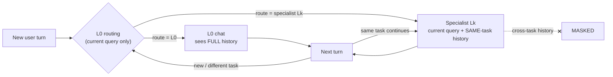
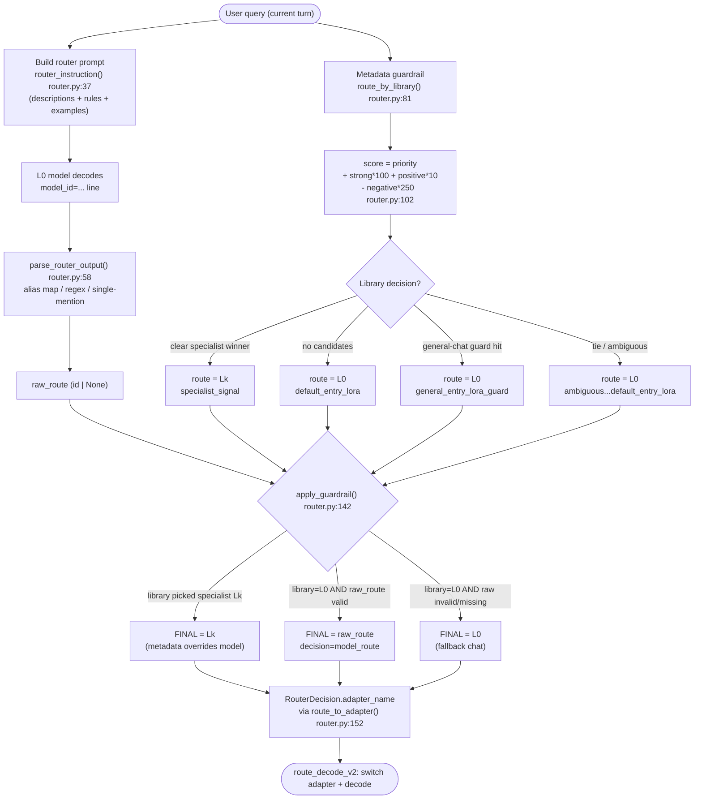
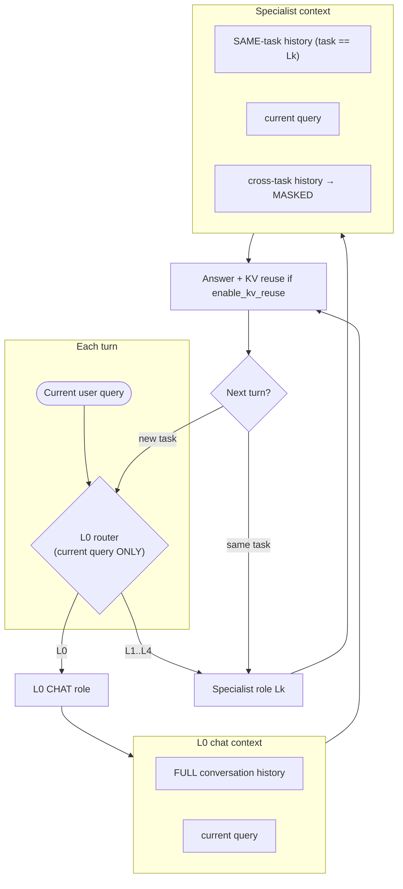

# Mixture-of-LoRA Harness — Routing & Harness Architecture

Source repo: `Mixture-of-LoRA-Harness/`
Code studied: `mol_harness/router.py`, `mol_harness/library.py`, `mol_harness/__init__.py`,
`examples/offline_router_demo.py`, `examples/route_decode_client.py`,
`examples/lora_library/L0.md…L4.md`, `lora_library/glm51_current/L0.md…L4.md`,
`docs/lora_library.md`, `oai_api_connectivity_test/{README.md,test_lora_adapter_oai_api.py}`,
`README.md`.

---

## 1. Overview

The Mixture-of-LoRA (MoL) Harness is a router plus an SGLang overlay that serves many
LoRA adapters behind a single OpenAI-compatible endpoint. Every request enters on **L0**,
which plays a dual role: it is both the **entry router LoRA** (it decides where the request
should be decoded) and the **general-chat LoRA** (the fallback that actually answers ordinary
requests). Specialist adapters (L1–L4) are selected only when one task family clearly matches.

Routing is **hybrid** and combines two independent signals (`docs/lora_library.md`, lines 43–51;
`README.md` "Routing Design"):

1. A **model prompt route** — L0 is prompted to emit a single `model_id=...` line, built from
   each route's description / rules / examples (`RouterHarness.router_instruction`, `router.py:37`).
2. A **deterministic metadata guardrail** — a keyword/phrase scorer over each route's
   strong/positive/negative signal lists (`RouterHarness.route_by_library`, `router.py:81`).
   It is *specialist-first*: a clear specialist metadata match overrides noisy model output.
3. An **L0 fallback** — invalid, missing, or ambiguous routes resolve to L0
   (`RouterHarness.apply_guardrail`, `router.py:142`).

The repo is source-only: no weights, no shadow LoRA dirs. Adapter checkpoint paths live only in
the library markdown (`source_path`) and are passed to SGLang at launch via `--lora-paths` /
`LORA_PATHS_ARGS`; at request time only route ids and already-loaded `adapter_name`s travel over
the wire (`docs/lora_library.md`, lines 27–31).

```
LoRA Library (.md per route)
        │  parse_lora_markdown / load_lora_library  (library.py)
        ▼
   dict[str, LoRATask]
        │
        ▼
   RouterHarness  (router.py)
   ├── router_instruction()  → prompt sent to L0 model      (prompt route)
   ├── route_by_library()    → deterministic signal scorer  (metadata guardrail)
   └── apply_guardrail()     → final RouterDecision (route_id, adapter_name)
        │
        ▼
   route_decode_v2 custom_params  → patched SGLang  → adapter switch + decode
```

---

## 2. The LoRA Library entry schema + the parser

### 2.1 File format

The harness reads **one markdown file per route**. Each file has YAML-style front matter plus
`## ` sections (`docs/lora_library.md`).

Front matter fields (`library.py:91` `parse_lora_markdown`, `library.py:30` `_split_front_matter`):

| Field | Meaning | Used by |
| --- | --- | --- |
| `id` | route id the router emits (`L0`, `L1`, …) | dict key, parse output |
| `level` | tier label; `is_entry` is true when `L0` (`library.py:25`) | entry detection |
| `task` | human task family label (may be slash-separated) | metadata |
| `adapter_name` | server-visible LoRA model id loaded by SGLang | request `model` |
| `source_path` | local adapter checkpoint dir (NOT sent at request time) | shadow-lora prep |
| `priority` | deterministic tie-break / base score in the guardrail | `route_by_library` |
| `dataset` | optional single dataset (folded into `datasets`) | eval scripts |

Sections (parsed by `_parse_sections`, `library.py:47`):

- `## Description` → `_section_text` (compact summary, used in the router prompt).
- `## Routing Rules` → `_bullets` (one rule per `- ` bullet; fed to the model prompt).
- `## Strong Signals` → `_comma_list` (high-confidence trigger phrases; guardrail).
- `## Positive Signals` → `_comma_list` (weaker trigger phrases; guardrail).
- `## Negative Signals` → `_comma_list` (suppressors; guardrail subtracts these).
- `## Examples` → `_section_items` in the form `prompt => L2`.
- `## Datasets` → `_section_items` (optional local eval paths).

### 2.2 A real entry (from `examples/lora_library/L2.md`)

```markdown
---
id: L2
level: L2
task: coding
adapter_name: l2_coding
source_path: /path/to/coding-lora
priority: 100
---

# L2 coding

## Description
Specialist LoRA for coding and terminal benchmark workflows: repository repair,
debugging, source-code edits, shell command execution, tests, scripts, local file
processing, and benchmark-style software engineering tasks.

## Routing Rules
- Choose L2 for prompts that require source-code changes, debugging, repository inspection,
  tests, stack traces, patches, scripts, shell commands, or terminal workflows.
- Choose L2 for benchmark coding tasks such as SWE-Bench, SWE-Gym, Terminal-Bench, ...
- Do not choose L2 for general technical discussion unless the user asks to inspect code, ...

## Strong Signals
repository, codebase, failing test, stack trace, pytest, shell command, terminal,
source-code fix, implement patch, run tests, benchmark issue

## Positive Signals
bug, regression, code patch, unit tests, CI failure, traceback, src/, tests/, pyproject.toml, ...

## Negative Signals
general chat, conceptual explanation, booking, order, appointment, customer service, build a UI, ...

## Examples
- Fix a failing test in this repository and run the relevant pytest command. => L2
- Complete this Terminal-Bench task by writing scripts and validating the output files. => L2
```

### 2.3 The five routes

There are two parallel libraries. `examples/lora_library/` is a simplified placeholder set;
`lora_library/glm51_current/` is the sanitized real GLM5.1 set (richer signals, plus a
`## Datasets` section on L2). Their priorities/labels:

| id | `examples/` task / adapter / priority | `glm51_current/` task / adapter / priority |
| --- | --- | --- |
| L0 | chat / `l0_chat` / 10 | chat / `l0_chat` / 10 |
| L1 | personal-agent / `l1_personal_agent` / 85 | living/vita/tau3 / `l1_living_vita_tau3` / 85 |
| L2 | coding / `l2_coding` / 100 | swe/tb2 / `l2_swe_tb2` / 100 |
| L3 | ui-generation / `l3_ui` / 70 | a2ui / `l3_a2ui` / 92 |
| L4 | workspace-agent / `l4_workspace` / 80 | openclaw/pinch / `l4_openclaw_pinch` / 95 |

L0 always has the lowest priority (10) so it never out-scores a real specialist match; it wins
only through the explicit fallback paths.

### 2.4 The parser

- `parse_lora_markdown(path)` (`library.py:91`) → one `LoRATask` dataclass (`library.py:8`).
  `id` defaults to the file stem if no `id` front matter; a `dataset:` value is prepended into
  `datasets` if not already present (`library.py:96–99`).
- `load_lora_library(dir)` (`library.py:118`) globs `*.md` in sorted order, builds
  `dict[id -> LoRATask]`, and **enforces that an `L0` route exists** (`library.py:128`) — the
  entry/fallback route is mandatory. Raises if the dir is missing or has no `.md`.
- `library_to_jsonable` (`library.py:133`) flattens the dict for transport (e.g. the server's
  `/v1/lora_router_library` endpoint).

The OAI client (`test_lora_adapter_oai_api.py:65`) has a **standalone re-implementation** of the
same parser (`parse_lora_markdown`, `load_local_lora_library`) so it can run as a pure client with
no dependency on `mol_harness`.

---

## 3. Detailed routing logic

`RouterHarness` (`router.py:19`) is constructed with the task dict and `entry_route_id="L0"`
(it raises if L0 is absent, `router.py:25`). It exposes three layers.

### 3.1 The model prompt route

`router_instruction()` (`router.py:37`) renders the full router prompt by stitching together
library-derived blocks:

- Header: "You are running inside L0, the entry chat LoRA … Choose exactly one model_id …
  Classify by the user's goal and execution environment, not by keyword overlap. Return L0 for
  ordinary chat … Slash-separated labels mean one adapter covers all listed task families."
- `Available model ids:` — `_model_id_list()` (`router.py:174`): `- <id>: <description>` per route.
- `Routing rules:` — `_routing_rules()` (`router.py:183`): every route's `routing_rules` bullets,
  numbered and prefixed `"<id>: <rule>"`.
- `Examples:` — `_routing_examples()` (`router.py:190`): each `## Examples` line split on `=>`
  into `User: <prompt>\nmodel_id=<route>` (defaulting to the owning route id when no `=>`).
- A trailing format constraint: `model_id=<L0|L1|L2|L3|L4>` (`_model_id_choices`, `router.py:180`)
  followed by a dangling `model_id=` to prime the completion.

`router_prompt(user_text)` (`router.py:30`) prepends `"User request:\n<text>\n\n"` to that
instruction. (In the real route_decode flow the clients build the prompt themselves as
`answer_prefix + "\n\n" + router_instruction` — see §5.)

`parse_router_output(text)` (`router.py:58`) interprets the model's reply tolerantly:

1. Builds an **alias map** from every route id and `adapter_name` (lowercased) → canonical id.
2. Primary: regex `model_id\s*=\s*(<token>)`, strip punctuation, look up in aliases.
3. Else: if the whole stripped reply is itself an alias, use it.
4. Else: scan for word-boundary mentions of any alias; if **exactly one** unique route is
   mentioned, return it; otherwise return `None` (ambiguous → caller falls back to L0).

> Note: in the offline demo and the route_decode clients, the *deterministic* guardrail is what
> is actually invoked (`route_by_library`). `parse_router_output` exists for the hybrid path where
> a real model emits the route and `apply_guardrail` arbitrates.

### 3.2 The metadata guardrail (deterministic scorer)

`route_by_library(user_text)` (`router.py:81`) scores every **non-L0** route:

- `_signal_hits` (`router.py:211`) finds which signals appear. `_signal_matches` (`router.py:202`)
  uses word-boundary regex for token-like signals (`[a-z0-9_+-]+`) and plain substring match for
  phrases.
- `_weighted_signal_score` (`router.py:236`) sums per-signal weights from `_signal_weight`
  (`router.py:216`): non-ASCII (CJK) phrases 3–4, length ≥40 → 6, ≥20 → 4, contains
  `/ _ - : ` * ` → 4, multi-word → 3, single short word → 1.
- A route is skipped if it has no strong/positive hits, or if `strong_score == 0 and
  positive_score < 2` (`router.py:100`) — i.e. one weak positive alone is not enough.
- Final score (`router.py:102`):
  `score = priority + strong_score*100 + positive_score*10 - negative_score*250`.
  Negative signals are heavily penalized; strong signals dominate; `priority` is the tie-break
  baseline. Routes with `score <= 0` are dropped.

Decision after sorting by `(score, strong_count)` desc (`router.py:122`):

- **No candidates** → L0, decision `default_entry_lora` (`router.py:119`).
- **General-chat guard** (`router.py:124`): if `_is_general_l0_request` (the text starts with
  `translate / rewrite / proofread / explain / summarize / compare / what is / why does /
  give me an overview`, `router.py:240`) **and** the top candidate is weak
  (`strong_score <= 1 and positive_score == 0`) → L0, decision `general_entry_lora_guard`. This
  stops a stray keyword (e.g. "explain the repository structure") from hijacking a specialist.
- **Clear winner** (`router.py:130`): only one candidate, or top score strictly beats the
  runner-up → that specialist, decision `specialist_signal`.
- **Tie** → L0, decision `ambiguous_specialist_signal_default_entry_lora` (`router.py:136`).

Every branch carries `diagnostics` (per-route hit lists, candidate scores) for inspection.

### 3.3 Combining model + metadata + L0 fallback

`apply_guardrail(raw_route, user_text)` (`router.py:142`) is the hybrid arbiter:

1. Run `route_by_library`. If it picked a **specialist** (`route_id != L0`), the metadata wins —
   attach `raw_model_route` and return it. *Strong metadata overrides noisy model output.*
2. Else (metadata said L0): if the model's `raw_route` is a **valid known route**, accept it
   (decision `model_route`, `router.py:148`) — a valid model route is honored when metadata has no
   stronger specialist.
3. Else (invalid / missing model route) → keep the L0 library decision (the fallback).

`route_to_adapter()` (`router.py:152`) returns `{route_id: adapter_name}` for the routes that
declare an adapter — this map is what the clients ship to SGLang.

### 3.4 Multi-turn / history-masking policy

This is a **harness-level policy** (described in `README.md` "Routing Design", lines 39–47); the
router code itself is stateless per call. The intended rules:

- **L0 routing** sees only the **current user query** (so old turns can't skew the route).
- **L0 chat** (when L0 is the answer) may see the **full conversation history**.
- **Specialist LoRAs** see the **current query + same-task history** only.
- **Cross-task** specialist history is **masked** at the policy level.
- After a specialist finishes a turn, the next **new task starts back at L0**.
- With `enable_kv_reuse=true`, the patched SGLang path reuses the contiguous current-query KV
  prefix after trimming router-only prompt/decode tokens.



---

## 4. Diagrams

### 4.1 Hybrid router flow (query → prompt route + metadata guardrail → role/adapter)



### 4.2 Multi-turn history masking (L0 vs specialist, same- vs cross-task)



---

## 5. `route_decode_v2` custom params + `lora_adapter_id` selection

Two clients drive the patched SGLang `/v1/completions` endpoint.

### 5.1 `examples/route_decode_client.py` (single raw request)

Builds the prompt as `answer_prefix(user_text) + "\n\n" + harness.router_instruction()`
(`route_decode_client.py:74`, `:82`), tokenizes the answer prefix via `/tokenize`
(`:75`) to know how many KV tokens to keep, and runs the deterministic route locally
(`harness.route_by_library`, `:78`) to attach `deterministic_route` hints.

The `custom_params.lora_router` block (`route_decode_client.py:87`):

| param | value / meaning |
| --- | --- |
| `mode` | `"route_decode_v2"` |
| `entry_route_id` / `base_route_id` | `"L0"` |
| `route_to_adapter` | `{id: adapter_name}` from `harness.route_to_adapter()` |
| `router_max_tokens` | tokens the router phase may decode (default 16) |
| `decode_tokens` | tokens the specialist decode may produce (default 32) |
| `keep_prefix_token_count` | KV prefix to keep (= prefix tokens if reuse on, else 0) |
| `query_prefix_token_count` / `specialist_context_token_count` | answer-prefix token count |
| `query_cache_reused_token_count` | prefix tokens if reuse, else 0 |
| `task_reprefill_token_count` | 0 if reuse, else prefix tokens |
| `task_reprefill_required` | `not enable_kv_reuse` |
| `enable_kv_reuse` | toggled by `--disable-kv-reuse` |
| `deterministic_route` / `deterministic_route_decision` | local guardrail result + reason |
| `user_text` | raw query |

`max_tokens = router_max_tokens + decode_tokens`, `temperature=0`, `ignore_eos=True`,
unique `rid` (`:83–86`).

### 5.2 `oai_api_connectivity_test/test_lora_adapter_oai_api.py` (`auto` vs L0–L4)

A pure external client (no `mol_harness` import). Selector `--lora_adapter_id` ∈
`("auto","L0","L1","L2","L3","L4")` (`:17`).

**Library source:** it prefers the **remote** library via `GET /v1/lora_router_library`
(`fetch_remote_lora_library`, `:159`) and falls back to a local `--library-dir`
(`load_client_lora_library`, `:180`; default `lora_library/glm51_current`, `:29`).

**`auto`** (`build_auto_payload`, `:334`):
- `model` = the L0 entry adapter; prompt = `answer_prompt + "\n\n" + build_router_instruction(tasks)`.
- Sends the same `route_decode_v2` `custom_params.lora_router` block as §5.1, **plus**
  `base_route_adapter` and `route_signals` = `build_route_signals(tasks)` (`:256`) — the
  strong+positive signals per non-L0 route, deduped. The server uses these to apply its **own
  fallback override** if L0 fails to emit a parseable `model_id=...` line
  (`oai…/README.md`, lines 31–37).
- Before the request, `configure_lora_router` (`:301`) POSTs `/v1/configure_lora_router` with the
  intersection of requested adapters and `/v1/models` (only already-loaded adapters), `mode=route_decode_v2`.

**`L0`–`L4` direct** (`build_direct_payload`, `:380`): a normal `/v1/completions` where `model`
is that route's `adapter_name`; `prompt = answer_prompt(user_text)`, no `custom_params`. The whole
completion uses that single adapter (`oai…/README.md`, lines 27–30). No router config call is made.

The response is read for `metadata.lora_router_selected_route` /
`lora_router_selected_adapter` (`:460`) to report what the server actually chose.

---

## 6. How to run

### 6.1 Offline metadata router (no server, no weights)

```bash
cd Mixture-of-LoRA-Harness
python3 examples/offline_router_demo.py \
  --library-dir examples/lora_library \
  "Fix a failing pytest in this repository and run verification."
```

Prints `route_id`, `adapter_name`, `decision`, and full `diagnostics`
(`offline_router_demo.py:22`, calling `harness.route_by_library`). This exercises only the
deterministic guardrail (§3.2) — useful to verify signal lists without a model.

### 6.2 Single `route_decode_v2` request (needs patched SGLang)

```bash
python3 examples/route_decode_client.py \
  --base-url http://127.0.0.1:30000 \
  --library-dir my_lora_library \
  --model l0_chat \
  "Fix a failing pytest in this repository and run verification."
# add --disable-kv-reuse to force task re-prefill instead of KV prefix reuse
```

### 6.3 OAI adapter-selection test

```bash
# auto routing (default): start on L0, let route_decode_v2 pick the adapter
python3 oai_api_connectivity_test/test_lora_adapter_oai_api.py \
  --base-url http://YOUR_SGLANG_HOST:30000 \
  --lora_adapter_id auto \
  --prompt "Fix a failing pytest in this repository and run verification."

# direct adapter (skips routing entirely)
python3 oai_api_connectivity_test/test_lora_adapter_oai_api.py \
  --base-url http://YOUR_SGLANG_HOST:30000 \
  --lora_adapter_id L2 \
  --prompt "Fix a failing pytest in this repository and run the relevant verification command."

# run the built-in samples for auto + L0..L4
python3 oai_api_connectivity_test/test_lora_adapter_oai_api.py \
  --base-url http://YOUR_SGLANG_HOST:30000 --sample all
```

`SGLANG_BASE_URL` overrides the default base URL. `auto` requires the patched overlay and the
`/v1/configure_lora_router` endpoint; direct `L0`–`L4` only require the chosen adapter to be loaded.

### 6.4 Server prerequisites (from `README.md`)

```bash
export PATCH_ROOT=$PWD/sglang_patch
export LORA_PATHS_ARGS='l0_chat=shadow_loras/L0 l1_living_vita_tau3=shadow_loras/L1 \
  l2_swe_tb2=shadow_loras/L2 l3_a2ui=shadow_loras/L3 l4_openclaw_pinch=shadow_loras/L4'
bash sglang_patch/scripts/start_sglang_kv_reuse_server.sh
# then configure route decode:
curl -s http://127.0.0.1:30000/v1/configure_lora_router \
  -H 'Content-Type: application/json' \
  -d '{"lora_pool":["l0_chat","l2_swe_tb2"],"switch_every_n_tokens":0,"mode":"route_decode_v2"}'
```

---

## 7. Notes / caveats

- **L0 is mandatory and dual-role.** `load_lora_library` raises without `L0.md` (`library.py:128`);
  `RouterHarness.__init__` raises if `entry_route_id` is absent (`router.py:25`). L0 is the entry
  router *and* the general-chat/fallback adapter.
- **Metadata beats the model.** When the deterministic guardrail finds a clear specialist, it
  overrides the model's route (`apply_guardrail`, `router.py:144`). The model route is only honored
  when metadata is neutral (L0) *and* the model emitted a known route id.
- **Negative signals are decisive.** Each negative hit subtracts 250 (`router.py:102`), far more
  than a strong hit adds (100), so a single negative phrase can fully suppress a route.
- **General-chat guard** prevents `translate/explain/summarize/...` openers from being captured by a
  weak specialist match (`router.py:124`, `_is_general_l0_request` `router.py:240`).
- **Ambiguity → L0.** Exact score ties between specialists fall back to L0 by design (`router.py:136`).
- **Two parsers, kept in sync by hand.** `mol_harness/library.py` and the inlined parser in
  `test_lora_adapter_oai_api.py:65` duplicate logic so the OAI client stays import-free; changes to
  the markdown schema must be mirrored in both.
- **Two libraries differ.** `examples/lora_library` is placeholder/simplified; `glm51_current` has
  richer (including CJK) signals, different adapter names, different priorities (e.g. L3=92, L4=95),
  and a `## Datasets` section on L2. Pick the library that matches the adapter names loaded by SGLang
  (`--library-dir`).
- **KV reuse is contiguous only.** `route_decode_v2` reuses a continuous current-query KV prefix
  after trimming router-only tokens; it does not do arbitrary non-contiguous KV splicing
  (`README.md` Notes). `--disable-kv-reuse` flips the params to require a task re-prefill.
- **Multi-turn masking is policy, not router code.** `RouterHarness` is stateless per call; the
  L0-routing-sees-only-current-query / specialist-same-task / cross-task-masked behavior is enforced
  by the harness/server layer described in `README.md`, not by the functions in `router.py`.
- **Validation boundary.** Do not compare 16-token route/KV smoke tests against full tool-loop task
  scores; teacher-forcing runs are diagnostics only (`README.md` "Validation Boundary").
```
