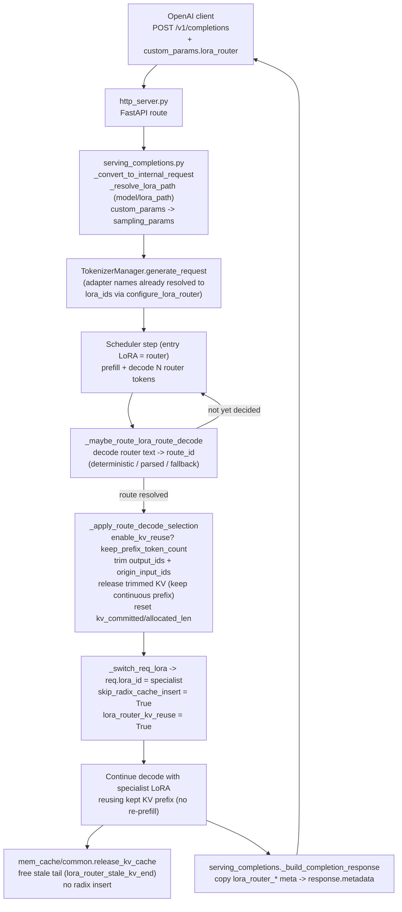
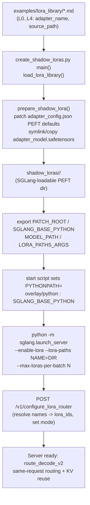

# 04 — Mixture-of-LoRA Serving (SGLang Route-Decode + KV Reuse)

This document describes how the Mixture-of-LoRA-Harness serves many LoRA adapters
behind a single OpenAI-compatible endpoint using a **non-invasive SGLang overlay**
that adds same-request LoRA routing (`route_decode` / `route_decode_v2`) and
KV-prefix reuse.

All citations are to files under
`Mixture-of-LoRA-Harness/sglang_patch/` and `Mixture-of-LoRA-Harness/examples/`.

---

## 1. Overview

The harness runs **one base model** (e.g. a GLM tensor-parallel deployment) with
several LoRA adapters loaded into the same process. A single request can:

1. **Prefill + decode a few tokens with an "entry" LoRA** (the router, e.g. `L0`),
2. **Parse a route id** out of the router's own short decode output,
3. **Trim the router-only prompt/decode tokens** from the request's KV sequence,
4. **Switch to the selected specialist LoRA** (e.g. `L2` coding),
5. **Continue decoding** with the specialist — **reusing the continuous KV prefix**
   that survives the trim, instead of re-prefilling from scratch.

This is implemented entirely as a **file-level overlay** placed *before* the
installed SGLang on `PYTHONPATH`. The upstream installation is never edited
(`sglang_patch/README.md:3-6`). The overlay touches the files listed in
`sglang_patch/changed_files.txt`:

- `entrypoints/http_server.py` — adds `/v1/configure_lora_router`,
  `/v1/lora_router_library`, `/v1/switch_lora_adapter` endpoints.
- `entrypoints/openai/serving_completions.py` — passes `lora_router_*` metadata
  through to the OpenAI completion response.
- `lora/layers.py` — attribute-delegation shim for MoE-wrapped LoRA layers.
- `managers/io_struct.py` — `ConfigureLoRARouterReqInput`,
  `SwitchLoRAAdapterReqInput` and their outputs.
- `managers/scheduler.py` — the route-decode state machine (the v2 patch).
- `managers/tokenizer_manager.py` + `managers/tokenizer_control_mixin.py` —
  adapter-name → `lora_id` resolution and fan-out to scheduler workers.
- `mem_cache/common.py` — trimmed-KV release on request finish.

**Boundary (from `README.md:22-28`):** SGLang stores a request's KV as a
*continuous* sequence. The patch trims the router prompt/decode **suffix** and
reuses a **continuous prefix** for the selected adapter. Arbitrary non-contiguous
GPU KV splicing is **not** claimed; cross-task masking is a *policy* the
higher-level harness applies by choosing which text it sends per request.

---

## 2. Overlay Activation (no source edits)

### Mechanism

Activation is pure `PYTHONPATH` ordering — no files in the installed SGLang are
modified.

`sglang_patch/scripts/start_sglang_kv_reuse_server.sh:25-26`:

```bash
export SGLANG_BASE_PYTHON
export PYTHONPATH="${PATCH_ROOT}/overlay/python:${SGLANG_BASE_PYTHON}${PYTHONPATH:+:${PYTHONPATH}}"
```

The overlay directory (`overlay/python`) is placed **first**, the upstream
`sglang/python` second. Python therefore imports the overlay copies of the touched
modules (e.g. `sglang.srt.managers.scheduler`) and falls through to the upstream
package for everything else. Because the overlay mirrors the upstream package
layout exactly, only the files in `changed_files.txt` are shadowed.

### The LoRA-layer shim (special case)

`overlay/python/sglang/srt/lora/layers.py` does **not** re-implement the module;
instead it loads the *real* upstream `layers.py` by absolute path using
`SGLANG_BASE_PYTHON`, then re-exports every public symbol from it
(`layers.py:17-53`). Its only behavioral change: it installs a delegating
`__getattr__` on `BaseLayerWithLoRA` (`layers.py:27-47`) so that GLM/DeepSeek MoE
code reading attributes like `moe_runner_config` off a LoRA-wrapped
`FusedMoEWithLoRA` transparently sees the wrapped `base_layer`'s surface
(`weight`/`bias` are deliberately *not* delegated, to avoid breaking
`register_parameter`). This makes MoE + LoRA wrapping compatible without patching
upstream.

### Start command

`start_sglang_kv_reuse_server.sh:36-58` launches the stock server with LoRA on:

```bash
python3 -m sglang.launch_server \
  --model-path "$MODEL_PATH" --served-model-name "$MODEL_NAME" \
  --host "$HOST" --port "$PORT" --tp "$TP" \
  --reasoning-parser glm45 --tool-call-parser glm47 \
  --mem-fraction-static "$MEM_FRACTION_STATIC" \
  --enable-lora \
  --lora-paths l0_chat=/path/to/shadow_loras/L0 l2_coding=/path/to/shadow_loras/L2 \
  --max-loras-per-batch "$MAX_LORAS_PER_BATCH" \
  --max-lora-rank "$MAX_LORA_RANK" \
  --disable-overlap-schedule \
  [--lora-use-virtual-experts]
```

Key points:

- `--lora-paths NAME=DIR` is the **adapter handoff** (`README.md:42-45`). Each item
  maps a *server-visible adapter name* to a local shadow-LoRA dir. Route-decode
  requests later refer to these **names**, never filesystem paths.
- `MAX_LORAS_PER_BATCH` defaults to the **number of adapters** loaded
  (`start...sh:28-34`); it is floored to that count so every adapter can be live in
  a batch simultaneously (required for same-batch switching).
- `--disable-overlap-schedule` is set so the route-decode batch mutations
  (trimming, lora switch) happen deterministically between steps.

After startup the router mode is configured at runtime
(`README.md:47-53`):

```bash
curl -s http://127.0.0.1:30000/v1/configure_lora_router \
  -H 'Content-Type: application/json' \
  -d '{"lora_pool":["l0_chat","l2_coding"],"switch_every_n_tokens":0,"mode":"route_decode_v2"}'
```

---

## 3. Shadow-LoRA Preparation

SGLang's LoRA loader expects a PEFT-style adapter directory with a complete
`adapter_config.json` and `adapter_model.safetensors`. Training output sometimes
omits PEFT fields SGLang reads, so the harness produces **"shadow" LoRA dirs**:
patched config + (by default) symlinked weights.

`examples/scripts/create_shadow_loras.py`:

- `prepare_shadow_lora(source, target, copy_weights)` (`create_shadow_loras.py:15-41`):
  - Verifies `source/adapter_config.json` and `source/adapter_model.safetensors`
    exist (`:16-21`).
  - Loads the config and **fills required PEFT defaults** if missing
    (`:24-29`): `peft_type="LORA"`, `inference_mode=True`, `lora_dropout=0.0`,
    `fan_in_fan_out=False`, `modules_to_save=None`. It writes the augmented config
    into `target/adapter_config.json` (`:30-33`).
  - Materializes the weights into `target/adapter_model.safetensors`: a
    **symlink** to the original by default, or a real copy with `--copy-weights`
    (`:35-41`). Symlinking avoids duplicating large weight files.
- `main()` (`create_shadow_loras.py:44-57`): reads the markdown **LoRA Library**
  via `mol_harness.load_lora_library(library-dir)` (default
  `examples/lora_library`, files `L0.md … L4.md`), and for each task with both an
  `adapter_name` and a `source_path`, builds `output-dir/<task_id>`
  (e.g. `shadow_loras/L0`). These output dirs are exactly what you feed to
  `--lora-paths` in the start script.

**Why:** it converts heterogeneous training artifacts into a uniform,
SGLang-loadable PEFT layout *without* copying weights, and ties each adapter to a
stable task id / adapter name that the router and `configure_lora_router` use.

---

## 4. The KV-Reuse Change (the v2 patch)

File: `sglang_patch/patches/sglang-lora-kv-reuse-v2.patch` (against
`managers/scheduler.py`), with the trimmed-KV release living in
`mem_cache/common.py`.

### 4.1 What the v2 patch adds at the mode level

The patch threads a new mode **`route_decode_v2`** alongside the existing
`route_decode` everywhere the mode is gated. All of these `if mode == "route_decode"`
checks become `mode in ("route_decode", "route_decode_v2")`:

- supported-mode tuple (`patch hunk @@ -1836` → `scheduler.py` `_lora_router_enabled`-region list).
- `_get_route_decode_params` (`patch @@ -1849`, `scheduler.py:1853`): only returns
  router params when `custom_params["lora_router"]["mode"]` is one of the two.
- routing dispatch: `_maybe_route_lora_route_decode` (`patch @@ -2171`,
  `scheduler.py:2256`), `_maybe_route_lora_after_prefill` (`patch @@ -2254`,
  `scheduler.py:2338`), `_maybe_route_lora_after_decode` (`patch @@ -2278`).
- batch lora-set bookkeeping: route-decode modes are **excluded** from the
  "add the whole pool to running_loras" branch (`patch @@ -3076`) — the running
  set is driven by per-request `req.lora_id` instead.
- `configure_lora_router` validation in the scheduler (`patch @@ -4165 / -4183 /
  -4190`) and in `tokenizer_control_mixin.py:758-792` — route-decode requires
  `len(lora_pool) >= 1`.

### 4.2 The reuse vs. no-reuse decision (`enable_kv_reuse`)

The patch introduces an `enable_kv_reuse` flag, read from the per-request router
params, defaulting to **True**.

In `_apply_route_decode_selection` (`scheduler.py:2132-2231`,
`patch @@ -2068,+2135`):

```python
enable_kv_reuse = bool(params.get("enable_kv_reuse", True))
...
if keep_prefix_token_count <= 0:
    if enable_kv_reuse:
        keep_prefix_token_count = original_prompt_tokens   # reuse whole prompt prefix
    else:
        keep_prefix_token_count = min(1, original_prompt_tokens)  # minimal anchor
```

(`scheduler.py:2151-2158`.) `keep_prefix_token_count` is the length of the
*continuous prefix* whose KV is kept. Reuse keeps the full original prompt;
no-reuse keeps essentially nothing (the real no-reuse path is a target-adapter
re-prefill done by the harness — the scheduler only keeps a 1-token anchor if a
caller still sends a no-reuse request through same-request route_decode).

`keep_prefix_token_count_by_route` (`scheduler.py:2139-2147`) lets the caller set
a **per-route** prefix length, overriding the scalar default.

### 4.3 The trim itself (what changes in the request)

Still inside `_apply_route_decode_selection` (`scheduler.py:2161-2217`), once the
router has emitted enough tokens to decide a route:

1. **Release the trimmed KV** beyond the kept prefix:
   `_release_route_decode_trimmed_kv(req, keep_prefix_token_count, old_kv_allocated_len)`
   (`scheduler.py:2101-2130`) frees `req_to_token[req_pool_idx,
   release_start:old_kv_allocated_len]` from the KV pool, page-aligning
   `release_start` up to `page_size`.
2. **Truncate the request's token arrays** to the kept prefix
   (`scheduler.py:2167-2172`): `origin_input_ids`, `origin_input_ids_unpadded`.
3. **Reset KV bookkeeping** to the prefix: `cache_protected_len = 0`,
   `kv_committed_len = min(..., keep_prefix)`, `kv_allocated_len = min(...,
   keep_prefix)` (`scheduler.py:2173-2175`).
4. **Drop the router's decode tokens** (`del req.output_ids[:]`) and rebuild
   `fill_ids` from the trimmed prompt, resetting all streaming offsets and finish
   state so decode restarts cleanly (`scheduler.py:2177-2188`).
5. **Cap continuation length**: `max_new_tokens = decode_tokens`
   (`scheduler.py:2188`).
6. **Switch the adapter**: resolve route → adapter → `lora_id` via
   `_route_decode_target` (`scheduler.py:1970-1999`), then
   `_switch_req_lora(req, target_lora_id, "route_decode")`
   (`scheduler.py:2192-2217`).

`_switch_req_lora` (`scheduler.py:2319-2336`) sets `req.lora_id = new_lora_id` and
calls `_mark_lora_reuse_request`, which sets
`req.skip_radix_cache_insert = True` and `req.lora_router_kv_reuse = True`
(`scheduler.py:1842-1844`). Skipping radix-cache insert is essential: the trimmed,
mid-edit sequence must not pollute the shared prefix cache.

The batch tensors are then resized to match the new (shorter) sequence length in
`_sync_route_decode_batch_state` (`scheduler.py:2233-2253`) — `seq_lens`,
`seq_lens_cpu`, `orig_seq_lens`, `input_ids[index]` (set to the last prefix
token), and `seq_lens_sum`.

### 4.4 Where the routing loop runs

`_maybe_route_lora_route_decode` (`scheduler.py:2255-2317`) is invoked both after
prefill and after each decode step (`_maybe_route_lora_after_prefill` /
`_after_decode`). For each not-yet-routed request it:

- marks the request as a reuse request and pending (`:2266-2268`),
- waits until the router has produced output tokens (`:2269-2270`),
- decodes the router output (`_decode_route_output_text`, `:2272`) and resolves a
  route via deterministic override → parsed id → fallback-to-base after
  `router_max_tokens` (`:2273-2282`),
- applies optional deterministic / signal overrides (`:2283-2315`),
- runs `_apply_route_decode_selection` + `_sync_route_decode_batch_state`
  (`:2316-2317`).

### 4.5 Final KV release on finish (`mem_cache/common.py`)

`release_kv_cache` (`mem_cache/common.py:567-655`) honors a per-request
`lora_router_stale_kv_end`. If set (`:581-582`), it directly frees
`req_to_token[req_pool_idx, kv_allocated_len:release_end]` and then runs
`cache_finished_req` with `is_insert` gated on `skip_radix_cache_insert`
(`:583-601`), clearing the stale marker. This guarantees the trimmed/overallocated
tail of a route-decode request is reclaimed and never inserted into the radix
cache.

### 4.6 v2 metadata (multi-turn policy reporting)

For `route_decode_v2`, `_set_route_decode_metadata` (`scheduler.py:2001-2099`,
`patch @@ -2026,+2030`) emits a rich `lora_router_*` metadata block describing the
turn: `lora_router_query_prefix_token_count`,
`lora_router_query_cache_reused_token_count`,
`lora_router_task_reprefill_token_count`,
`lora_router_same_task_reused_token_count`,
`lora_router_cross_task_masked_token_count`, `lora_router_entry_route_id`,
`lora_router_reset_to_route_id`, conversation/turn ids, cache policy, and the
human-readable `lora_router_visible_history_policy` string. Reuse vs. re-prefill
counts are derived from `enable_kv_reuse` (`patch @@ -2026` lines for
`query_cache_reused_token_count` / `task_reprefill_token_count`). The base
`lora_router_request_local_kv_reuse` flag now reports the actual
`enable_kv_reuse` value (`patch @@ -2026`, `lora_router_request_local_kv_reuse`).

---

## 5. Request Path & Adapter Selection

### 5.1 Where `lora_path` (adapter) is first selected

For a plain OpenAI completion, adapter selection happens in
`OpenAIServingCompletion._convert_to_internal_request`
(`serving_completions.py:65-135`): `lora_path = self._resolve_lora_path(request.model,
request.lora_path)` (`:108`) sets `GenerateReqInput.lora_path` (`:118`). The
router params themselves ride in `sampling_params.custom_params`
(`serving_completions.py:161` → `"custom_params": request.custom_params`), which is
exactly what the scheduler reads as `custom_params["lora_router"]`
(`scheduler.py:1846-1855`).

### 5.2 Adapter-name → lora_id resolution

When the router pool is configured, `TokenizerManager.configure_lora_router`
(`tokenizer_control_mixin.py:742-816`) resolves each **adapter name** in
`lora_pool` to a stable `lora_id` via `lora_registry.acquire`
(`:784-792`), holds references to them (`_lora_router_hold_ids`, `:799-801`,
releasing the previous set), and fans the resolved `lora_ids` out to every
scheduler worker through `configure_lora_router_communicator` (`:794`). The
scheduler only ever sees stable `lora_ids` (`io_struct.py:1706-1713` documents
this contract). The special name `base_model` maps to `lora_id = None`
(`:786-787`).

The per-request **route → adapter → lora_id** mapping at decode time is done in
`_route_decode_target` (`scheduler.py:1970-1999`), matching the resolved route
adapter name against `self.lora_router_names` / `self.lora_router_pool`.

### 5.3 Response metadata pass-through

`OpenAIServingCompletion._build_completion_response`
(`serving_completions.py:553-559`) copies every `meta_info` key beginning with
`lora_router_` into the response `metadata` (collapsing per-token lists to their
last value). So the client sees the selected route/adapter and the v2 KV-reuse
accounting directly in the completion response.

### 5.4 Diagram — serving request path



### 5.5 Diagram — request-local route-decode sequence

```mermaid
sequenceDiagram
    participant C as Client
    participant H as http_server
    participant S as Scheduler
    participant M as mem_cache/common
    C->>H: POST /v1/completions (lora_router: route_decode_v2)
    H->>S: GenerateReqInput (custom_params.lora_router)
    Note over S: prefill + decode with entry LoRA (L0 router)
    S->>S: _decode_route_output_text -> route_id (e.g. L2)
    alt route_id resolved
        S->>S: _apply_route_decode_selection<br/>keep_prefix = origin_prompt (enable_kv_reuse)
        S->>M: free KV[release_start:old_kv_allocated_len]
        S->>S: del output_ids; reset kv_committed/allocated_len
        S->>S: _switch_req_lora -> lora_id = L2<br/>skip_radix_cache_insert = True
        Note over S: continue decode with L2, reuse continuous KV prefix
    else router_max_tokens exceeded
        S->>S: fallback_base route
    end
    S->>C: tokens + meta_info lora_router_* (stream/non-stream)
    Note over S,M: on finish: release_kv_cache frees stale tail, no radix insert
```

---

## 6. io_struct Custom Fields

`overlay/python/sglang/srt/managers/io_struct.py`:

- `ConfigureLoRARouterReqInput` (`io_struct.py:1704-1713`):
  `lora_pool: List[str]` (user-facing adapter **names**), `switch_every_n_tokens`,
  `seed`, `mode` (default `"token_interval"`; route modes are `"route_decode"` /
  `"route_decode_v2"`), and `lora_ids` (filled by TokenizerManager; the scheduler
  consumes only stable ids — see comments at `:1706-1712`).
- `ConfigureLoRARouterReqOutput` (`io_struct.py:1716-1722`): `success`, `message`,
  echoed `mode`, `lora_pool`, `switch_every_n_tokens`.
- `SwitchLoRAAdapterReqInput` / `…Output` (`io_struct.py:1725-1736`):
  `request_id`, `lora_name`, resolved `lora_id` — backs `/v1/switch_lora_adapter`.

The **`enable_kv_reuse`**, **`keep_prefix_token_count`**,
**`keep_prefix_token_count_by_route`**, **`decode_tokens`**, **`router_max_tokens`**,
**`route_to_adapter`**, **`entry_route_id`/`base_route_id`**, conversation/turn
fields, etc. are **not** dataclass fields — they travel inside the per-request
`sampling_params.custom_params["lora_router"]` dict and are read directly by the
scheduler (`scheduler.py:1846-1855`, `:2132-2231`, `:2001-2099`). `route_decode_v2`
is added to the accepted `mode` set in both `io_struct`/`scheduler` validation and
`tokenizer_control_mixin.configure_lora_router` (`:758-792`).

---

## 7. How to Run

### 7.1 Prepare shadow LoRAs

```bash
cd Mixture-of-LoRA-Harness
python examples/scripts/create_shadow_loras.py \
  --library-dir examples/lora_library \
  --output-dir shadow_loras
# optional: --copy-weights  (real copy instead of symlink)
# prints e.g.  L0: shadow_loras/L0   L2: shadow_loras/L2 ...
```

### 7.2 Launch the overlay server

```bash
export PATCH_ROOT=/abs/path/to/Mixture-of-LoRA-Harness/sglang_patch
export SGLANG_BASE_PYTHON=/abs/path/to/upstream/sglang/python
export MODEL_PATH=/abs/path/to/base/model
export MODEL_NAME=your-base-model-name
export LORA_PATHS_ARGS='l0_chat=/abs/path/to/shadow_loras/L0 l2_coding=/abs/path/to/shadow_loras/L2'

bash "$PATCH_ROOT/scripts/start_sglang_kv_reuse_server.sh"
```

Optional env: `HOST`, `PORT` (default 30000), `TP` (8), `MEM_FRACTION_STATIC`
(0.90), `MAX_LORA_RANK` (16), `MAX_LORAS_PER_BATCH` (defaults to adapter count),
`LORA_USE_VIRTUAL_EXPERTS` (1).

### 7.3 Configure the router mode

```bash
curl -s http://127.0.0.1:30000/v1/configure_lora_router \
  -H 'Content-Type: application/json' \
  -d '{"lora_pool":["l0_chat","l2_coding"],"switch_every_n_tokens":0,"mode":"route_decode_v2"}'
```

### 7.4 Shadow-LoRA prep + overlay activation flow



---

## Summary

The Mixture-of-LoRA-Harness serves many LoRA adapters behind one OpenAI endpoint
by overlaying a handful of SGLang modules ahead of the installed package on
`PYTHONPATH` (no source edits; the LoRA-layer file even re-execs the real upstream
module and only adds an attribute-delegation shim), loading all adapters with
`--enable-lora --lora-paths NAME=DIR` after `create_shadow_loras.py` normalizes
each PEFT dir (config defaults + symlinked weights), and adding a
`route_decode`/`route_decode_v2` state machine in the scheduler that lets a single
request prefill/decode with an entry router LoRA, parse a route id, trim the
router-only prompt/decode tokens while keeping a **continuous KV prefix**
(`enable_kv_reuse`, `keep_prefix_token_count[_by_route]`), free the trimmed tail
(`_release_route_decode_trimmed_kv` + `release_kv_cache`/`lora_router_stale_kv_end`),
switch `req.lora_id` to the chosen specialist with `skip_radix_cache_insert`, and
continue decoding without re-prefilling — surfacing the full routing/KV-reuse
accounting back to the client as `lora_router_*` response metadata.
