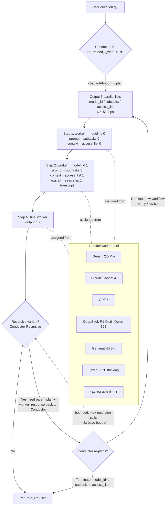

# Conductor — Deep Ground-Truth Analysis

**Paper:** "Learning to Orchestrate Agents in Natural Language with the Conductor"
**Venue:** Published as a conference paper at ICLR 2026
**Authors:** Stefan Nielsen¹\*, Edoardo Cetin¹\*, Peter Schwendeman²†, Qi Sun¹³, Jinglue Xu¹, Yujin Tang¹
(¹ Sakana AI, Japan · ² University of Michigan, USA · ³ Institute of Science Tokyo, Japan. \* equal contribution; † internship at Sakana AI)
**Source:** arXiv:2512.04388v5 (6 May 2026), 39 pages. This file supersedes any prior HTML extraction.

> Notation note: the paper uses both "Conductor" and "RL Conductor" interchangeably. The pretrained 7B model is the "Conductor"; the recursion-finetuned variant is "Conductor-Recursive"; the dynamic-pool-finetuned variant is the "Adaptive Conductor". The terms "workflow step", "routing step", and "subtask" are used interchangeably for one element of the plan.

---

## 1. One-Paragraph Overview

The Conductor is a small (7B, from Qwen2.5-7B) reasoning LLM trained with GRPO (the DeepSeek-R1-style RL recipe) to **orchestrate a pool of much larger, more powerful worker LLMs entirely in natural language**. Given a user question and a list of numbered available models, the Conductor emits a coordination strategy as **three parallel Python lists** — `model_id` (which worker runs each step), `subtasks` (the natural-language prompt each worker receives), and `access_list` (which prior steps' transcripts each worker sees) — describing an agentic workflow of up to 5 sequential steps. The workflow is executed sequentially; the output of the final step is returned as the answer. The Conductor is rewarded **only** on the final answer's correctness (0 for unparseable format, 1 for correct, 0.5 otherwise) — pure end-to-end reward maximization, no process supervision. From this signal, sophisticated coordination behaviors emerge: prompt engineering, planner/coder/verifier decompositions, tree-then-aggregate topologies, difficulty-adaptive step counts, and even "task abdication" (delegating planning to a worker). A 7B Conductor exceeds GPT-5, Gemini 2.5 Pro, and Claude Sonnet 4 individually and beats expensive multi-agent baselines (MoA, MASRouter, Smoothie, RouterDC, 5× self-reflection) at a fraction of the cost (avg ~3 calls). Two finetuned extensions add (a) robustness to **randomized worker pools** and (b) **recursive self-calls** for test-time scaling, where the Conductor can name itself as a worker and re-plan after seeing its own output.

---

## 2. Full Method

### 2.1 The Conductor model

- **Base model:** Qwen2.5-7B (Hui et al., 2024). A 3B variant (same base family) is trained for the scale ablation.
- **Role:** The Conductor solves tasks *indirectly* by designing agentic workflows specific to each input question `qᵢ`. It does not (in the base setting) answer the question itself; it plans, the workers answer.
- **Output medium:** natural language plans (the three lists), parsed from the response after its chain-of-thought.

### 2.2 What it outputs — the workflow format (Section 3.1, Figure 2, Figure 13)

The Conductor's response, after its CoT, contains **three Python lists of equal length N** (N ≤ 5 = max workflow steps):

1. **`model_id`** — list of integers; the numbered worker model assigned to each step. Models are presented to the Conductor as **purely ordinal numbers** ("Model 0, Model 1, …") with no provider names, deliberately to avoid name bias and encourage exploration (Appendix E / Fig. 13).
2. **`subtasks`** — list of strings; the natural-language instruction (the prompt) given to the corresponding worker. A subtask may ask a worker to solve from scratch, refine a previous step's solution, verify, plan, format, etc.
3. **`access_list`** — list, one entry per step, indexing **which previous steps' subtask+response transcripts** are injected into that worker's context. Each entry is either:
   - `[]` — the worker sees only its own subtask (no prior context), or
   - `["all"]` — the worker sees **all** previous routing messages (subtasks + responses), or
   - in the binary scheme used in the main paper, entries are lists of `"all"` / empty. (An *alternate fine-grained scheme*, Appendix B.8, lets `access_list` contain **integer position indices**, e.g. `[0,2,3]`, to expose only specific prior steps — a strict generalization. The fine-grained scheme works but yields no significant gains, so the paper keeps the binary version.)

**Concrete example (Figure 2):**
```
User: "We call a subarray of an array complete if the number of distinct elements
       in the subarray is equal to the number of distinct elements in the whole
       array. Return the number of complete subarrays."

Conductor:
  "Here's the plan: 1) Model 2 will develop an algorithm to efficiently count all
   possible complete subarrays for a given array, 2) Model 0 will implement the
   function to solve the problem."

  model_id    = [ 2, 0 ]
  subtasks    = [ "Develop an efficient algorithm to count the number of complete
                   subarrays of an array",
                  "Implement the algorithm described by the previous agent in Python" ]
  access_list = [ [], ["all"] ]
```
Here step 1 (Model 2) sees only its subtask; step 2 (Model 0) sees all of step 1's transcript and implements it.

### 2.3 How the workflow executes (Section 3.1, "Workflow execution and learning dynamics")

- **Sequential.** Each step is executed by prompting the assigned worker with its subtask. The worker's context is built by concatenating, **as past conversational messages**, the subtask+response pairs named in that step's `access_list`.
- **The final answer is the output of the final step** — the last worker's response *is* the Conductor's response `oᵢ`. The Conductor does not synthesize a final answer itself (except in the recursive variant where it can re-plan).
- The "shared memory" mechanism is precisely the `access_list`: there is no global blackboard; visibility is per-step and explicitly chosen by the Conductor. This lets it build best-of-N, sequential chains, or parallel tree-then-aggregate topologies (parallel steps = steps with `[]` access, aggregated by a later `["all"]` step).

### 2.4 The recursive self-call (Section 3.2, 4.4; Figures 12, 14, 21, 22)

- **Mechanism:** the Conductor can **specify itself as a worker**, giving rise to *recursive topologies*. During an inner recursive call, the Conductor is given as additional input its own **parent output** (the coordination strategy from the call that instantiated it) **together with the previous (worker) response**. With this context it can either devise a *new* agentic workflow or **terminate by passing three empty lists** to return the existing response to the user.
- **Recursion prompt (Figure 14):** the Conductor is shown `Here is the final response obtained at the end of your routing steps: {worker_response}` and told it may output a new sequence of up to `{max_number_of_routing_steps}` steps in the same format. If the previous response is already correct, it passes `model_id=[]`, `subtasks=[]`, `access_list=[]` to return as-is (Figure 21). If verification is needed, it devises revising/verifying steps (Figure 22). When passing `"all"` in the new `access_list`, the previous final routing message is also included.
- **Depth bounding:** recursion is bounded to occur **only up to a specified maximum number** of calls before the final response is returned. Loops are avoided by only allowing recursion *after the initial root Conductor call*. At inference, the maximum number of recursion calls is a **tunable test-time-scaling axis** (increase compute by allowing more recursion). The recursive variant in experiments is set to use **less than 2× the original agentic call budget**.
- **Re-plan vs terminate:** terminate = emit empty lists (response is correct/concise); re-plan = emit a new workflow (response incorrect or needs verification). See Figures 21 (terminate) and 22 (re-plan with verify).

---

## 3. RL Training

### 3.1 Algorithm — GRPO (Section 2 background + Section 3.1)

GRPO (Shao et al., 2024, DeepSeek-R1 recipe). The Conductor `π_θ` generates G > 1 grouped completions `{o₁,…,o_G}` per question `q ∈ D`. With β ≥ 0 (KL penalty to reference model) the objective is the **KL-discounted clipped policy maximization (Eq. 1):**

```
J(θ) = E_{q~D, {o}_{i=1}^G ~ π_θ(·|q)} [ (1/G) Σ_{i=1}^G ( min(rᵢAᵢ, clip(rᵢ, 1−ε, 1+ε) Aᵢ) − β·D_KL(π_θ ‖ π_ref) ) ]
```

with the Monte-Carlo group-normalized **advantage (Eq. 2):**

```
Aᵢ = ( rᵢ − mean({r₁,…,r_G}) ) / std({r₁,…,r_G})
```

The paper notes training end-to-end with the Conductor reward is compatible with any RL algorithm (Schulman et al. 2017 PPO, Ahmadian et al. 2024 REINFORCE-style); they use GRPO.

### 3.2 Reward function — EXACT (Section 3.1, "Workflow execution and learning dynamics")

Two progressive conditions determine `rᵢ` for each Conductor response:

1. **Conductor format condition:** `rᵢ = 0` for responses from which the Python lists of subtasks, worker ids, and access lists **cannot be parsed**.
2. **Conductor correctness condition:** `rᵢ = 1` if the **final output `oᵢ` from executing a well-formatted agentic workflow matches the solution `sᵢ`**, and **`rᵢ = 0.5` otherwise** (well-formatted but wrong final answer).

So the tiers are **0 / 0.5 / 1**:
- 0 → unparseable / malformed plan
- 0.5 → valid plan, wrong answer
- 1 → valid plan, correct answer

(Contrast with the base R1 reasoning reward described in Section 2 for context: −1 format-fail, +1 correct, −0.5 wrong. The Conductor reward replaces −1 with 0 and −0.5 with 0.5.)

### 3.3 Hyperparameters & training regime (Appendix A.1, Table 3, Section 4.1)

| Setting | Value |
|---|---|
| Base model | Qwen2.5-7B (also 3B variant for ablation) |
| Max completion length (Conductor) | 1024 tokens |
| Iterations | 200 GRPO iterations |
| Questions per iteration (batch) | 4 questions/iteration; **batch size 256 samples** |
| Rollouts/generations per question | 64 rollouts per question, temperature 1.0 |
| Optimizer | AdamW (Loshchilov & Hutter 2017) |
| β₁, β₂ | 0.9, 0.999 |
| ε (clip) | 0.2 |
| Learning rate | 1e-6 (0.000001), cosine schedule, warmup ratio 0.03 |
| KL / β | **0 — reference-model synchronization disabled, KL penalty set to 0** |
| Hardware | **2× NVIDIA H100 80GB GPUs** |
| Training-set size | **960 problems** (4 domains: MATH500, MMLU, RLPR, LiveCodeBench V1) |

**Worker (agent) settings (Appendix A.1):** all workers capped at 4096 max completion tokens, temperature 0.2. Reasoning budgets set to minima: 128 tokens for Gemini 2.5 Pro, 0 for Claude Sonnet 4, "minimal" for GPT-5. Qwen3-32B (thinking & non-thinking): top-p=0.8, top-k=20, presence penalty 1.0.

**Recursion finetuning (Appendix A.1):** take trained Conductor, finetune **20 iterations** on a **350-sample filtered subset** of training data (**175 LiveCodeBench + 175 RLPR**). Same config: 64 rollouts/sample, batch 256, no ref-model sync, no KL. A **discount factor of 0.25** scales the rewards in the initial (non-recursive) round; rewards normalized across rounds. A single recursion call is manually instantiated for half the samples in each batch during training.

**Note on a discrepancy to flag:** Section 4.1 states 200 GRPO iterations / batch 256 and "without any KL regularization." Appendix A.1 also says "sampling 4 questions per iteration and generating 64 rollouts per question" — 4 × 64 = 256, consistent with batch 256. Both descriptions agree (4 unique questions × 64 rollouts = 256 rollouts/step).

### 3.4 Training pseudocode

The paper provides **no explicit boxed pseudocode/algorithm listing.** The training procedure is fully specified by Eq. 1, Eq. 2, the reward tiers (§3.2), and the hyperparameters (§3.3). Reconstructed loop:

```
# Reconstructed from Eqs. 1–2 + Appendix A.1 (NOT a verbatim box — none exists in paper)
for iteration in range(200):
    Q = sample(D, 4)                       # 4 questions
    for q in Q:
        completions = pi_theta.generate(q, G=64, temp=1.0)   # 64 rollouts
        for o in completions:
            if not parseable(o):  r = 0.0
            else:
                final = execute_workflow(o, workers)         # sequential exec
                r = 1.0 if final == solution(q) else 0.5
        A = (r - mean(r_group)) / std(r_group)               # Eq. 2
    update pi_theta via GRPO clipped objective               # Eq. 1, beta=0
    # AdamW lr=1e-6 cosine, warmup 0.03; NO ref sync, NO KL
```

---

## 4. The Agent Pool (Section 4.1, Appendix A.1)

**Main worker pool = 7 models** (used for Conductor + all multi-agent baselines):
- **Proprietary frontier:** Gemini 2.5 Pro, Claude Sonnet 4, GPT-5.
- **Open-source:** DeepSeek-R1-Distill-Qwen-32B, Gemma3-27B-instruct, Qwen3-32B (in both thinking and non-thinking modes — note this means the "7 agents" count treats Qwen3-32B thinking and direct as distinct workers).

**Unconstrained completion/reasoning budgets (Table 3):**

| Model | Max Completion Tokens | Reasoning Budget |
|---|---|---|
| Gemini Pro 2.5 | 65535 | 32768 |
| Claude Sonnet 4 | 64000 | 32768 |
| GPT-5 | 128000 | high (medium for BigCodeBench) |
| R1-Distill-Qwen-32B | 20480 | N/A |
| gemma-3-27b-it | 20480 | N/A |
| Qwen3-32B (thinking) | 20480 | enabled |
| Qwen3-32B | 20480 | N/A |

---

## 5. Conductor → Workers → Recursion Flow



---

## 6. Complete Results (exact numbers)

### 6.1 Table 1 — "Unconstrained" comparison vs previous best reported results

In-Domain: M500 (MATH500), MMLU, RLPR, LCB (LiveCodeBench). Unseen: AIME25, BCB (BigCodeBench), GPQA-D (GPQA-Diamond). Avg = row average.

| Model | M500 | MMLU | RLPR | LCB | AIME25 | BCB | GPQA-D | Avg |
|---|---|---|---|---|---|---|---|---|
| gemma-3-27b-it | 39.8 | 81.3 | 16.67 | 13.14 | 20.7 | 14.86 | 38.4 | 32.12 |
| Qwen3-32B | 73.5 | 83.5 | 31.00 | 21.21 | 20.0 | 30.41 | 64.1 | 53.81 |
| Qwen3-32B (thinking) | 80.7 | 84.1 | 37.25 | 25.86 | 72.9 | 28.38 | 66.8 | 56.57 |
| R1-Distill-Qwen-32B | 82.5 | 84.4 | 33.50 | 26.86 | 63.0 | 33.07 | 58.1 | 54.49 |
| Claude Sonnet 4 | 96.0 | 91.4 | 36.70 | 46.54 | 74.3 | 37.16 | 77.7 | 65.69 |
| Gemini 2.5 Pro | 96.0 | 92.4 | 40.55 | 67.24 | 78.3 | 37.51 | 84.8 | 70.97 |
| GPT 5 | 99.0 | 93.5 | 42.20 | 82.90 | 90.8 | 32.75 | 82.3 | 74.78 |
| **Conductor (Ours)** | **99.4** | **94.1** | **44.75** | **83.93** | **93.3** | 37.86 | **87.5** | **77.27** |

Conductor sets new records on every in-domain task and on AIME25 + GPQA-D; on BCB it is 37.86 (below Gemini 37.51? — actually beats Gemini's 37.51 and Claude's 37.16). +~3% on AIME25/GPQA-D mirrors the o3→GPT-5 generational jump.

### 6.2 Table 2 — Test-time recursion (controlled/constrained setting)

| Model | AIME25 | BigCodeBench | GPQA-D | Average |
|---|---|---|---|---|
| gemma-3-27b-it | 6.67 | 10.8 | 33.33 | 16.93 |
| Qwen3-32B | 23.33 | 23.0 | 54.05 | 33.46 |
| Qwen3-32B (thinking) | 23.33 | 20.9 | 59.09 | 34.44 |
| R1-Distill-Qwen-32B | 30.00 | 24.3 | 51.01 | 35.10 |
| Gemini Pro 2.5 | 46.67 | 35.1 | 75.25 | 52.34 |
| Claude Sonnet 4 | 35.33 | 35.8 | 67.30 | 46.14 |
| GPT 5 | 46.67 | 33.8 | 72.73 | 51.73 |
| **Conductor (Ours)** | **66.67** | 37.8 | 81.31 | 61.93 |
| **Conductor-Recursive (Ours)** | **66.67** | **40.0** | **82.32** | **63.00** |

Recursion's big win is BigCodeBench (37.8 → 40.0): on BCB GPT-5 behaves suboptimally, and the recursive Conductor redistributes selection toward Claude 4 and Gemini 2.5 (Figure 10).

### 6.3 Table 7 — Self-reflection & multi-agent baseline comparison (constrained setting, full)

Format: mean ± standard error. Sections: base (4K/minimal context, 1-turn), 5× Context Length, 5× Self-Reflection, Scaffolding/Aggregation baselines.

**Base (single workers, 4K/minimal, 1 turn):**

| Model | MATH500 | MMLU | RLPR | LiveCodeBench | Avg |
|---|---|---|---|---|---|
| Gemini Pro 2.5 (4K/128) | 85.30±1.42 | 91.53±0.26 | 39.57±1.50 | 40.14±2.20 | 64.14 |
| Claude Sonnet 4 | 82.90±1.59 | 90.66±1.01 | 32.60±0.35 | 38.00±1.50 | 61.04 |
| GPT 5 (4K/minimal) | 74.45±2.19 | 89.79±0.65 | 33.13±1.29 | 57.50±2.32 | 63.72 |
| DeepSeek-R1-Distill-Qwen-32B | 78.50±1.99 | 84.41±0.87 | 32.75±1.56 | 24.86±0.90 | 48.95 |
| gemma-3-27b-it | 37.45±7.84 | 63.58±2.26 | 14.93±4.99 | 7.21±2.07 | 30.79 |
| Qwen3-32B (reasoning) | 76.85±1.79 | 83.28±0.20 | 34.35±0.98 | 31.21±2.16 | 56.42 |
| Qwen3-32B (direct) | 73.15±2.25 | 84.02±0.56 | 30.60±0.82 | 26.79±1.48 | 53.64 |

**5× Context Length:**

| Model | MATH500 | MMLU | RLPR | LiveCodeBench | Avg |
|---|---|---|---|---|---|
| Gemini Pro 2.5 (20K/128) | 86.40±1.39 | 91.51±0.24 | 39.57±1.50 | 52.93±2.16 | 67.60 |
| Claude Sonnet 4 | 82.20±1.54 | 86.93±0.54 | 32.42±0.81 | 37.93±1.18 | 59.87 |
| GPT 5 (20K/minimal) | 75.50±2.89 | 89.42±0.34 | 32.68±1.09 | 58.36±2.15 | 63.99 |
| DeepSeek-R1-Distill-Qwen-32B | 82.50±1.76 | 84.43±0.64 | 33.50±0.78 | 26.86±0.33 | 50.11 |
| gemma-3-27b-it | 39.80±8.16 | 81.28±0.14 | 16.67±2.70 | 13.14±2.09 | 37.72 |
| Qwen3-32B (reasoning) | 76.85±1.79 | 84.08±0.36 | 34.35±0.98 | 25.86±1.25 | 55.29 |
| Qwen3-32B (direct) | 73.50±2.14 | 83.54±0.40 | 31.00±0.85 | 21.21±1.60 | 52.31 |

**5× Self-Reflection:**

| Model | MATH500 | MMLU | RLPR | LiveCodeBench | Avg |
|---|---|---|---|---|---|
| Gemini Pro 2.5 | 81.75±1.80 | 88.33±0.37 | 39.30±1.99 | 47.43±1.67 | 64.20 |
| Claude Sonnet 4 | 83.66±1.74 | 90.66±0.74 | 32.42±0.81 | 34.56±0.81 | 60.33 |
| GPT 5 | 76.93±2.40 | 91.79±0.07 | 31.80±2.00 | 57.57±2.07 | 64.52 |
| DeepSeek-R1-Distill-Qwen-32B | 81.00±1.73 | 84.41±0.15 | 32.32±0.36 | 26.50±0.75 | 49.48 |
| gemma-3-27b-it | 29.00±5.94 | 61.57±0.96 | 15.05±6.21 | 5.57±0.90 | 27.80 |
| Qwen3-32B (reasoning) | 76.00±2.65 | 83.60±0.51 | 35.90±0.26 | 32.71±2.30 | 57.05 |
| Qwen3-32B (direct) | 69.90±2.95 | 83.37±0.16 | 31.33±0.32 | 30.79±1.54 | 53.85 |

**Scaffolding / Aggregation baselines + Conductor:**

| Model | MATH500 | MMLU | RLPR | LiveCodeBench | Avg |
|---|---|---|---|---|---|
| MASRouter | 80.60±0.89 | 86.28±2.77 | 32.80±4.77 | 27.86±3.24 | 56.89 |
| MoA | 83.10±2.65 | 88.46±0.76 | 38.37±0.95 | 38.57±3.50 | 62.13 |
| RouterDC | 59.25±4.22 | 87.52±0.06 | 27.53±2.22 | 35.33±2.74 | 52.41 |
| Smoothie (Independent) | 76.85±1.74 | 83.28±0.16 | 34.35±1.04 | 31.21±2.02 | 56.42 |
| Smoothie (Dependent) | 76.95±2.06 | 83.56±0.27 | 34.45±0.67 | 31.00±2.04 | 56.48 |
| **Conductor (Ours)** | **89.33±0.58** | **93.14±0.36** | **42.63±0.65** | **64.29±2.01** | **72.35** |

### 6.4 Table 4 — OOD few-shot prompting (in-distribution vs OOD few-shot examples)

| Model | MATH500 | MMLU | RLPR | LiveCodeBench |
|---|---|---|---|---|
| In-distribution | 88.20 | 92.31 | 42.60 | 58.32 |
| Mixed OOD and In-distribution | 88.70 | 92.62 | 42.60 | 61.43 |
| **OOD (Ours)** | **89.33** | **93.14** | **42.63** | **64.29** |

Surprising finding: performance **increases** with the proportion of OOD few-shot examples (best when all few-shots are from unseen tasks). Posited reason: OOD examples prevent exploitation/reward-hacking of provided strategies and incentivize exploration. The default Conductor uses fully-OOD few-shots (from Medreason, DeepMath, Countdown).

### 6.5 Table 5 — Efficiency vs 5× inference-time scaling (consensus vs reflect), MMLU

| Model | Performance | Token Usage | Avg. Cost | Cost-adjusted Performance |
|---|---|---|---|---|
| Claude 5× consensus | 91.00 | 1412.8 | 0.0211 | 42.94 |
| Claude 5× reflect | 90.66 | 2517.0 | 0.0208 | 43.58 |
| Gemini 5× consensus | 91.60 | 1658.4 | 0.01658 | 55.23 |
| Gemini 5× reflect | 88.33 | 2919.8 | 0.01675 | 52.70 |
| GPT 5 5× consensus | 91.30 | 1376.3 | 0.0138 | 66.34 |
| GPT 5 5× reflect | 91.79 | 2457.132 | 0.0142 | 64.42 |
| **Conductor** | **93.14** | **735.2** | **0.009** | **103.49** |

Cost-adjusted performance = performance / avg cost (cents). Conductor dominates on every axis.

### 6.6 Table 6 — Efficiency across multi-agent baselines (4-way mixed dataset avg)

| Model | Performance | Token Usage | Cost |
|---|---|---|---|
| MoA | 62.13 | 11203 | 0.04855 |
| Smoothie | 56.48 | 9909 | 0.03929 |
| RDC (RouterDC) | 52.41 | **840** | **0.00561** |
| MASRouter | 56.89 | 4970 | 0.01345 |
| **Conductor** | **72.35** | 1820 | 0.02384 |

Conductor has 2nd-lowest token usage (only RouterDC lower) yet far highest performance. Avg ~3 steps/workflow (Section 4.3, Figure 5).

### 6.7 Table 8 — OOD evaluation under cost constraints (constrained)

| Model | AIME25 | BigCodeBench | GPQA-D | Avg |
|---|---|---|---|---|
| R1-Distill-Qwen-32B | 30.00 | 24.3 | 51.01 | 35.10 |
| gemma-3-27b-it | 6.67 | 10.8 | 33.33 | 16.93 |
| Qwen3-32B (thinking) | 23.33 | 20.9 | 59.09 | 34.44 |
| Qwen3-32B | 23.33 | 23.0 | 54.05 | 33.46 |
| Gemini Pro 2.5 | 46.67 | 35.1 | 75.25 | 52.34 |
| Claude Sonnet 4 | 35.33 | 35.8 | 67.30 | 46.14 |
| GPT 5 | 46.67 | 33.8 | 72.73 | 51.07 |
| **Conductor (Ours)** | **66.67** | **37.8** | **81.31** | **61.93** |

(Note: GPT-5 BigCodeBench oddity — Qwen3-32B non-thinking *outperforms* Qwen3-32B thinking here; added verbosity causes formatting failures, paralleling GPT-5 medium-vs-high reasoning effort.)

---

## 7. Ablations (exact numbers)

### 7.1 Table 9 — Subtasks / few-shot / fine-grained topology ablations

| Model | MATH500 | MMLU | RLPR | LiveCodeBench |
|---|---|---|---|---|
| fine-grained (integer-index access_list, App. B.8) | 88.67 | **93.55** | 42.28 | 61.24 |
| w/o few-shot (no few-shot conditioning) | 82.00 | 92.69 | 41.50 | 54.86 |
| w/o subtasks (workers all prompted "Solve the user question") | 88.5 | 92.75 | 41.95 | 58.62 |
| **Conductor (Ours)** | **89.33** | 93.14 | **42.63** | **64.29** |

- **w/o subtasks** (Appendix B.7): retrained with subtask generation removed; every selected model uniformly prompted *"Solve the user question"*. Conductor learns only agent combinations + topology. Consistent drop everywhere, **largest on LiveCodeBench** (64.29 → 58.62) — confirming that targeted **prompt engineering (NL subtasks) is the dominant contributor** as task/instruction complexity rises.
- **w/o few-shot:** removing few-shot conditioning causes the largest overall drop (esp. MATH500 89.33→82.00, LCB 64.29→54.86). Few-shot conditions the generative distribution toward proper formatting before RL (mirrors SFT coldstart).
- **fine-grained:** the integer-index access_list scheme works (learns tree/chain topologies) but gives no significant gains; binary scheme retained as default.

### 7.2 Table 10 — Fixing all agents to GPT-5 ("Conductor w/ all GPT-5")

| Model | AIME | BigCodeBench | GPQA-D | Avg |
|---|---|---|---|---|
| Claude Sonnet 4 | 74.30 | 37.16 | 77.70 | 63.0533 |
| Gemini 2.5 Pro | 78.30 | 37.51 | 84.80 | 66.8700 |
| GPT-5 | 90.80 | 32.75 | 82.30 | 68.6167 |
| Conductor w/ all GPT-5 | 93.33 | 33.50 | 82.60 | 69.8100 |
| **Conductor** | **93.30** | **37.86** | **87.50** | **72.8867** |

"Conductor w/ all GPT-5" (subtask design but only GPT-5 workers) already beats raw GPT-5 (68.61→69.81), proving subtask design alone adds value; the full Conductor with diverse pool wins more (72.89), proving **both subtask design AND diverse collective intelligence are indispensable**. On AIME (where GPT-5 is already best) all-GPT-5 matches the full Conductor; on BCB/GPQA (where GPT-5 is weaker) the diverse pool wins.

### 7.3 Table 11 — Replacing the trained Conductor with a frontier model as orchestrator

| Model | LCB | AIME | BigCodeBench | GPQA-D | Avg |
|---|---|---|---|---|---|
| GPT-5 conduct 7 models | 50.86 | 76.67 | 34.50 | 77.78 | 59.9525 |
| GPT-5 conduct (3 best models) | 67.43 | 93.30 | 33.10 | 86.36 | 70.0475 |
| Gemini 2.5 Pro conduct (3 best) | 70.29 | 93.30 | 35.13 | 87.62 | 71.5850 |
| **Conductor** | **83.93** | **93.30** | **37.86** | **87.50** | **75.6475** |

Untrained frontier orchestrators over-rely on prior biases (e.g. mis-assign Claude to LCB or GPT-5 to BCB) without RL feedback to correct misconceptions; the trained 7B Conductor wins overall. Notably, "GPT-5/Gemini conduct 3 models" still beats their own constituent agents and the untrained 7B base — supporting the "powerful LLMs are good meta-orchestrators" hypothesis and the scalability of the framework with stronger base models.

### 7.4 Figures-based ablations

- **Figure 4 / Figure 5:** Conductor surpasses all multi-agent methods and 5-turn reflection (numbers = Table 7). Performance-vs-efficiency scatter: Conductor far top-left (high perf, ~3 avg calls), MoA top-right (high perf, ~8 calls), RouterDC bottom-left (low perf, ~1 call). All baselines except RouterDC have strictly higher inference cost.
- **Figure 6 (Dynamic/Adaptive worker pool, App. 4.4):** Adaptive Conductor finetuned on randomized k-model subsets. On open-only subset it consistently beats Claude Sonnet 4 by ~10% within the constrained setting; on closed-only subset it matches its original SOTA performance. Larger gains where base has more headroom.
- **Figure 7 (Conductor scale, 3B vs 7B):** both converge on selecting the 3 most powerful models; 7B maintains a clear edge at end of training via superior prompt engineering. LCB V6 bar (Fig 7 right): Claude Sonnet 4 ≈ 40, Gemini 2.5 Pro ≈ 50, GPT-5 ≈ 57, Conductor 3B ≈ 63, Conductor 7B ≈ 65 (approximate from bars). Figure 15 shows a 3B completion producing less intelligent subtasks (e.g. suboptimally telling the first model to hide reasoning).
- **Figure 8 (Task adaptivity):** distribution of #workflow steps. MMLU → mostly 1–2 steps (2 agents optimal). LiveCodeBench → 3–4 steps as training progresses (more planners/implementers/verifiers). Emergent difficulty-adaptive compute allocation.
- **Figure 10 (Recursion redistribution):** on BCB recursive rounds, selection shifts away from GPT-5 toward Claude 4 and Gemini 2.5.

---

## 8. Key Prompt Templates (Appendix E)

### 8.1 The Conductor system prompt (Figure 13, verbatim structure)

> Your role as an assistant involves obtaining answers to questions by an iterative process of querying powerful language models, each with a different skillset.
>
> You are given a user-provided question and a list of available numbered language models with their metadata. Your objective is to output a sequence of up to **5 workflow steps**.
>
> Each routing is made of three elements: A language model, its assigned subtask to accomplish, and an "access list" of past workflow steps it will see in its context when trying to accomplish the subtask.
>
> A subtask could directly ask the language model to solve the given question from scratch, refine the solution of the previous subtask in the sequence, or perform any other completely different task that would facilitate later language models in the sequence to answer the original question with their expertise.
>
> Based on your answer, the first model selected will be prompted with the user question and the first subtask you define. Each following model in the sequence will be prompted with the history of the previous subtask and response messages specified in its access list, and will be asked to accomplish its relative subtask. The answer of the final model and subtask will be provided back as the final solution to the user.
>
> Your response should be provided as three Python lists.
> - The first list should be called **model_id**, and contain the integers corresponding to the numbered language models in the sequence you want to prompt.
> - The second list should be called **subtasks**, and contain the strings that will be used to prompt the corresponding language model specified in model_id.
> - The third list should be called **access_list**, and contain the lists of past routing messages (subtasks and assistant responses) from the previous routing steps to include in the context in the current routing step.
>
> You can pass the string **all** for any of the routing steps in access_list to provide all the previous routing messages in the language model's context. Alternatively, if you want an agent to attempt its subtask without any access to previous routing steps, you can pass an empty list.
>
> For instance: {few-shot examples}
> USER QUESTION: {user_question}
> AVAILABLE LANGUAGE MODELS: {available_models}

(Models given as ordinal "Model 0, Model 1, …" with no provider names.)

### 8.2 The recursion prompt (Figure 14, verbatim structure)

> Here is the final response obtained at the end of your routing steps: {worker_response}
>
> You now have a chance to correct or improve this response by outputting a new sequence of up to {max_number_of_routing_steps} routing steps, with the same format.
>
> Once again, the goal is to produce a final response that answers the original user question correctly. Now, if you pass the string "all" for any of the routing steps in "access_list", the previous final routing message will also be included in the language model's contexts, together with the history of the previous subtask and response messages specified in your new access list.
>
> In case the previous final response obtained from your previous routing steps is already correct, you can pass three empty lists for "model_id", "subtasks", and "access_list" to return this to the user as is. In case you think the previous final response is incorrect or in need of verification, you can devise a sequence of routing steps that will revise or verify the previous response.

### 8.3 Few-shot examples (Figures 16, 17)

Few-shots are **real Conductor completions from coldstart training runs**, chosen to balance #steps and selected agents to encourage exploration. Default (OOD) few-shots drawn from **Medreason, DeepMath, Countdown** (4 examples: 1 Medreason + 1 DeepMath + 2 Countdown). In-distribution few-shots (Fig 16): 1 each from MATH500, RLPR, MMLU, LiveCodeBench. Each example shows a question, an "Assistant Response" reasoning blurb, then `model_id`/`subtasks`/`access_list`.

Example (OOD, Fig 17, EXAMPLE 2):
```
model_id    = [6, 5, 3, 2]
subtasks    = ["Understand the question and provide an initial solution to approximate
                the limit ... potentially using a Taylor expansion. Show your work in
                <idea></idea> tags.",
               "(same independent attempt)",
               "Verify the work done by the first two models and optionally use
                L'Hopital's rule or numerical methods ...",
               "Check the work of the previous models, refine where necessary and obtain
                the final answer. Provide the final answer according to the question's
                formatting instructions."]
access_list = [[], [], ["all"], ["all"]]   # tree: 2 independent + aggregate/verify
```

### 8.4 Observed orchestration modes (Appendix F.1, Figures 18–28)

The paper catalogs recurring emergent strategies:
- **1-shot** — recognize a simple question, solve with a single model (`model_id=[3]`, `access_list=[[]]`) — Figure 18.
- **Sequential planner→executor (+ refiners/checkers)** — Figures 23, 24 (e.g. Gemini plans, GPT-5 codes; or Claude understands → Gemini strategizes → GPT-5 codes).
- **Tree (independent → aggregate)** — `access_list=[[], [], ["all"]]` — Figure 19.
- **Tree for factual recall** (no agent-to-agent collaboration needed) — Figures 26, 27.
- **Step-by-step logical decomposition** — Figure 20 (5-step LiveCodeBench: understand→analyze→strategy→implement→validate, `model_id=[6,4,5,3,2]`).
- **Conductor task abdication** — Conductor delegates the *planning role itself* to a powerful worker (e.g. asks Gemini 2.5 Pro/Model 0 to devise subtasks for the others) — Figure 28. Authors call this "one of our personal favorites."
- **Recursion: terminate** (Figure 21, empty lists) vs **recursion: re-plan/verify** (Figure 22).

---

## 9. Datasets (Appendix A.2)

**Training dataset:** 960 problems across 4 domains, chosen for difficulty/diversity:
- **MMLU** (Hendrycks 2020): 57-task multitask MC; 99,842 train / 14,042 test available.
- **MATH500** (Lightman 2023): 500 hardest MATH problems; they build 300 train / 100 test.
- **LiveCodeBench** (Jain 2024): coding subset of Live Bench. **Train = version 1 (oldest); Test = version 6 (newest)** for contamination control.
- **RLPR** (Yu et al. 2025): non-mathematical general reasoning, subset of WebInstruct, filtered by GPT-4.1 to remove easy ones; 77,700 total → 46,620 train / 15,540 test.

**Evaluation-only (unseen/OOD):**
- **AIME25** (MAA 2025): 30 questions, all used.
- **GPQA-Diamond** (Rein 2024): 198 problems, all used.
- **BigCodeBench** (Zhuo 2024): "hard"+"complete" subset, 148 samples, all used; default gradio backend on HuggingFace space.

Few-shot pools (OOD): Medreason (Wu 2025), DeepMath (He 2025), Countdown (Pan 2025).

---

## 10. Evaluation Setup (Appendix A.3)

- **Unconstrained setting** (Table 1, Section 4.2): completion tokens & reasoning budgets at max (Table 3). Exception: GPT-5 on BigCodeBench uses **medium** reasoning effort (not high) — per OpenAI's own findings medium can beat high.
- **Constrained setting** (Tables 7, 8, Section 4.3): all agents capped at **4096 output tokens**, reasoning budgets at minima (GPT-5 "minimal", Gemini 128, Claude 0, Qwen3-32B thinking "disabled"). **This is the identical setting the Conductor is trained in.** Recursion evaluated in this constrained setting too.
- Eval tools: AIME25 & GPQA-Diamond via **Lighteval** (Fourrier et al.); BigCodeBench via original source repo. Each eval repeated up to **16 times** based on #questions; report mean accuracy + standard error.
- Baselines (constrained): MASRouter, RouterDC, Smoothie (Independent + Dependent), MoA — all trained/evaluated on **the same 7-agent pool**. MASRouter: batch 256, validate every 5 iters, early stop at 10% val drop. RouterDC: 500 samples × 5 repeats for avg per-worker performance → contrastive loss. MoA: single MoA layer + single aggregator, total 8 model calls, aggregator chosen at random. 5× self-reflection (Madaan/Du): each model re-prompted up to 5× keeping all prior attempts in context.

---

## 11. Limitations, Compute, Reproducibility

- **Compute:** trained on **2× NVIDIA H100 80GB**. 200 iterations, batch 256, 64 rollouts/sample. Recursion: +20 iterations on 350 samples.
- **Reliance on expensive worker LLMs:** the method's strength is also its cost — performance is bounded by (and depends on) access to expensive frontier APIs. Ethics statement explicitly notes this **may exacerbate the economic divide / AI access barriers**. (The Adaptive Conductor partially mitigates by working with open-only pools.)
- **Conductor never produces the answer itself** (base setting): it is fully dependent on worker quality; with weak-only pools it underperforms (though it still combines weak workers surprisingly well, beating Claude 4 by ~10% on open-only subsets).
- **MoA fragility note (B.5):** combining open-weight models can *degrade* frontier performance when aggregated suboptimally (MoA underperformed GPT-5 on LCB) — context for why learned coordination matters.
- **Fine-grained topology** scheme adds expressivity but no measurable gain at 7B; authors leave revisiting it (with larger Conductors) to future work.
- **Reproducibility:** base model (Qwen2.5-7B/3B) and all datasets are publicly available; full setup in Appendix A and E. **No training code box/pseudocode and no public repo link is given in the paper** (only baseline/eval repo links: bigcodebench evaluator HF space, bigcode-project/bigcodebench).
- **Scale extrapolation:** all main results use a 7B Conductor; the 3B/7B gap and Table 11 suggest larger base Conductors would help, but this is not demonstrated beyond 7B.

---

## 12. What a Faithful TS Reimplementation Needs

A TypeScript reimplementation of the *inference-time* Conductor (training is a separate RL effort) needs:

1. **Conductor model client** — a served Qwen2.5-7B-style model (or any LLM) prompted with the Figure 13 system prompt. Inputs: user question + an ordinally-numbered model list (`Model 0`, `Model 1`, … — **strip provider names**). Inject the few-shot block (real completion examples). Max completion ~1024 tokens, but allow CoT before the lists.

2. **A robust parser** for the three lists from the Conductor's free-text output:
   - extract `model_id` (int[]), `subtasks` (string[]), `access_list` (entries each = `[]` or `["all"]`, or in fine-grained mode `number[]`).
   - **Validate equal lengths and N ≤ 5.** On parse failure → format-fail (in training this is reward 0; at inference, retry/resample — the paper doubles token limit and resamples for untrusted orchestrators).

3. **Sequential workflow executor:**
   - maintain an ordered list of executed `{stepIndex, subtask, response}` transcripts.
   - for step i: assemble the worker's message history from `access_list[i]` — `"all"` ⇒ all prior subtask+response pairs as conversational turns; `[]` ⇒ none; integer indices ⇒ only those prior steps. Then append `subtasks[i]` as the current user turn.
   - call worker = pool[`model_id[i]`].
   - **the final step's raw response is the returned answer** (no separate aggregation by the orchestrator unless a step does it).

4. **Worker pool abstraction** — a registry mapping ordinal id → concrete model + per-model decode config (temp 0.2, 4096 max tokens in constrained mode; per-model reasoning budgets). Support randomized k-subsets for the Adaptive variant (re-number ordinals per request).

5. **Recursion controller (optional, Conductor-Recursive):**
   - after a workflow completes, if recursion enabled and `currentDepth < maxRecursionCalls` (only after the root call; budget < 2× base), re-invoke the Conductor with the Figure 14 recursion prompt, passing `worker_response` (+ parent plan/transcripts).
   - if Conductor returns three **empty lists** ⇒ terminate, return current response.
   - else execute the new workflow (its `access_list` `"all"` now also exposes the previous final routing message). Loop until empty-lists or max depth.
   - `maxRecursionCalls` is the test-time-scaling knob (expose as config).

6. **Few-shot conditioning is load-bearing** — do not drop it (Table 9 "w/o few-shot" loses up to ~10 pts). Prefer **OOD** few-shots relative to the target task distribution (Table 4: OOD few-shots beat in-distribution).

7. **Subtask generation is the main lever** — do NOT collapse subtasks to a generic "Solve the user question" (Table 9 "w/o subtasks" loses big, esp. on code). The orchestrator must emit task-specific NL prompts (plan/implement/verify/format roles, `<idea>`/`<answer>` tag conventions seen in examples).

8. **Cost/step accounting** — track API calls (target avg ~3 steps) and token usage if you want the paper's efficiency profile.

**TS reimplementation does NOT need** the GRPO trainer to *use* a Conductor — but to *reproduce* the trained behavior you'd need: a GRPO/PPO loop (64 rollouts, batch 256, lr 1e-6, β=0, no ref sync), the 0/0.5/1 reward computed by actually executing each sampled workflow against the worker pool and grading the final answer, and the 960-problem 4-domain dataset. That is a substantial RL + multi-API harness, not just TS.

---

## 13. Ambiguities / Things to Flag

1. **No verbatim training pseudocode box** exists in the paper. Section 12's pseudocode above is reconstructed from Eqs. 1–2 + Appendix A.1 — flagged as such.
2. **No public code repository** for the Conductor itself is linked (only eval/baseline repos). Reproducibility relies on the appendix description.
3. **"7 agents" counting:** the pool lists 6 distinct models but counts Qwen3-32B thinking and non-thinking as separate workers → 7. Table 3 / Section 4.1 confirm both Qwen3-32B modes. A reimplementation must decide whether thinking-mode toggles count as distinct ordinal workers (the paper treats them as such).
4. **access_list semantics in the binary main scheme:** the prompt allows `"all"` or `[]` per step; whether mixed-integer indexing is ever used in the *main* results is unclear — Appendix B.8 presents integer indexing as a separate "fine-grained" ablation (Table 9), implying the main runs use only `"all"`/`[]`.
5. **BigCodeBench GPT-5 reasoning effort:** unconstrained uses *medium* (not high) for GPT-5 on BCB only — an asymmetric exception that affects Table 1's BCB column comparability.
6. **Recursion discount factor 0.25** "scales the rewards in the initial, non-recursive round" — the exact credit-assignment math between rounds (how 0.25 combines with cross-round normalization) is described qualitatively, not formally.
7. **Reward 0.5 vs 0 boundary:** "well-formatted but wrong" = 0.5; "unparseable" = 0. The grader for correctness (exact match vs benchmark-specific checker) is per-benchmark (Lighteval / bigcode evaluator) and not unified in one equation.
8. **AIME labeling:** Table 1 column says "AIME25"; Tables 2/10 say "AIME" — same AIME25 30-question set per Appendix A.2.
9. **Conductor max completion 1024 tokens** (Appendix A.1) is tight for CoT + 5 subtasks; how truncation is handled at inference (vs the doubled limit used only for untrusted-orchestrator baselines in Table 11) is not stated for the Conductor itself.

---

*End of ground-truth analysis. All numbers transcribed directly from the official PDF (arXiv:2512.04388v5); tables cross-checked against Tables 1–11 and Figures 1–28.*
