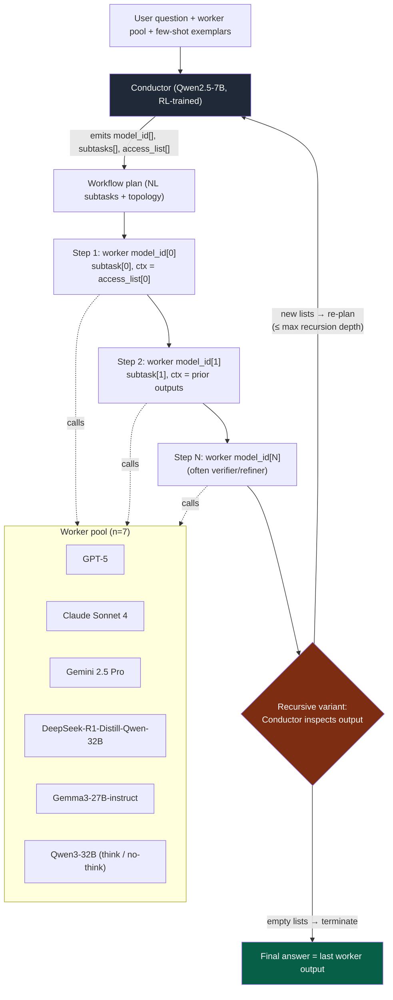

# The Conductor — Learning to Orchestrate Agents in Natural Language

> **Paper:** "Learning to Orchestrate Agents in Natural Language with the Conductor"
> **Authors:** Stefan Nielsen, Edoardo Cetin, Peter Schwendeman, Qi Sun, Jinglue Xu, Yujin Tang (Sakana AI)
> **Venue:** Accepted at ICLR 2026
> **arXiv:** 2512.04388 — primary source used: <https://arxiv.org/html/2512.04388v1>
> (abstract: <https://arxiv.org/abs/2512.04388> · Sakana blog: <https://sakana.ai/learning-to-orchestrate/>)
> One of the two research bases of Sakana's **Fugu** orchestration model (the other being TRINITY).

All quotes below are extracted via WebFetch from the arXiv HTML; section/figure/table references are as the fetcher reported them. Treat exact table numbers as best-effort (the HTML fetch was lossy on math/table rendering) — wording and numbers are quoted verbatim.

---

## 1. Overview

The paper introduces a **Conductor**: a small (7B) LLM trained with **reinforcement learning** to act as a *manager* that delegates a hard problem to a diverse pool of other LLMs ("workers"), rather than solving the problem itself.

Verbatim abstract opening:

> "Powerful large language models (LLMs) from different providers have been expensively trained and finetuned to specialize across varying domains. In this work, we introduce a new kind of Conductor model trained with reinforcement learning to automatically discover powerful coordination strategies among LLMs."

The Conductor learns two things jointly:
1. **Communication topology** — which workers talk to which, in what order, and what each one sees.
2. **Focused prompt engineering** — the natural-language subtask instructions handed to each worker, so each model's individual strength is maximally exploited.

> "The Conductor learns not only to design targeted communication topologies for effective agent-to-agent collaboration, but also to prompt engineer focused instructions to the LLMs to maximally leverage their individual capabilities."

Headline claim: a **7B Conductor beats every individual worker** (including GPT-5) on hard reasoning benchmarks (LiveCodeBench, GPQA, AIME25, BigCodeBench, MATH500, MMLU), and — trained with **randomized agent pools** — adapts to arbitrary open/closed-source worker sets:

> "By training with randomized agent pools, our conductor effectively adapts to arbitrary sets of open- and closed-source agents, meeting any user requirements."

Crucially, difficulty-adaptive: simple factual questions get routed to a single model; hard coding problems spin up a planner/coder/verifier pipeline. The Conductor used "an average of 3 steps, well below the requested limit despite being trained with no regularization."

---

## 2. The Mechanism

### 2.1 What the Conductor emits

The Conductor outputs an agentic workflow as **three parallel Python lists** (Figure 2):

- `model_id` — integer id of the worker assigned to each step
- `subtasks` — a natural-language subtask string per step
- `access_list` — for each step, which previous steps' outputs are visible to that worker

> "Each step specifies a string with a natural-language subtask, an integer id corresponding to the assigned worker agent responsible for performing that subtask, and an access list indexing which subtask solutions from the previous steps to include in the worker's context."

Example (Figure 2):

```python
model_id   = [2, 0]
subtasks   = ["Develop an efficient algorithm...", "Implement the algorithm..."]
access_list = [[], ["all"]]
```

Because the output medium is **natural language + free-form lists**, the expressible topologies span:

> "...agentic workflows ranging from simple best-of-N and sequential chain-like topologies to parallelizable arbitrary tree-structured approaches."

### 2.2 How workers are called

> "Each agentic workflow outputted by the Conductor is executed sequentially by prompting the specified worker agents with their assigned natural language subtask."

> "In each workflow step, the worker's context includes the sequence of previous subtasks and corresponding responses defined in the access list, simply provided as past messages in a conversational template."

Worker decoding settings: max **4096** completion tokens, temperature **0.2**.

### 2.3 The recursive call (Section 3.2)

The key trick: the Conductor can list **itself** as a worker, producing a recursive topology.

> "by allowing the Conductor to specify itself as a worker LLM, we give rise to a new kind of recursive topology."

Flow of a recursive call (Figure 12 / Figure 14, Appendix D): when re-invoked, the Conductor receives "its own parent output from which the call was instantiated, together with the previous agent's response." It then either:

- emits "a new sequence of up to `{max_number_of_routing_steps}` routing steps" (re-plan), **or**
- "pass[es] three empty lists for `model_id`, `subtasks`, and `access_list` to return this to the user as is" (terminate).

Infinite-loop guard:

> "We avoid infinite recursion loops by allowing recursive calls, after the initial root Conductor call, to occur only up to a specified maximum number."

### 2.4 Output integration

There is **no explicit aggregator/voting head**. The final answer is simply the last step's worker output:

> "The answer of the final model and subtask will be provided back as the final solution to the user."

The Conductor instead *learns* to place verification/refinement agents at the end of the workflow when correctness demands it.

### 2.5 Inference loop (forward pass)

1. **Input:** user question + description of the available workers (+ few-shot exemplars; see §3.5).
2. **Plan:** Conductor generates the three lists.
3. **Parse:** lists parsed into a step sequence (malformed output → reward 0; see §3).
4. **Execute:** for each step `i`, call `model_id[i]` with `subtasks[i]` and the prior outputs named in `access_list[i]`.
5. **Accumulate:** prior outputs are appended to later workers' contexts.
6. **Terminate / recurse:** return final worker output; or, in the recursive variant, the Conductor inspects the result and may re-plan up to the recursion cap.



---

## 3. RL Training Method

### 3.1 Algorithm — GRPO

> "the model is trained with GRPO (shao2024deepseekmath), a simple online RL algorithm."

**Objective (Eq. 1):**
`J(θ) = E[ 1/G · Σ ( min(r_i·A_i, clip(r_i, 1−ε, 1+ε)·A_i) − β·D_KL(π_θ‖π_ref) ) ]`

**Group-relative advantage (Eq. 2):**
`A_i = (r_i − mean({r_1,…,r_G})) / std({r_1,…,r_G})`

i.e. rewards are normalized against the group of `G` sampled completions per question. KL penalty `β` was **disabled (set to 0)** in practice.

### 3.2 Reward function

Two-tier, outcome-based:

- **Format gate:** "setting `r_i` to 0 for responses from which the Python lists of subtasks, worker ids, and access lists cannot be parsed."
- **Correctness:** "setting `r_i` to 1 if the final output from executing a well-formatted agentic workflow `o_i` matches the solution `s_i` and to 0.5 otherwise."

So: unparseable → 0, parseable but wrong → 0.5, parseable and correct → 1.

### 3.3 Dataset / tasks

> "Our training dataset comprises 960 problems from four reasoning domains."

Sources reported: **MATH500**, **MMLU**, **LiveCodeBench V1**, and **RLPR** (the fetch also surfaced larger pool counts e.g. MMLU 99,842 / RLPR 46,620, but the curated training set is the 960 problems across the four domains).

### 3.4 Rollout structure & hyperparameters

| Setting | Value |
|---|---|
| Algorithm | GRPO |
| Base model | **Qwen2.5-7B** |
| Questions / iteration | 4 |
| Rollouts / question (group G) | 64 (temp 1.0) → effective batch 256 |
| Training iterations | 200 |
| Learning rate | 1e-6 |
| Optimizer | AdamW (β1=0.9, β2=0.999) |
| LR schedule | Cosine, warmup ratio 0.03 |
| KL penalty β | 0 (disabled) |
| Max Conductor completion length | 1024 tokens |
| Worker decoding | max 4096 tokens, temp 0.2 |
| Compute | **2× NVIDIA H100 80GB** |

> "sampling 4 questions per iteration and generating 64 rollouts per question with a temperature of 1.0."
> "We use Qwen2.5-7B (hui2024qwen2) as our base model."
> "We train our Conductor on 2 NVIDIA H100 80GB GPUs."

### 3.5 Few-shot conditioning

The Conductor is primed with exemplar workflows:

> "is supplied with few-shot examples of known, successful coordination strategies."

Four exemplars, "one from each of [training] component tasks," chosen to "balance workflow steps and agent selection to encourage exploration." Ablation: +0.45 on MMLU with vs. without few-shot.

### 3.6 Randomized agent pools

For generalization to arbitrary worker sets, training restricts each question to a random subset:

> "restricting it for each question to a randomly sampled k-model subset from the larger total pool of n workers and accordingly modifying its input instructions."

Total pool **n = 7**; evaluation subsets used k ≤ 3 (e.g. the closed-source trio, or open-source-only). The pool-adaptive variant was finetuned with the same GRPO on "a small subset of questions already seen during training."

### 3.7 Worker pool (n = 7)

- **Closed-source:** GPT-5, Claude Sonnet 4, Gemini 2.5 Pro
- **Open-source:** DeepSeek-R1-Distill-Qwen-32B, Gemma3-27B-instruct, Qwen3-32B (with thinking + without thinking — counted as the variants making up the 7)

---

## 4. Results (exact numbers)

### 4.1 Main benchmarks — Conductor vs best single model (Table 1)

| Benchmark | Conductor (7B) | Best prior (GPT-5) | Δ |
|---|---|---|---|
| LiveCodeBench | **83.93** | 82.90 | +1.03 |
| GPQA-Diamond | **87.5** | 82.3 | +5.2 |
| MATH500 | **99.4** | 99.0 | +0.4 |
| MMLU | **94.1** | 93.5 | +0.6 |
| AIME25 | **93.3** | 90.8 | +2.5 |
| BigCodeBench | **37.86** | 32.75 | +5.11 |
| **Average (all tasks)** | **77.27** | 74.78 | +2.49 |

> "Average performance across all tasks was 77.27 for the Conductor versus 74.78 for GPT-5."

### 4.2 vs orchestration baselines (controlled / cost-matched, Table 7)

| Method | Average |
|---|---|
| RouterDC | 52.41 |
| Smoothie | 56.48 |
| MASRouter | 56.89 |
| Mixture-of-Agents (MoA) | 62.13 |
| **Conductor** | **72.35** |

> "The Conductor surpasses all baselines by substantive margins."

Also beats individual workers run with 5-turn self-reflection (single-pass Conductor > 5-turn reflection across all tested tasks).

### 4.3 Efficiency (Tables 5/6, Figure 5)

- MMLU cost-adjusted performance: **Conductor 103.49** vs **GPT-5 (5× consensus) 66.34**.
- Token/cost: **Conductor 1,820 tokens @ $0.02384** vs **MoA 11,203 tokens @ $0.04855**.
- "The Conductor far surpasses multi-agent baselines at a fraction of the cost" (Fig. 5).
- Average **~3 steps** per workflow despite no efficiency regularization.

### 4.4 Recursion ablation (Table 2)

| Task | Non-recursive | Recursive | Δ |
|---|---|---|---|
| BigCodeBench | 37.8 | **40.0** | +2.2 |
| GPQA-Diamond | 81.31 | **82.32** | +1.01 |
| AIME25 | 66.67 | 66.67 | 0 |

> "When allowed to specify itself as a worker LLM...the Conductor unlocks substantive additional gains."

**Verdict:** recursion helps modestly on the hardest coding/QA tasks (~+1 to +2 points) and is neutral on AIME25 — net positive but not the dominant driver.

### 4.5 Other ablations (Table 9)

- **Subtasks matter most:** with subtasks 64.29 vs without 58.62 on LiveCodeBench → **+5.67** (the NL prompt-engineering of subtasks is a large lever).
- **Few-shot:** +0.45 on MMLU.

### 4.6 Randomized-pool generalization (Figure 6)

When restricted to **open-source-only** workers, the finetuned Conductor beats Claude Sonnet 4 "by almost 10% within our constrained setting," and "entirely match[es] its pretrained performance" when restricted to closed-source workers.

---

## 5. How it differs from TRINITY

The paper frames the Conductor against prior routing/orchestration work; TRINITY (the other Fugu basis) is the contrasting design:

| Dimension | **Conductor (this paper)** | **TRINITY (evolved lightweight head)** |
|---|---|---|
| Output medium | **Natural language** — free-form subtasks + topology lists | Discrete selection from a pre-specified option set |
| Expressiveness | Arbitrary tree/chain/best-of-N + recursive self-call | Constrained to designed topologies / model picks |
| Learning signal | **RL (GRPO)**, outcome reward on executed workflow | Evolutionary search over a small head |
| What's learned | A generative policy that *writes* the workflow + prompts | A lightweight router that *picks* from options |
| Cost to train | 7B RL on 2×H100 | Cheaper evolved head |

The paper's own contrast with classifier-style routers (the family TRINITY belongs to):

> "These prior multi-agent strategies essentially train a router classifier to construct agentic workflows by simply selecting models and/or human-designed coordination topologies from a set of pre-specified options."

> "we place complete specification freedom in the Conductor by directly using natural language as its output medium."

Net: **Conductor = generative NL workflow author trained by RL** (more expressive, heavier). **TRINITY = evolved discrete router** (lighter, cheaper, less expressive). Fugu appears to combine both.

---

## 6. Limitations & compute notes

- **No dedicated Limitations section** in the fetched HTML. The Ethics statement flags: "the reliance of our method on expensive language models might further exacerbate the economic divide and barriers posed by AI."
- **Cost structure:** the Conductor itself is cheap (7B, 2×H100 to train), but inference cost is dominated by the frontier *workers* it calls. Net inference cost is still far below multi-agent baselines (§4.3).
- **No explicit aggregation:** final answer = last worker output; correctness depends on the Conductor learning to end with a verifier, which can fail for tasks where no learned end-verification pattern exists.
- **Sequential execution:** workflows are executed sequentially even when the topology is tree-structured (parallelism expressible but execution described as sequential).
- **Future work:** "an exciting, unexplored extension is to go beyond LLMs alone, introducing workers with expertise in other modalities."

---

## 7. What's reusable for a TypeScript reimplementation

A practical TS port does **not** need the RL training to capture most of the architecture — the inference-time orchestration is the reusable core. (You can ship the runtime first and treat the trained policy as optional/swappable with a strong prompted model.)

1. **Workflow IR = three parallel arrays.** Define a typed plan:
   ```ts
   interface WorkflowPlan {
     modelId: number[];        // worker index per step
     subtasks: string[];       // NL instruction per step
     accessList: (number[] | "all")[]; // visible prior steps per step
   }
   ```
   Parse with a strict validator; on parse failure, retry/repair (mirrors the format-gate reward = 0).

2. **Conductor = a prompted (or fine-tuned) model that emits `WorkflowPlan`.** Use structured output / JSON schema (e.g. via the AI SDK `generateObject`) to get the three arrays reliably. Prime with **4 few-shot exemplar workflows** (one per task family) — this is cheap and shown to help.

3. **Sequential executor with selective context.** For step `i`, build the worker message as: its `subtasks[i]` plus the conversational history of the steps named in `accessList[i]` (`"all"` = every prior step). Worker decode params: temp 0.2, generous max tokens.

4. **Pluggable worker pool behind a uniform interface.** A registry of named providers (GPT-5, Claude, Gemini, plus open-source via a gateway) indexed by integer id, with each worker's capabilities described in the Conductor's prompt. **Randomize the available subset per request** to make the Conductor robust to whatever pool the user has keys for (the paper's `k`-of-`n` trick).

5. **Recursive self-call as a bounded loop.** After executing the plan, optionally feed the parent plan + last output back to the Conductor; if it returns three empty arrays → terminate, else re-plan. Enforce a hard `maxRecursionDepth` and a max-steps cap.

6. **Final answer = last step output.** No voting/aggregator needed; instead encourage the Conductor's prompt to end hard tasks with a verifier/refiner step (the largest measured lever was *subtasks*, +5.67, i.e. invest in good subtask prompting).

7. **Difficulty adaptivity for free.** Because the plan length is model-chosen, easy queries collapse to a single-step single-model call — no special routing logic required; just don't over-regularize toward long plans.

8. **(Optional) RL later.** If you want to train your own Conductor: GRPO with the two-tier reward (0 / 0.5 / 1), group size ~64, 4 questions/iter, lr 1e-6, KL off, on a small curated set (~960 problems). Until then, a strong prompted Conductor + good few-shot exemplars recovers most of the architecture's value.

---

*Sources fetched 2026-06-22: <https://arxiv.org/html/2512.04388v1>, <https://arxiv.org/abs/2512.04388>, Sakana announcement <https://sakana.ai/learning-to-orchestrate/>. Quotes extracted via WebFetch over the arXiv HTML; math/table rendering was lossy in fetch, so exact table indices are best-effort — verify table numbers against the PDF if citing formally.*
