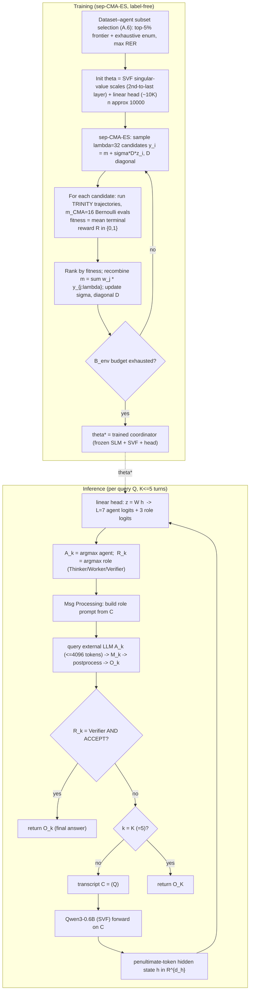

# TRINITY: An Evolved LLM Coordinator — Ground-Truth Deep Analysis

> Source: `2512.04695v3.pdf` (arXiv 2512.04695v3, 27 Apr 2026), 30 pages.
> Published as a conference paper at **ICLR 2026**.
> Authors: Jinglue Xu¹*, Qi Sun¹³*, Peter Schwendeman²† (intern), Stefan Nielsen¹, Edoardo Cetin¹, Yujin Tang¹.
> ¹ Sakana AI, Japan · ² University of Michigan, USA · ³ Institute of Science Tokyo, Japan. (* equal contribution)
>
> This document is extracted directly from the official PDF. Exact numbers here supersede any earlier HTML extraction. Equation/Table/Figure numbers are quoted as printed.

---

## 1. One-paragraph overview

TRINITY is a *macro-level* (data-flow / test-time) model-composition method: instead of merging weights, it trains a tiny **coordinator** that orchestrates a fixed pool of 7 diverse LLMs (3 closed API models + 4 open-source) over a multi-turn dialogue. The coordinator is a frozen small language model (SLM, **Qwen3-0.6B**) plus a **lightweight head (~10K params)** that reads the SLM's **penultimate-token hidden state** and emits two sets of logits: which model to call (L=7 logits) and which of three roles to assign — **Thinker / Worker / Verifier** (3 logits). It also lightly **fine-tunes the singular values (SVF)** of one chosen weight matrix (the second-to-last layer). The whole coordinator has **< 20K learnable parameters**. Because the per-parameter influence on the binary terminal reward is tiny and each evaluation requires costly LLM calls, the system is trained by a **derivative-free evolutionary strategy, sep-CMA-ES**, which the paper argues (theoretically via "block-ε-separability" + empirically) beats REINFORCE, SFT, and random search under high-dimensional, weak-correlation, tight-budget conditions. TRINITY beats single models and multi-agent routers across Math500, MMLU, RLPR, LiveCodeBench, sets a new SOTA pass@1 of **86.2% (0.862)** on LiveCodeBench v6 (Jan–Apr 2025), and transfers zero-shot to AIME, BigCodeBench, MT-Bench, GPQA-D, beating every constituent model.

---

## 2. Problem formulation (Section 2)

- `S` = set of interaction states `s` (original query + full multi-turn conversation so far).
- An SLM maps each state to a **representation state** `h(s) ∈ H ⊂ ℝ^d` (e.g. a penultimate-token hidden vector).
- A lightweight **coordination head** with parameters `θ ∈ P ⊂ ℝ^n` takes `h(s)` and outputs logits over a finite action set `A` of **agent–role pairs**:

  > `f_θ : H → ℝ^|A|`,  `π_θ(a | s) ∝ exp(f_θ(h(s))_a)`,  `a ∈ A`. (eq. in §2)

- The policy `π_θ` induces a distribution over **all multi-turn trajectories** `T`; a trajectory is `τ = (s₀, a₀, …, s_T)` with horizon `T ≤ B_turn` (fixed turn budget). A **terminal reward** `R(τ) ∈ {0,1}` is revealed at the end (binary).
- Objective: **`J(θ) := E_{τ∼π_θ}[R(τ)]`** — expected terminal reward.
- Each complete end-to-end run = one **atomic evaluation** = a Bernoulli draw of the terminal reward. Because each run involves multiple (costly) LLM calls, they seek `θ* ∈ arg max_{θ∈P} J(θ)` under a **tight atomic evaluation budget `B_env`** that counts individual Bernoulli calls of the terminal reward used in estimating `J(θ)` (e.g. via replication/averaging).

Key conceptual split: representation space `H` provides contextualization; coordination space `P` parametrizes policies over all trajectories.

---

## 3. The full method (Section 3 + Appendix A.4)

### 3.1 Backbone + head + input (Section 3.1, Figure 2)

- **SLM backbone:** pre-trained **Qwen3-0.6B** (~0.6B params), frozen except for SVF.
- **Lightweight head:** appended directly after the SLM's final hidden layer, operating *in parallel* to the base model's LM head. It projects a hidden state `h ∈ ℝ^d` to an output of size **L + 3**:
  - **L logits** for selecting an LLM (here L = 7),
  - **3 logits** for assigning one of three roles.
- **Input to head = the penultimate-token hidden state** (the hidden vector at the penultimate output-token position, marked "<Head Input>" in Figure 2). Rationale (§1, §3.1): the penultimate token's hidden state attends over the entire sequence and guides prediction of a special token (e.g. `<think>` or EOS), giving a stable, context-rich output distribution. Using an *earlier* token (penultimate) rather than waiting for full generation lets the coordinator make a **quick decision**; its generated text is **discarded** because prompting is delegated to the pool LLMs. This combination of extreme parameter efficiency + rapid inference is what makes training the whole system with ES "uniquely feasible," avoiding the data/compute overhead of imitation learning or RL.
- **SVF (singular-value fine-tuning):** inspired by Transformer² (Sun et al., 2025). For a *selected subset* of the SLM's weight matrices, perform an SVD and **learn only the singular-value scales**, keeping the orthogonal matrices `U`, `V` fixed. In the paper's main config, SVF is applied to **the second-to-last layer** of the 0.6B model.
- **Total learnable params kept below 20K** (orders of magnitude smaller than typical fine-tuning).

### 3.2 Tri-role coordination (Section 3.2, Figure 1)

Coordination proceeds over **at most K turns** for a user query `Q`. Let the transcript after `k−1` turns be `C_{k−1} = (Q, O₁, …, O_{k−1})`. At turn `k`, the coordinator:
1. selects an agent (LLM) `A_k` from pool `M`,
2. selects a role `R_k ∈ {Thinker (T), Worker (W), Verifier (V)}`,
3. prepares a brief **role-specific prompt** based on `C_{k−1}` (a "Msg Processing" module injects the role-specific prompt),
4. queries `A_k` to obtain message `M_k`,
5. lightly post-processes `M_k` into `O_k`, appended to the transcript for the next turn.

**The three roles (exact contracts):**
- **Thinker strategizes.** Analyzes current state and returns meta-level guidance: high-level plans, decompositions, or critiques of partial solutions. May propose a plan over subgoals (which the coordinator condenses into `O_k` to steer subsequent turns); may also specify the role of the next agent along with the plan.
- **Worker executes.** Acts directly on the task to make concrete progress (a derivation, code snippet, or numerical result). The coordinator extracts key information and stores it as `O_k`.
- **Verifier evaluates.** Checks whether the accumulated solution in `C_{k−1}` is correct, complete, and responsive to `Q`. Outputs a judgment `u_k ∈ {ACCEPT, REVISE}` and an optional diagnosis `δ_k`. The coordinator records `(u_k, δ_k)` as `O_k` and, if `u_k = ACCEPT`, signals termination.

**Termination condition (§3.2):**
> `τ = min{ k ≤ K : R_k = V and u_k = ACCEPT }`, with `τ = K` if no acceptance occurs.

i.e. the process halts the first time a **Verifier** is selected **and** it returns **ACCEPT** (final answer = `O_τ`); otherwise it runs to the fixed turn budget `K`.

- **Max turns (main experiments):** **K = 5** (max number of coordination turns set to five).

---

## 4. Head parameterizations (Appendix A.4, Table 6)

The head maps SLM hidden state `h ∈ ℝ^{d_h}` to agent+role logits `z ∈ ℝ^{n_a}` (here `n_a = L + 3 = 10`), then softmax or argmax. Four head families:

### Linear (eq. 5) — the winner
> `z = W h`,  `W ∈ ℝ^{n_a × d_h}`.
- Affine map, **no bias**. Exactly `d_h · n_a` trainable params.
- Strong baseline; allows unrestricted linear combinations of hidden dims.

### Low-rank (eq. 6–8)
> `u = ELU(U h)`,  `z = V u · σ`.
- `U ∈ ℝ^{r × d_h}`, `V ∈ ℝ^{n_a × r}`, fixed non-trainable scalar scale `σ ∈ ℝ`.
- ELU with `α = 0.1` (`ELU(x)=x` if `x≥0`, `α(e^x − 1)` if `x<0`).
- Bottleneck fixed to **r = 14**. Note: this is *more* params than a strict low-rank (it adds depth + nonlinearity). Xavier-uniform init with adaptive gains (eq. 8): `U ~ U(−√(6/(d_h+r)), √(6/(d_h+r)))`, `V ~ U(−√(18/(r+n_a)), √(18/(r+n_a)))`.

### Sparse (eq. 9–11)
> `z = W (h ⊙ α)`,  `W ∈ ℝ^{n_a × d_h}`.
- `α ∈ ℝ^{d_h}` is a learnable selection vector. Target #active dims `k = max(1, ⌊d_h·(1 − sigmoid(ρ))⌋)` with learnable sparsity logit `ρ`.
- Training uses a differentiable top-k via Gumbel noise + temperature `τ ∈ [1.0, 20.0]`: `s̃ = (s+ε)/τ`, `ε ~ Gumbel(0,1)`; `α_soft = TopK_soft(s̃, k)·k`, normalized; inference uses hard top-k binary mask `α = TopK_hard(s, k)`.
- Params: `d_h n_a + d_h + 2` (projection weights, importance scores, temperature, sparsity logit). Offers regularization + interpretability.

### Block-diagonal (eq. 12)
> `W = diag(W₁,…,W_B)` block matrix; `z = [W₁h₁; W₂h₂; …; W_Bh_B]`, with `h = [h₁;…;h_B]`, `W_i ∈ ℝ^{a_i × h_i}`.
- **Block-diagonal-2:** `B = 2`, partitions hidden + agent/role dims proportionally (`a_i = min(⌈n_a/2⌉, n_a − Σ_{j<i} a_j)`; `h_i = ⌊a_i d_h / n_a⌋` for i<2, remainder for i=2). Moderates parameter correlations.
- **Block-diagonal-10:** the **high-independence** case for the n_a=10 logits setting. One block per agent/role (`B=10`, `a_i=1`), `z_j = w_jᵀ h_j`, distributing hidden dims as evenly as possible (`h_j = ⌊d_h/10⌋+1` if `j ≤ (d_h mod 10)`, else `⌊d_h/10⌋`). Maximizes independence across the ten logits; intentionally suppresses inter-logit correlations. Used with **argmax** output conversion (no softmax simplex constraint) to maximize block independence.

### Table 6 — Parameter sizes (computed for Qwen3-0.6B)

| | SVF | linear | low-rank | sparse | block-diagonal-2 | block-diagonal-10 |
|---|---|---|---|---|---|---|
| **Parameter Size** | 9216 | 10240 | 20680 | 11266 | 5120 | 1024 |

Notes: with `d_h = 1024`, `n_a = 10`: linear = 1024×10 = 10,240. block-diagonal-10 = 1,024 (exactly 10× fewer than linear). low-rank ≈ 2× linear (depth + nonlinearity, r=14). SVF (second-to-last layer) = 9,216 params. Main config = **linear head (10,240) + SVF (9,216) ≈ 19,456 < 20K**.

### Table 3 — Which head wins (results by varying head + output conversion; default output = softmax, block-diagonal-10 uses argmax)

| Head | LiveCodeBench | MATH500 | MMLU | RLPR |
|---|---|---|---|---|
| **linear** | **0.615** | **0.880** | 0.916 | **0.401** |
| low-rank | 0.597 | 0.770 | 0.914 | 0.344 |
| sparse | 0.400 | 0.811 | **0.917** | 0.372 |
| block-diagonal-2 | 0.336 | 0.776 | 0.897 | 0.378 |
| block-diagonal-10 + argmax | 0.551 | 0.812 | 0.802 | 0.376 |

**Linear is the most reliable overall** (wins LiveCodeBench, MATH500, RLPR), with sparse edging it on **MMLU only by a negligible margin** (0.917 vs 0.916). block-diagonal-10 with argmax remains competitive mid-tier despite ~10× fewer head params — cited as evidence of **block-ε-separability** of the *coordination objective* (in addition to the geometric separability of hidden states in §4.6).

---

## 5. Learning with an evolutionary strategy (Section 3.3 + Appendix A.1, A.5)

### Why CMA-ES, not REINFORCE/SFT/RS (the separability argument)
- Parameters exhibit **weak coupling** — each has only a tiny influence on the scalar reward → REINFORCE's per-parameter gradients are **low-SNR**, ill-conditioned, poor credit assignment, unstable.
- Binary terminal rewards + costly per-step LLM inference → tight budgets.
- The optimization problem (representation + coordination space) exhibits **strong block-ε separability (Definition 1)**: most informative signal is concentrated *within blocks*; inter-block interference is negligible. This geometry favors **diagonal** methods (sep-CMA-ES keeps only a diagonal covariance) and undermines REINFORCE (noisy global returns swamp inter-block signals).
- Empirical evidence: in the extremely budget-tight scenario (**1.5k–40k evaluations for a ~10k-dimensional problem**), sep-CMA-ES significantly outperforms RL and random search.

### sep-CMA-ES setup
- Black-box ES: maintains a central "parent" policy (mean iterate `m_t ∈ P`, radius `r_t := ‖m_t‖`, step-size `σ_t > 0`), samples a population of perturbed parameter vectors, scores each (fitness), recombines via fitness-weighted averaging to form the next parent. Unlike full CMA-ES, it maintains **only a diagonal covariance** `D_t = diag(√s_{1,t}, …, √s_{n,t})` → well suited to block-diagonal landscapes.
- **Sampling:** `y = m_t + σ_t D_t z`, `z ~ N(0, I_n)`.
- **Population size:** `λ = ⌈4 + 3 ln n⌉` (`≥ 2`); `μ` parents with weights `(w_j)_{j=1}^μ`.
- **Replication counts (evals per candidate):** `m_CMA / m_RS` — number of Bernoulli evals per candidate.
- **In this study's specific regime:** `n ≈ 10000`, so `λ = ⌈4 + 3 ln 10000⌉ = 32`; `m_CMA = 16`, `m_RS = 32`.
- **Fitness / objective:** the same `J(θ) = E_{τ∼π_θ}[R(τ)]` (expected binary terminal reward), estimated by replication/averaging of atomic Bernoulli evaluations within `B_env`.
- **Reward `R(τ) ∈ {0,1}`:** terminal correctness of the final answer `O_τ` on the task (binary), revealed only at trajectory end.

### Theory summary (Appendix A.1, Propositions 1–2)
- `T` = optimization iteration count. For small-`T`, **Proposition 1** shows sep-CMA-ES's improvement grows roughly **linearly with the number of iterations**, while random search (RS) grows only with the **logarithm** of how many candidates it can test → for modest `T`, sep-CMA-ES > RS.
  - Specific: budget matching yields ≈ 16T RS candidates; gain ratio behaves like `(T / ln(16T)) · η²` (`η` = reliability factor in (0,1], usually close to 1) → ratio > 1 even for small `T`.
  - Head-to-head bound (eq. 4): `CMA gain / RS gain ≳ (κ̄_{μ,λ}/2)·(B_env/(m_CMA λ))·((n+2√(n ln N)+2 ln N)/v_N²)·(ρ̃_CMA²/ρ̃_RS²) − C ε_H`, with `v_N² ~ 2 ln N`.
- **Proposition 2:** after `n` calibration iterations, sep-CMA-ES enters a steady regime where each step reduces remaining error by a fraction of order `1/n` (rate constant `κ̄_{μ,λ} = Θ(1)`). RS keeps gaining only logarithmically. So as `T` grows, sep-CMA-ES improves and the gap widens. Restricting to diagonal covariance costs only an `O(ε_H)` multiplicative loss vs the block-diagonal optimum.
- The formal separability condition is **Definition 1 (Hessian-based block-ε separability in P)**: there's a structural diagonal scaling `S = diag(s₁,…,s_n) ≻ 0` making the scaled Hessian `H_S(θ) = S^{1/2} H(θ) S^{1/2}` uniformly nearly block-diagonal on `D`, with off-block coupling `≤ ε_H` (bounds B1–B3).

### Empirical comparison — Table 4: sep-CMA-ES vs REINFORCE / SFT / RS (in-distribution, comparable budgets)

| Method | LiveCodeBench | MATH500 | MMLU | RLPR |
|---|---|---|---|---|
| REINFORCE | 0.253 | 0.459 | 0.500 | 0.266 |
| RS | 0.374 | 0.794 | 0.897 | 0.345 |
| SFT | 0.592 | 0.786 | 0.906 | 0.360 |
| **sep-CMA-ES** | **0.615** | **0.880** | **0.916** | **0.401** |

- sep-CMA-ES wins on all four. REINFORCE: jagged, high-variance learning (expected under binary terminal rewards + weak param correlation) and an almost-uniform selection pattern → ineffective policy improvement (Figure 6, right). RS often collapses to **unipolar** choices (over-selects a single agent/role) → degrades performance. SFT competitive but **does not scale to multi-turn** due to prohibitive label-generation cost (Appendix A.2).
- **Figure 6:** LLM-selection distribution evolves toward favoring high-performing LLMs under sep-CMA-ES (left); stays nearly uniform under REINFORCE (right).

### REINFORCE / RS / SFT baseline configs (Appendix A.5)
- **REINFORCE:** batch size = sep-CMA-ES's per-iteration eval size; ran **60 iterations**.
- **RS with fitness averaging:** 32 trials per sampled parameter vector, continued until total trials matched sep-CMA-ES's eval count. Sampling range warmstarted by calibrating to sep-CMA-ES weights: sample uniformly from **[−0.5, 0.5]** (slightly exceeds observed weight extrema).

### SFT cost blow-up (Appendix A.2.2) — why SFT can't scale to multi-turn
- Direct single-step mapping: 3 seeds × 7k datapoints × 7 agents = **147k LLM queries** (feasible).
- Multi-turn (5 turns, 7 agents, 3 roles): agent selection alone scales by `7^4 ≈ 2.4×10³`; role selection adds `3^5 = 243 ≈ 2.4×10²`. Total multiplicative factor `7^4 · 3^5 = 583,443 ≈ 5.8×10⁵`, inflating cost to ≈ `1.5×10⁵ × 5.8×10⁵ ≈ 8.7×10¹⁰` LLM queries → intractable. Label-free ES methods (sep-CMA-ES, REINFORCE, RS) need **no label generation**.

### Pseudocode (transcribed / reconstructed)
> The paper provides **no explicit algorithm box**; the procedure below is reconstructed from §3.2, §3.3, and Appendix A.1/A.5. Flagged as reconstruction, not a verbatim transcription.

```
# ---- Inference: one TRINITY coordination run for query Q ----
function TRINITY_RUN(Q, theta, pool M, SLM, K=5):
    transcript C = (Q,)
    for k = 1 .. K:
        h = SLM.penultimate_hidden_state(C)          # ℝ^{d_h}, SLM has SVF-scaled weights
        z = head_theta(h)                            # ℝ^{L+3}; first L = agent logits, last 3 = role logits
        A_k = argmax(z[0:L])                          # select LLM (softmax/argmax per head)
        R_k = argmax(z[L:L+3])                        # role in {Thinker, Worker, Verifier}
        prompt = build_role_prompt(R_k, C)           # Msg Processing injects role-specific prompt
        M_k = A_k.query(prompt)                       # external LLM call (max 4096 out tokens, min reasoning)
        O_k = postprocess(M_k, R_k)
        C = C + (O_k,)
        if R_k == Verifier and verdict(O_k) == ACCEPT:
            return O_k                                # termination
    return O_K                                        # budget exhausted

# ---- Training: sep-CMA-ES ----
function TRAIN(SLM, head_family, dataset, B_env):
    n = dim(theta)                  # ≈ 10000 incl. SVF + head
    lambda = ceil(4 + 3*ln(n))      # = 32 for n≈10000
    mu, weights = default_cma_weights(lambda)
    m = init_mean(); sigma = init_step(); D = diag(ones(n))   # diagonal covariance only
    while budget B_env not exhausted:
        for i = 1 .. lambda:
            y_i = m + sigma * D * z_i,  z_i ~ N(0, I_n)
            fit_i = mean over m_CMA Bernoulli runs of R(TRINITY_RUN(.; y_i))   # estimate J(y_i)
        rank candidates by fit_i (descending)
        m = sum_j weights_j * y_{j:lambda}            # fitness-weighted recombination
        update sigma, D (sep-CMA-ES diagonal adaptation)
    return m   # = theta*
```

---

## 6. The model pool (7 models) — Section 4.1 + Appendix A.7.2 (Figure 15)

Mapped agent IDs (Figure 15):
- **A0: GPT-5** (OpenAI, 2025) — closed
- **A1: Claude-4-Sonnet** (= Claude-Sonnet-4-20250514, Anthropic 2025) — closed
- **A2: Gemini-2.5-pro** (Comanici et al., 2025) — closed
- **A3: DeepSeek-R1-Distill-Qwen-32B** (Guo et al., 2025) — open
- **A4: Gemma-3-27B-It** (Team et al., 2025) — open
- **A5: Qwen3-32B (reasoning)** — open
- **A6: Qwen3-32B (direct)** — open (same checkpoint as A5, non-reasoning mode)

i.e. **3 top-tier closed-source + 4 well-known open-source** (note Qwen3-32B appears twice as reasoning vs direct modes). Coordinator SLM = **Qwen3-0.6B** (separate from pool).

---

## 7. Experiments (Section 4)

### 7.1 Setup (Section 4.1, Appendix A.6, A.7)
- Coordinator: Qwen3-0.6B + single linear head (10K) + SVF on second-to-last layer.
- **In-distribution tasks (train + test):** MATH500, MMLU, RLPR, LiveCodeBench. Trained on each task's designated train set, evaluated on official test split.
  - **LiveCodeBench:** train on **V1 (400 samples)**; evaluate on **newly-introduced V6 questions (175 samples)** (Jan–Apr 2025).
- **Output token cap:** 4096 max generated tokens per LLM, **minimal reasoning effort**, for consistency between open/closed models.
- **Max coordination turns = 5.**
- **OOD / held-out (zero-shot transfer):** AIME2025, BigCodeBench, MT-Bench, GPQA-D.
- **Baselines:** multi-agent routers MasRouter, RouterDC, Smoothie, MoA, Random agent selection; single LLMs (GPT-5, Gemini-2.5-pro, Claude-4-Sonnet) at **4K and 20K (=5×CTX)** inference tokens; **self-reflection over 5 turns (5×SR)**; **majority-voting@5**; **LLM-as-coordinator** (Gemini 2.5 pro). "Per-Question-Best" = upper bound (union of all correct answers across the 7 models).

### 7.2 In-distribution results (Figure 3) — exact numbers read from bars

Figure 3 four panels. Bars (left→right) per panel:

**Math500:** Gemini Pro 2.5: 0.85/0.90; Gemini Pro 2.5 (5×CTX): 0.83/0.90; Sonnet 4: 0.74/0.76; Sonnet 4 (5×CTX): 0.69/0.77; GPT-5: 0.72; GPT-5 (5×CTX): (—); Random: 0.83; MoA: 0.59; RouterDC: 0.77; Smoothie (indep): 0.77; Smoothie (DM): (—); **TRINITY: 0.91**; Per-Question-Best: 0.91. (TRINITY ≈ tied with per-question-best.)

**MMLU:** Gemini Pro 2.5: 0.92/0.92; Gemini Pro 2.5 (5×CTX): 0.91/0.91; Sonnet 4: 0.90/0.90; Sonnet 4 (5×CTX): 0.91/0.92; GPT-5: 0.84; MoA: 0.83/0.83/0.84; Random: ~0.84; Smoothie: 0.90; **TRINITY: 0.92**; Per-Question-Best: 0.97.

**RLPR:** Gemini Pro 2.5: 0.40/0.40; Gemini Pro 2.5 (5×CTX): 0.39; Sonnet 4: 0.33/0.32; Sonnet 4 (5×CTX): 0.32/0.32; GPT-5: 0.32; Random: 0.38; MoA: 0.28; RouterDC: 0.34/0.34; Smoothie: 0.41; **TRINITY: 0.41**; Per-Question-Best: 0.61.

**LiveCodeBench:** Gemini Pro 2.5: 0.46/0.47; Gemini Pro 2.5 (5×CTX): (—); Sonnet 4: 0.38/0.38; Sonnet 4 (5×CTX): 0.35; GPT-5: 0.579/0.58/0.58; Random: 0.25; MoA: 0.39; RouterDC/Smoothie: 0.35/0.31/0.31; **TRINITY: 0.61**; Per-Question-Best: 0.65.

Headline claims (§4.2, abstract): mean relative error reduction of **21.9%** over the second-best approach across the four in-distribution benchmarks; **11.76% relative error reduction on MATH500** vs 2nd-best (Gemini Pro 2.5 with 5×CTX). TRINITY achieves **0.61 pass@1 on LiveCodeBench v6**. Notably, some routers degrade *below* random (e.g. RouterDC's RLPR = 0.28 vs random's 0.32).

> Note: exact in-distribution headline figures for TRINITY are stated more precisely in Table 2 (first row) and Table 3 (linear row): **LiveCodeBench 0.6146 (61.46), MATH500 0.880 (88.00), MMLU 0.9156 (91.56), RLPR 0.4072 (40.72)**, Average **70.44**.

### 7.3 Zero-shot transfer — Table 1 (Performance Across Hold-Out Tasks)

| Model | AIME | BigCodeBench | MT-Bench | GPQA-D | Average |
|---|---|---|---|---|---|
| Gemini Pro 2.5 | 46.67 | 35.10 | 9.37 | 75.25 | 52.34 |
| GPT-5 | 46.67 | 33.80 | 9.35 | 72.73 | 51.07 |
| Claude-4-Sonnet | 35.33 | **35.80** | 9.28 | 67.30 | 46.14 |
| Qwen3-32B (reasoning) | 23.33 | 20.90 | 8.99 | 59.09 | 34.44 |
| DeepSeek-R1-Qwen-32B | 30.00 | 24.30 | 8.43 | 51.01 | 35.10 |
| Qwen3-32B (direct) | 20.00 | 23.00 | 9.03 | 54.05 | 33.46 |
| Gemma-3-27B-IT | 20.00 | 20.30 | 8.76 | 33.33 | 21.38 |
| **TRINITY (Ours)** | **50.00** | **35.80** | **9.60** | **76.82** | **54.21** |

TRINITY: highest average (54.21), top on AIME (50.00), MT-Bench (9.60), GPQA-D (76.82), **ties for first** on BigCodeBench (35.80, tied with Claude-4-Sonnet). Beats every individual model on every held-out task.

### 7.4 Unleashing full power (Section 4.4, Figure 4)
- For LiveCodeBench, removing the open-source output-length constraint narrows coordinator's LLM selection to the **three closed models** (constraints removed, no retraining).
- **Figure 4 (top):** TRINITY reaches SOTA **pass@1 = 0.862** on LiveCodeBench V6 (Jan–Apr 2025). Constituent model scores: GPT-5 = 0.838 (±0.007), Gemini 2.5-Pro = 0.672 (±0.031), Claude-4-Sonnet = 0.465 (±0.010). TRINITY = **0.862 (±0.005)**.
- **Figure 4 (bottom):** TRINITY improves with max-turn budget: **0.823 → 0.863 as turns increase from 2 to 6** (a Math500/LCB curve over Maximum Turns 2,4,6).

### 7.5 Ablations — Table 2 (in-distribution)

| Method | LiveCodeBench | MATH500 | MMLU | RLPR | Average |
|---|---|---|---|---|---|
| **TRINITY** | **61.46** | **88.00** | 91.56 | 40.72 | **70.44** |
| w/o Singular value fine-tuning | 55.68 | 85.85 | 90.10 | 39.77 | 67.85 |
| w/o Thinker-role selection | 57.80 | 86.20 | **92.75** | 38.00 | 68.69 |
| w/o Tri-role selection | 58.28 | 91.64 | 91.64 | 36.15 | 67.02 |
| w/ Last token | 50.85 | 87.00 | 82.19 | 38.60 | 64.66 |
| Claude-4-Sonnet only | 39.09 | 82.25 | 88.23 | 34.90 | 61.12 |
| Gemini Pro 2.5 only | 46.51 | 83.05 | 79.41 | **43.00** | 62.99 |
| GPT-5 only | 59.54 | 75.66 | 90.74 | 37.87 | 65.95 |

Ablation takeaways:
- **Remove SVF** → consistent drop (avg 70.44 → 67.85): confirms benefit of adapting the coordinator's internal representation directly.
- **Remove Thinker role**, then **remove entire tri-role selection** → detrimental to complex reasoning: MATH500 −6.0 points, RLPR −4.57 points (relative to full TRINITY). (Note: the printed "w/o Tri-role" MATH500 cell reads 91.64, but the text states tri-role removal causes substantial degradation; treat MATH500 row value as printed and flag the apparent inconsistency below.)
- **Use last token instead of penultimate** → severe collapse, especially LiveCodeBench (drop >10 pts: 61.46 → 50.85; MMLU 91.56 → 82.19) — last token often = semantically sparse EOS.
- **Remove agent selection but keep role selection** (ablation (5)) → "performance significantly undermined" (text; not given a distinct numeric row beyond the description).

### 7.6 Separability in representation space (Section 4.6, Figure 5; Appendix A.3, Figs 8–14)
- Penultimate-token hidden states are highly task-separable. **Linear SVM achieves perfect (1.000 ± 0.000) classification of task type** (chance = 0.25 for 4 classes); t-SNE shows clear clusters.
- **Figure 12 (SVM on SLM hidden states):** Linear SVM (task type) = 1.000, RBF SVM (task type) = 1.000, Linear SVM (agent selection) = 0.713, RBF SVM (agent selection) = 0.776.
- **Figure 13 (SVM on output logits / coordination space):** Linear SVM (task type) = 0.945, RBF SVM (task type) = 0.955, Linear SVM (agent selection) = 0.786, RBF SVM (agent selection) = 0.783. (Head compresses/reorients toward decision-aligned axes: task-type acc drops, agent/role acc rises.)
- **Figure 9 (LDA):** Fisher's ratios ≈ 2–3× (between-class scatter > within-class); reported separability 0.993 (SLM agent selection), 0.997 (head agent selection).
- **Per-task agent-selection SVM accuracies** (predict agent selection from SLM hidden states): LiveCodeBench 0.844, MATH500 0.764, MMLU 0.679, RLPR 0.544 — aligns with where TRINITY shows biggest gains (LCB, MATH500 > MMLU, RLPR).
- **Figure 14:** synthetic datasets (1024 dims, 7 agent classes, 4 task clusters) varying separability index → strong positive correlation between separability index and the *linear* head's test classification accuracy.

### 7.7 Agent selection behavior (Appendix A.7.2, Figure 15 + Table 5, Figure 7)

**Figure 15 — selection % by task (rows = task, cols = agent A0..A6):**

| Task | A0 GPT-5 | A1 Claude | A2 Gemini | A3 DeepSeek | A4 Gemma | A5 Qwen-R | A6 Qwen-D |
|---|---|---|---|---|---|---|---|
| LCB | 87.9 | 9.3 | 2.3 | 0.0 | 0.0 | 0.0 | 0.5 |
| math500 | 9.2 | 5.3 | 82.2 | 0.0 | 0.0 | 0.0 | 3.4 |
| mmlu | 24.7 | 74.3 | 1.0 | 0.0 | 0.0 | 0.0 | 0.0 |
| rlpr | 22.2 | 16.3 | 59.4 | 0.0 | 0.0 | 0.0 | 2.1 |

Strong task-aware specialization: GPT-5 dominates coding; Gemini dominates math/RLPR; Claude dominates MMLU. (Open-source 32B models rarely selected at the constrained token budget.)

**Table 5 — Agent label distribution by task (SFT oracle "best-via-majority-vote" labels), % (count):**

| Agent | LiveCodeBench | MATH500 | MMLU | RLPR | Overall |
|---|---|---|---|---|---|
| Gemini Pro 2.5 | 17.7% (31) | 18.0% (18) | 16.1% (247) | **17.3% (898)** | 17.1% (1194) |
| GPT-5 | **39.4% (69)** | 13.0% (13) | **16.4% (251)** | 14.7% (762) | 15.7% (1095) |
| Claude-4-Sonnet | 17.7% (31) | **21.0% (21)** | 14.4% (221) | 14.6% (748) | 14.6% (1021) |
| Qwen3-32B (reasoning) | 7.4% (13) | 12.0% (12) | 12.9% (198) | 15.1% (781) | 14.4% (1004) |
| DeepSeek-R1-Qwen-32B | 3.4% (6) | 15.0% (15) | 14.6% (224) | 14.5% (750) | 14.2% (995) |
| Qwen3-32B (direct) | 10.9% (19) | 17.0% (17) | 16.3% (249) | 14.3% (739) | 14.6% (1024) |
| Gemma-3-27B-IT | 3.4% (6) | 4.0% (4) | 9.2% (141) | 9.8% (506) | 9.4% (657) |

### 7.8 Baseline detail tables

**Table 7 — Majority@5 on MMLU:** Gemini Pro 2.5 = 91.57 ±0.70; GPT-5 = 91.31 ±0.23; Claude-4-Sonnet = 90.99 ±0.39.

**Table 8 — TRINITY vs LLM-as-Coordinator:**

| Method | Math500 | MMLU | RLPR | LiveCodeBench | Avg |
|---|---|---|---|---|---|
| TRINITY | 88.00 | 91.56 | 40.72 | 61.49 | 70.44 |
| Gemini 2.5 pro as Coordinator | 78.67 | 83.26 | 26.83 | 26.28 | 53.76 |

(Prompting a closed LLM to do coordination is far worse — it can't capture agents' inherent characteristics; that knowledge must be learned via training.)

**Tables 9–12 — Token efficiency (avg output tokens):**

*Table 9 (coordination methods):* TRINITY = 2,853 / 1,200 / 2,141 / 1,999 (Math500/MMLU/RLPR/LCB). MoA = 6,871 / 5,218 / 11,086 / 21,634. RouterDC = 624 / 374 / 811 / 1,552. Smoothie = 6,472 / 4,718 / 10,580 / 17,864. MASRouter = 4,260 / 1,847 / 5,370 / 8,401. → TRINITY far cheaper than MoA/Smoothie.

*Table 10 (5× Self-Reflection per model):* e.g. GPT-5 = 577/428/895/1,971; Gemini-2.5-Pro = 5,142/5,460/6,710/11,046; DeepSeek-R1-Distill = 3,988/3,811/4,609/12,228. (full per-model table in PDF p.29)

*Table 11 (5× Context):* per-model lower token counts (e.g. GPT-5 = 221/66/219/1,207).

*Table 12 (Default Context 4096):* per-model (e.g. GPT-5 = 218/66/220/1,113; Gemini-2.5-Pro = 819/578/774/2,396; DeepSeek-R1-Distill-32B = 1,175/485/1,181/3,443).

---

## 8. Dataset–agent subset selection (Appendix A.6)
- Selection of the pool + dataset curriculum cast as **joint subset selection** maximizing **Relative Error Reduction (RER)**:
  > `RER(C, M') = (Z_{C,M'} − S*_{C,M'}) / (1 − S*_{C,M'})` (eq. 14), where `Z` = best-per-dataset coordinated accuracy, `S*` = best single-agent baseline.
  > `(C*, M*) = arg max_{C⊆D, M'⊆M} RER(C, M')` (eq. 15).
- Principles: evaluate gains in *error space*; enforce **complementarity, not strength** (so coordinator exploits heterogeneous capabilities).
- Procedure: build performance matrix `E(D_y, M_x)`; **top-5% frontier filter** `K_95 = {(D_y, M_x): E ≥ τ}` (τ = 95th percentile, eq. 16); then **exhaustive enumeration** over candidate pairs satisfying coverage constraint (tractable at this scale); ties broken by **diversity** (favor balanced mix of reasoning agents + direct-inference agents). Scales poorly as `|D|+|M|` grows → heuristics (greedy seed + annealed/beam refinement) suggested for larger regimes.

---

## 9. Training pipeline (mermaid)



---

## 10. Hyperparameters & compute (consolidated)

| Item | Value | Source |
|---|---|---|
| Coordinator SLM | Qwen3-0.6B (frozen except SVF) | §4.1 |
| Head (main) | linear, no bias, `z = Wh`, `W ∈ ℝ^{10×1024}` | eq.5, §4.1 |
| Head params (linear) | 10,240 | Table 6 |
| SVF location | second-to-last layer of 0.6B | §4.1 |
| SVF params | 9,216 | Table 6 |
| Total learnable | < 20K (≈19,456 main) | abstract, §3.1 |
| Hidden dim `d_h` | 1024 | implied (Table 6 math, Fig 14) |
| Output logits `n_a` = L+3 | 10 (L=7 models + 3 roles) | §3.1, A.4 |
| Roles | Thinker, Worker, Verifier | §3.2 |
| Max turns K | 5 | §4.1 |
| Output token cap (LLMs) | 4096, minimal reasoning effort | §4.1 |
| Optimizer (main) | sep-CMA-ES | §3.3 |
| Problem dim `n` | ≈ 10000 | A.1 |
| Population `λ` | ⌈4 + 3 ln n⌉ = 32 | A.1, §3.3 |
| `m_CMA` (CMA evals/candidate) | 16 | A.1 |
| `m_RS` (RS evals/candidate) | 32 | A.1 |
| Budget regime | 1.5k–40k evals for ~10k-dim problem | §1, §3.3 |
| REINFORCE config | batch = ES per-iter eval size; 60 iterations | A.5 |
| RS config | 32 trials/vector; sample U[−0.5, 0.5] | A.5 |
| SFT optimizer | Adam, lr 1e−6, batch 64, train only linear head | A.2.1 |
| SFT achieved | 0.592 / 0.786 / 0.906 / 0.360 (LCB/M500/MMLU/RLPR) | A.2.1 |
| Low-rank bottleneck r | 14 | A.4 |
| Sparse Gumbel temp τ | [1.0, 20.0] | A.4 |
| LCB train/test | V1 (400) / V6 (175) | §4.1 |

Compute: not given in FLOPs/GPU-hours. Acknowledgements thank Koshi Eguchi & Kou Misaki for infrastructure. Reproducibility statement: source code + trained weights + all model/task selection decisions provided in supplementary material; all base models and datasets are publicly available.

---

## 11. Limitations (Section 6 + scattered)
- **Tool execution gap (primary stated limitation):** the system can *devise* abstract plans involving tools but **cannot yet act on them / execute** (no grounded execution). Future work = integrate code interpreters + APIs into a more heterogeneous agent pool.
- **Verbose reasoning hurts formatting** — Qwen3-32B reasoning mode underperforms direct mode on BigCodeBench because verbose reasoning causes formatting failures in some test cases (§4.3).
- **Open-source serving constraints** forced a 4096-token cap in main experiments (hardware constraints), limiting fair-comparison head-room (lifted only in §4.4 with closed models).
- **Subset selection scales poorly** — exhaustive enumeration intractable as `|D|+|M|` grows; needs heuristics (A.6).
- **SFT doesn't scale** to multi-turn (label-cost blow-up) — restricts the supervised path (A.2.2).

---

## 12. What a faithful TS/Python reimplementation needs

**Backbone & head**
- Load **Qwen3-0.6B** with `output_hidden_states=True`. Take the hidden state at the **penultimate output-token position** of the final layer (NOT the last/EOS token — that ablation collapses; NOT mean-pooled). `d_h = 1024`.
- Implement **SVF** on the **second-to-last transformer layer's** weight matrices: precompute SVD `W = UΣVᵀ`, freeze `U, V`, learn a per-singular-value scale vector (reconstruct `W' = U diag(σ_learned) Vᵀ` per forward). ~9,216 trainable scalars.
- **Linear head:** `W ∈ ℝ^{10×1024}`, no bias, `z = W h`. First 7 logits → softmax/argmax over the 7-model pool; last 3 logits → softmax/argmax over {Thinker, Worker, Verifier}. (Optionally implement low-rank/sparse/block-diagonal per A.4 for ablations — exact eqs above.)

**Coordination loop**
- Max **K = 5** turns. Maintain transcript `C = (Q, O₁, …)`. Each turn: forward SLM on full transcript → head → pick agent + role → build a **role-specific prompt** (3 distinct prompt templates: Thinker=plan/decompose/critique; Worker=execute/derive/code; Verifier=judge ACCEPT|REVISE + diagnosis) → call external LLM (cap 4096 out, minimal reasoning) → postprocess to `O_k`.
- **Termination:** stop the first turn where role=Verifier AND verdict=ACCEPT; else run to K. Need a parser to extract the ACCEPT/REVISE verdict from the verifier's output.
- Discard coordinator's *generated text*; only logits matter.

**Pool wiring**
- 7 model adapters: GPT-5, Claude-4-Sonnet (claude-sonnet-4-20250514), Gemini-2.5-pro (closed APIs); DeepSeek-R1-Distill-Qwen-32B, Gemma-3-27B-It, Qwen3-32B-reasoning, Qwen3-32B-direct (open, self-served). Reasoning vs direct = same checkpoint, toggle reasoning mode.

**Training (sep-CMA-ES)**
- Use a sep-CMA-ES implementation (diagonal covariance only). Parameter vector `θ` = concat(SVF scales, head weights), `n ≈ 10000`.
- `λ = ⌈4 + 3 ln n⌉` (=32 at n≈10k), `m_CMA = 16` Bernoulli evals per candidate, fitness = **mean binary terminal reward** (task correctness) over those evals. Standard CMA weighted recombination + diagonal step/covariance update. Budget `B_env` = 1.5k–40k total atomic evals.
- Reward = exact-match / verifier-based correctness per benchmark (binary). For LiveCodeBench = test-case pass; MATH500 = answer match; MMLU = choice match; RLPR = its verifier-free reward.

**Data**
- In-distribution train/test splits: MATH500, MMLU, RLPR, LiveCodeBench (train V1-400 / eval V6-175). Held-out (no training): AIME2025, BigCodeBench, MT-Bench, GPQA-D.
- Optionally implement the **RER-maximizing subset selection** (A.6, eqs 13–16) to pick pool+curriculum: build `E(D_y, M_x)` matrix, top-5% frontier, exhaustive enum, complementarity tie-break.

**Validation targets to hit:** in-dist LCB 0.6146 / M500 0.880 / MMLU 0.9156 / RLPR 0.4072 (avg 0.7044); LCB-v6 unconstrained 0.862; hold-out avg 54.21.

---

## 13. Ambiguities / things to flag
1. **No verbatim algorithm box** in the paper — the pseudocode in §5 above is a faithful *reconstruction* from §3.2/§3.3/A.1/A.5, not a transcription.
2. **Table 2 "w/o Tri-role selection" MATH500 = 91.64** as printed, yet the surrounding text says tri-role removal causes "−6.0 points on MATH500." These are inconsistent; the printed cell value (91.64) and the text claim cannot both be right against the 88.00 baseline. Likely a typo in one place; flagged.
3. **Hidden dim `d_h`** is never stated explicitly as 1024 in prose — inferred from Table 6 arithmetic (10,240 = 1024×10; block-diag-10 = 1,024) and Figure 14 ("1024 dimensions"). High confidence but not stated.
4. **SVF exact matrix set:** "a selected subset of the backbone's layers" / "second-to-last layer" — which specific matrices within that layer (Q/K/V/O/MLP) get SVF'd is not enumerated; 9,216 params suggests a specific subset (e.g. one or a few matrices), not all.
5. **`B_env` exact value** for the main run isn't pinned to a single number — only the range 1.5k–40k and the regime constants (λ=32, m_CMA=16).
6. **Figure 3 bar values** are read off a small chart and some bars are partially occluded/duplicated (multiple variants per model); treat Table 2/Table 3 numbers as authoritative for TRINITY's in-distribution scores rather than the Figure 3 bar reads.
7. **Role-prompt templates** are described functionally but not given verbatim — a reimplementation must author them.
8. **`L` vs pool size:** L=7 logits, but the pool lists Qwen3-32B twice (reasoning + direct as A5/A6 distinct actions), so the coordinator chooses among 7 *action-models* (6 distinct checkpoints, Qwen counted twice).

---

*End of ground-truth analysis. All numbers extracted from the official PDF (arXiv 2512.04695v3).*
