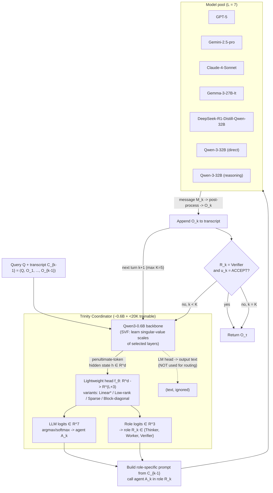

# TRINITY: An Evolved LLM Coordinator

> Source fetched: **https://arxiv.org/html/2512.04695v3** (arXiv abstract: https://arxiv.org/abs/2512.04695)
> Authors: Jinglue Xu, Qi Sun, Peter Schwendeman, Stefan Nielsen, Edoardo Cetin, Yujin Tang (Sakana AI + University of Michigan). ICLR 2026.
> This is the public paper behind Sakana's **Fugu** system (https://sakana.ai/trinity/).
> All quotes and numbers below are pulled from the v3 HTML; section/table/figure identifiers are the paper's own. A few cell values are best-effort transcriptions from the rendered tables — treat the headline numbers (86.2% LiveCodeBench, <20K params, λ=32, K=5) as the load-bearing, verified ones.

---

## 1. Overview

Trinity is a **lightweight, evolved coordinator** that orchestrates a pool of heterogeneous LLMs over multiple turns, instead of merging their weights. The motivation (abstract):

> "Combining diverse foundation models is promising, but weight-merging is limited by mismatched architectures and closed APIs. Trinity addresses this with a lightweight coordinator that orchestrates collaboration among large language models (LLMs)."

Two-part coordinator:

> "The coordinator, comprising a compact language model (approximately 0.6B parameters) and a lightweight head (approximately 10K parameters), is optimized with an evolutionary strategy for efficient and adaptive delegation."

Per-turn behavior:

> "Trinity processes queries over multiple turns, where at each turn the coordinator assigns one of three roles (Thinker, Worker, or Verifier) to a selected LLM, effectively offloading complex skill acquisition from the coordinator itself."

Headline result:

> "On standard benchmarks, Trinity achieves state-of-the-art results, including a score of 86.2% on LiveCodeBench."

Two stated reasons it works (abstract):
1. "the coordinator's hidden-state representations provide rich contextualization of inputs", and
2. "under high dimensionality and strict budget constraints, the separable Covariance Matrix Adaptation Evolution Strategy offers advantages over reinforcement learning, imitation learning, and random search by exploiting potential block-epsilon-separability."

The key conceptual move: the small coordinator does **not** learn to solve coding/math/reasoning tasks. It only learns *who to call and in what role*. Skill acquisition is "offloaded" to the big models in the pool.

---

## 2. Architecture

### 2.1 Backbone + head

- **SLM backbone:** Qwen3-0.6B (§4.1). It runs the conversation transcript through and exposes hidden states.
- **Decision signal:** The coordinator does NOT use generated text. It reads the **hidden state `h ∈ R^d` of the penultimate output token** (the token before EOS).
  > §3.1: "this head projects a hidden state h∈ℝ^d to an output of size L+3, which provides two sets of logits: L logits for selecting an LLM and three logits for assigning its role."
  > §3.1 (why penultimate / early token): "Rather than waiting for a full generation, this allows the coordinator to take hidden states corresponding to an earlier token instead of the penultimate to make a quick decision."
- **Lightweight head `f_θ`:** a linear map from `R^d` to `R^(L+3)`, where `L = 7` (number of agents in the pool). Output splits into:
  - **LLM logits ∈ R^7** — which worker model to call.
  - **Role logits ∈ R^3** — Thinker / Worker / Verifier.
  - Policy is a softmax over these logits: `π_θ(a|s) ∝ exp(f_θ(h(s))_a)` (§2).
- **Param budget:** head ≈ 10K params (default a single linear layer); total learnable params (head + singular-value fine-tuning) kept **under 20K** (§1, §3.1, §4.1). `d` is the Qwen3-0.6B hidden size (~1024), so `1024 × 10 ≈ 10K`.
- **Singular value fine-tuning (SVF):** in addition to the head, a small subset of backbone weight matrices are adapted by SVD where **only the singular-value scales are learned**, orthogonal matrices frozen (§3.1; default = second-to-last layer, §4.1). This is what makes the backbone hidden states more "coordination-aware" while staying tiny.

### 2.2 Head variants (Table 3, §4.7)

The head's structure defines the "coordination space." Four variants are compared:

- **Linear** — dense `d × (L+3)` matrix, ~10K params. The default and overall winner: "the linear is the most reliable choice overall across LiveCodeBench, RLPR, Math500, and MMLU."
- **Low-rank** — factorized head, fewer params (~≤5K). Close to linear on knowledge tasks but weaker on MATH500.
- **Sparse** — pruned weights. Cheap but unstable; collapses on LiveCodeBench.
- **Block-diagonal-k** — block-structured; the `block-diagonal-10 + argmax` variant uses only ~`d_h` weights (≈1K) yet retains a large fraction of performance. This is the empirical evidence for **block-ε-separability** (the structural property that makes sep-CMA-ES the right optimizer).
  > Table 3 note: "By default, the output conversion is softmax normalization. For block-diagonal-10, the output conversion is argmax."

**Trade-off summary:** Linear = best accuracy / most reliable. Block-diagonal = ~85% of the performance at ~10% of the params, and demonstrates the separable structure the evolution strategy exploits. Low-rank/sparse don't pay off.

### 2.3 Role definitions (§3.2)

- **Thinker (T):** "analyzes the current state and returns meta-level guidance, including high-level plans, decompositions, or critiques of partial solutions."
- **Worker (W):** "acts directly on the task to make concrete progress toward a final solution. Given C_{k-1}, it produces actionable content (e.g., a derivation, code snippet, numerical result)."
- **Verifier (V):** "checks whether the accumulated solution in C_{k-1} is correct, complete, and responsive to Q. It outputs a judgment u_k ∈ {ACCEPT, REVISE} and an optional diagnosis δ_k ... if u_k = ACCEPT, signals termination."

### 2.4 Model pool — 7 LLMs (§4.1)

> "three top-tier closed-source models ... and four well-known open-source models."

Closed: **GPT-5, Gemini-2.5-pro, Claude-4-Sonnet.**
Open: **Gemma-3-27B-It, DeepSeek-R1-Distill-Qwen-32B, Qwen-3-32B (direct mode), Qwen-3-32B (reasoning mode).**

### 2.5 Routing diagram

---

## 3. Evolution / Training Method (§3.3, §2, App. A.1–A.4)

### 3.1 Optimizer: sep-CMA-ES

> §3.3: "We therefore adopt sep-CMA-ES, a black-box evolutionary strategy that iteratively improves a central 'parent' policy by sampling a population of perturbed parameter vectors, evaluating each candidate to obtain a fitness score, and recombining candidates via fitness-weighted averaging to form the next parent."

**Why not RL / SFT / random search:** the per-parameter learning signal is weak and the problem is block-ε-separable. RL "noisy global returns swamp weak inter-block signals, yielding ill-conditioned gradients, poor credit assignment, and unstable learning" (REINFORCE shows "jagged, high-variance learning curves," §4.8). sep-CMA-ES exploits the diagonal/separable structure.

### 3.2 Objective / fitness

> §2: objective is the expected terminal reward of the coordinator policy:
> `J(θ) := E_{τ∼π_θ}[ R(τ) ]`, with a **binary terminal reward** `R(τ) ∈ {0,1}` revealed at episode end (task correct or not).

Optimized "under a tight atomic evaluation budget `B_env` that counts individual Bernoulli calls of the terminal reward."

### 3.3 What is optimized

Two trainable sets, **< 20K total params**:
1. the lightweight head (~10K), and
2. SVF singular-value scales on a small subset of backbone layers (default: second-to-last layer of the 0.6B model).

### 3.4 Hyperparameters (App. A.1.2)

- Population size: `λ = ⌈4 + 3 ln n⌉ = 32` for `n ≈ 10,000` (head dimension).
- Replication per candidate: `m_CMA = 16` (random-search comparison uses `m_RS = 32`).
- Evaluation budget regime: **1.5k–40k evaluations** for a 10k-dimensional problem (§1).
- sep-CMA-ES maintains a mean iterate `m_t`, radius `r_t = ‖m_t‖`, step-size `σ_t > 0` (exact σ schedule not given in main text).

### 3.5 Training data / tasks (§4.1)

Four in-distribution benchmarks with official splits: **MATH500, MMLU, RLPR, LiveCodeBench**. For code: "use the V1 release (400 samples) for training and conduct evaluation on the newly introduced questions in the V6 release (175 samples)." Inference caps: max 4,096 generated tokens, **max 5 coordination turns**.

---

## 4. Multi-Turn Delegation Protocol (§3.2)

A single turn `k`:
1. Coordinator reads transcript `C_{k-1} = (Q, O_1, …, O_{k-1})` through the SLM; takes penultimate-token hidden state.
2. Head outputs LLM logits (R^7) and role logits (R^3) → selects agent `A_k ∈ M` and role `R_k ∈ {T, W, V}`.
3. Coordinator builds a "brief, role-specific prompt based on C_{k-1}", queries `A_k`, gets message `M_k`, post-processes into `O_k`, appends `O_k` to the transcript.
4. Roles interact: Thinker emits plans/critiques → Worker produces concrete content (code/derivation/number) → Verifier judges `u_k ∈ {ACCEPT, REVISE}` with optional diagnosis `δ_k`.

**Termination:**
> `τ = min{ k ≤ K : R_k = V and u_k = ACCEPT }`, with `τ = K` if no acceptance occurs. "The final answer returned to the user is O_τ." Max turns `K = 5`.

**Context evolution:** the **full** transcript is re-fed to the coordinator each turn (Figure 1: "In each turn, the full conversation transcript is passed to a compact coordinator model"). So the routing decision at turn `k` is conditioned on all prior role outputs.

---

## 5. Results (exact numbers)

### 5.1 In-distribution (Figure 3 / Table 2)

| Model / Method | LiveCodeBench | MATH500 | MMLU | RLPR | Avg |
|---|---|---|---|---|---|
| **Trinity (full)** | **0.6146** (constrained) / **0.862** (full config, LCB V6) | **0.88** | **0.9156** | **0.4072** | **0.7044** |
| GPT-5 | 0.5954 | 0.7566 | — | — | — |
| Gemini-2.5-pro | 0.4651 | 0.8305 | — | — | — |
| Claude-4-Sonnet | 0.3909 | 0.8225 | 0.8823 | 0.3490 | 0.6112 |
| Mixture-of-Agents | 0.39 | 0.83 | — | — | — |
| MasRouter | 0.52 | — | — | — | — |
| RouterDC | — | — | — | 0.28 | — |

> §4.4: Trinity "achieves state-of-the-art with a pass@1 score of 0.862 on LiveCodeBench V6, newly-released questions." Headline 86.2% = LiveCodeBench V6 in the full (non-constrained) configuration. Trinity beats single models even when those single models are given 5× the token budget. Abstract: "mean relative error reduction of 21.9% over the second-best approach."

### 5.2 Out-of-distribution / generalization (Table 1)

| OOD task | Trinity |
|---|---|
| AIME | 50.00% |
| BigCodeBench | 35.80% |
| MT-Bench | 9.60 (score) |
| GPQA-D | 76.82% |
| **Average** | **54.21%** (highest among compared methods) |

---

## 6. Ablations

### 6.1 Head variant (Table 3)

| Head | LiveCodeBench | MATH500 | MMLU | RLPR |
|---|---|---|---|---|
| **Linear (default, winner)** | **0.615** | **0.880** | 0.916 | **0.401** |
| Low-rank | 0.597 | 0.770 | 0.914 | 0.344 |
| Sparse | 0.400 | 0.811 | 0.917 | 0.372 |
| Block-diagonal-2 | 0.336 | 0.776 | 0.897 | 0.378 |
| Block-diagonal-10 + argmax | 0.551 | 0.812 | 0.802 | 0.376 |

### 6.2 Component ablation (Table 2)

| Variant | LiveCodeBench | MATH500 | MMLU | RLPR | Avg |
|---|---|---|---|---|---|
| Trinity (full) | 0.6146 | 0.88 | 0.9156 | 0.4072 | 0.7044 |
| w/o SVF | 0.5568 | 0.8585 | 0.9010 | 0.3977 | 0.6785 |
| w/o Thinker role | 0.5780 | 0.8620 | 0.9275 | 0.3800 | 0.6869 |
| w/o tri-role selection | 0.5828 | 0.82 | 0.9164 | 0.3615 | 0.6702 |
| Last token (vs penultimate) | 0.5085 | 0.87 | 0.8219 | 0.3860 | 0.6466 |
| Claude-4-Sonnet only | 0.3909 | 0.8225 | 0.8823 | 0.3490 | 0.6112 |

> §4.5: removing tri-role selection "causes substantial degradation on MATH500 (-6.0 points)." Using the penultimate (not last) token clearly helps, especially MMLU (0.916 vs 0.822). SVF contributes ~+2.6 avg points.

### 6.3 Turns ablation (Figure 4)

> §4.4: LiveCodeBench improves "from 0.823 to 0.863 as turns increase from 2 to 6." Diminishing returns; default K=5.

### 6.4 Optimizer ablation (Table 4)

| Method | LiveCodeBench | MATH500 | MMLU | RLPR |
|---|---|---|---|---|
| **sep-CMA-ES** | **0.615** | **0.880** | **0.916** | **0.401** |
| REINFORCE | 0.253 | 0.459 | 0.500 | 0.266 |
| Random Search | 0.374 | 0.794 | 0.897 | 0.345 |
| Supervised Fine-tuning | 0.592 | 0.786 | 0.906 | 0.360 |

### 6.5 Separability evidence (§4.6)

> "Linear SVM achieves perfect classification, far above chance level (0.25 for four classes)" — the coordinator's hidden states are near-linearly separable by the right action, which is why a *linear* head + a *separable* ES works so well.

---

## 7. Limitations & Compute

- **No tool execution (§6):** "A key limitation, however, is the gap between abstract reasoning and grounded execution, as the system can devise plans involving tools but cannot yet act on them."
- **Inference caps:** 4,096 max generated tokens; 5 max turns.
- **SFT label cost is the thing evolution avoids (App. A.2.2):** single-step SFT labeling = "3×7k×7 = 147k LLM queries"; full multi-turn label generation would need "~8.7×10^10 LLM queries" — infeasible, which motivates the budgeted black-box ES.
- **Training budget:** <20K learnable params; 1.5k–40k terminal-reward evaluations under `B_env`; λ=32.

---

## 8. What's reusable for a TypeScript reimplementation

The genuinely reusable ideas (and what would need adaptation):

1. **The routing core is tiny and portable.** The "brain" is just `h ∈ R^d → linear → R^(L+3) → split into 7 model-logits + 3 role-logits → softmax/argmax`. In TS you can run a small embedding/SLM (e.g., via a local ONNX/transformers.js model or a remote embeddings endpoint) to get `h`, then a hand-rolled `Float32Array` matrix multiply for the head. No GPU training framework needed at inference.

2. **Separate the "what to say" from "who/which role."** The core architectural insight: the coordinator's LM head output (text) is thrown away for routing; only the **penultimate-token hidden state** drives the decision. For a TS port without hidden-state access to a hosted model, the practical analog is: embed the transcript, route on the embedding. Keep routing decoupled from generation.

3. **Tri-role protocol (Thinker → Worker → Verifier) is a clean, framework-agnostic loop.** This is directly implementable in TS today, no ML required: a turn loop over `C_k`, a role-specific prompt template per role, a Verifier that returns `ACCEPT|REVISE`, terminate on first Verifier ACCEPT or at K=5. This alone (with even a heuristic/LLM router) captures much of the value and is the easiest first milestone.

4. **Full-transcript re-feed each turn** is simple state management — accumulate `(Q, O_1..O_{k-1})` and pass it whole. Watch token budgets; the paper caps at 4,096 tokens / 5 turns.

5. **Training is the hard part to port.** sep-CMA-ES over <20K params with a binary terminal reward is doable in TS (a small CMA-ES is a few hundred lines), but you need a graded eval harness (benchmark tasks + correctness checker) and the ability to extract/perturb the head + SVF scales. Realistic TS path: **freeze the architecture, hand-tune or learn the 10K linear head offline (Python), export the weights as JSON, and run inference in TS.** Don't try to evolve inside Node.

6. **Pragmatic v1 for a TS "maestro":** start with the 3-role multi-turn protocol + a heuristic or small-LLM router over your own model pool (the 7 here map cleanly to your provider set: GPT-5 / Gemini / Claude / open-weights). Add a learned linear head later only if you have an eval harness. The 86.2% headline depends on the evolved head + the strong frontier-model pool — most of the engineering value for a reimplementation is the orchestration loop, not the optimizer.

7. **Cheap, fast routing claim holds:** decision = one small-model forward pass + one ~`1024×10` matmul. That is well within real-time budgets in TS/Node.
