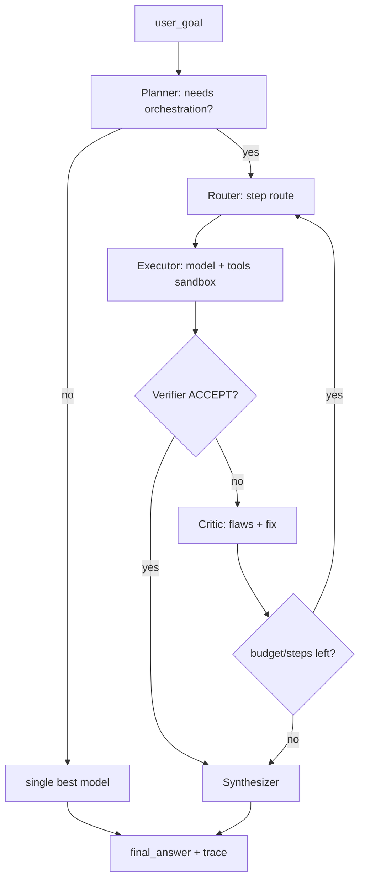
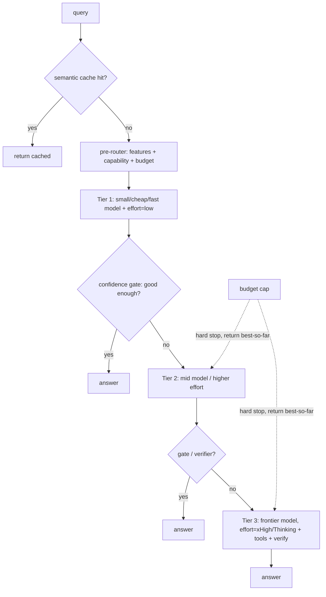

# Maestro — architecture & build plan (PLAN ONLY, no code yet)

A production-grade, **TypeScript-first, Next.js** open-source LLM-orchestration system that reverse-engineers the *useful* ideas from Sakana **Fugu** (TRINITY + Conductor), **OpenFugu**, and **Mixture-of-LoRA-Harness**, then improves on them — most importantly by **executing tools** (Fugu only plans them), **gating orchestration on confidence/cost** (Fugu itself sometimes loses to a single model), and being **open, self-hostable, and benchmark-driven**.

> Evidence base (read first): `archive/docs/01-openfugu-runtime.md`, `02-openfugu-training.md`, `03-mol-routing.md`, `04-mol-serving.md`, and `archive/docs/papers/{TRINITY-paper,CONDUCTOR-paper,FUGU-claims}.md`. Every claim below about the sources is cited to those (which are themselves cited to code/paper).

---

## 1) Executive summary
Fugu reframes "use the best model" as **a learned policy over a pool of models**: a tiny coordinator decides, per request, to answer directly or delegate to expert workers, then verify + synthesize — exposed as one model. Two methods underpin it: **TRINITY** (an *evolved* lightweight discrete router; `2512.04695`) and **Conductor** (an *RL-trained* natural-language workflow author with recursion; `2512.04388`).

**The opportunity** (from the verified benchmark table, `FUGU-claims.md`): Fugu is **capped at its pool's ceiling**, **sometimes worse than a single specialist** (loses SWEBench Pro, HLE, SciCode, CTI-REALM), **cannot execute tools** (TRINITY limitation), is **closed**, and is **EU-unserved**. Maestro targets exactly these: a **tool-executing**, **confidence/cost-gated**, **open/self-hostable** orchestrator that defaults to *cheap routing* and only escalates to multi-agent orchestration when it measurably helps.

**Design stance:** plumbing first (a single OpenAI-compatible gateway + pluggable router + budgets + cache + traces + an eval harness), learned routing later (exported from offline Python training). **Never assume more agents = better** — we instrument the cost/quality trade and gate on it.

---

## 2) Source inspection — evidence map
Concrete artifacts we inspected (full detail in `archive/docs/*`):

| Source | Purpose | Key files / symbols (cited) | Entry points |
|---|---|---|---|
| **Mixture-of-LoRA-Harness** | Route across **specialist LoRA adapters** behind one OpenAI endpoint | `mol_harness/router.py` (`router_instruction`, `route_by_library`, `apply_guardrail`), `mol_harness/library.py` (`parse_lora_markdown`, `load_lora_library`), `lora_library/glm51_current/L0–L4.md`, `sglang_patch/patches/sglang-lora-kv-reuse-v2.patch`, `sglang_patch/overlay/.../scheduler.py` (`_apply_route_decode_selection`), `examples/scripts/create_shadow_loras.py` | `examples/offline_router_demo.py`; SGLang server via `start_sglang_kv_reuse_server.sh` |
| **OpenFugu** | Reverse-engineer Fugu (read→run→train→serve) over a **frontier-model pool** | `openfugu/mini.py` (`FuguRouter`, `Coordinator`), `openfugu/ultra.py` (Conductor DAG), `openfugu/serve.py`, `train/train_trinity*.py` (sep-CMA-ES), `train/train_conductor.py` (GRPO), `eval/eval_orchestration.py`, `verify/verify_37.py` | `python openfugu/mini.py --self-test/--demo/--live`; `openfugu/serve.py` |
| **Sakana Fugu** (`fugu-release/`, `fugu/`, tech report) | Product: one-model API orchestrating a hidden pool | papers TRINITY `2512.04695`, Conductor `2512.04388`; tech-report §3.2.3 pool = Gemini-3.1-Pro + Opus-4.8 + GPT-5.5 | OpenAI-compatible API (paid tiers) |

---

## 3) Reverse-engineering: Mixture-of-LoRA-Harness  *(full: `archive/docs/03,04`)*
- **What it is:** a hybrid router + SGLang overlay serving many **LoRA adapters on one base** behind a single OpenAI endpoint. Source-only repo (no weights).
- **Routing (`router.py`):** (1) a **model prompt-route** — `router_instruction()` builds a prompt from each route's markdown (description/rules/examples) and asks **L0** to emit `model_id=…`; (2) a **deterministic metadata guardrail** — `route_by_library()` scores phrases (`priority + strong*100 + positive*10 − negative*250`); (3) `apply_guardrail()` lets a strong metadata match **override** noisy model output, honors a valid model route when metadata is neutral, else **falls back to L0**. **L0 = entry router *and* general chat.**
- **Library (`library.py`):** one markdown file per route — front-matter (`id/level/task/adapter_name/source_path/priority`) + `Description / Routing Rules / Strong|Positive|Negative Signals / Examples / Datasets`. `load_lora_library` mandates an L0 entry.
- **Multi-turn policy:** L0-routing sees only the current query; L0-chat sees full history; specialists see current + same-task history; cross-task history masked; new task → back to L0.
- **Serving (`sglang_patch`):** activated via **PYTHONPATH overlay** (no SGLang source edits). **Shadow LoRAs** = `create_shadow_loras.py` patches PEFT config + symlinks weights → `--lora-paths`. The **KV-reuse v2 patch** (`scheduler.py:_apply_route_decode_selection`) switches adapter mid-decode (`route_decode_v2`), reuses the contiguous current-query prefix (`enable_kv_reuse`, default on), frees the router-only KV tail.
- **Assumptions/limits:** adapters must share one base model + be SGLang-loadable; KV reuse only for contiguous prefixes; two hand-synced parsers; two diverging libraries.

## 4) Reverse-engineering: OpenFugu  *(full: `archive/docs/01,02`)*
- **What it is:** a faithful-ish **reverse-engineering + simplified reproduction** of Fugu over a **frontier-model pool** (litellm). Stages read→run→train→serve, all runnable; many results are **mock harnesses** (be precise — see caveats).
- **Runtime (TRINITY, `mini.py`):** query → raw `"role: content"` (not a chat template — **95% vs 11%**) → Qwen3-0.6B + **SVF** offsets (`model_iter_60.npy` = 19,456 floats; 9,216 SVF on 9 matrices + a 10×1024 head) → **penultimate-token hidden state h∈ℝ¹⁰²⁴** → head → **7 agent + 3 role logits** (two argmax classifiers). `Coordinator` re-routes one `(worker, role)` per turn over an evolving transcript; stops on **Verifier ACCEPT** (max 5). **ultra (`ultra.py`)** = Conductor: an LM emits a 3-list workflow DAG, executed topologically; **recursion** = the Conductor names itself a worker.
- **serve.py:** one OpenAI `/v1/chat/completions` hiding the pool; only `usage.fugu_turns` surfaces.
- **Training (`train/`):** **sep-CMA-ES** optimizes the head/SVF vector (mock `PARAM_DIM=112`; real `HEAD_DIM=10240`; reconstructed `N=19456`); fitness = mean terminal reward; mock converges chance→optimal in ~5 gens. **GRPO** Conductor on `nvidia/ToolScale` (reward `format+action`, `num_generations=8`, `beta=0`, lr 1e-5, 8×A800; curve **1.21→1.64**/100 steps). Recursion **+9% (mock)**; adaptive k-of-n pool **+44% over blind / 94% of oracle**.
- **Eval honesty:** "+107% over best single" is **per-query** routing on a **mock** harness; real GSM8K only ties (0.917); ToolScale real gain ~**+7%**.

## 5) Sakana Fugu — public-claim analysis  *(full: `archive/docs/papers/FUGU-claims.md`)*
- **Framing:** "one model" that is really a **learned orchestrator over other vendors' APIs**, hiding selection/delegation/verification/synthesis + recursion. **Fugu** = single-worker low-latency router (TRINITY/evolutionary). **Fugu Ultra** = ≤5-step multi-agent RL workflow with shared memory (Conductor).
- **Agent pool (tech report §3.2.3):** Gemini-3.1-Pro + Claude-Opus-4.8 + GPT-5.5 (+ recursive Fugu). **Fable 5 / Mythos Preview excluded** as "not publicly accessible." "No export controls" is marketing — capability **depends entirely** on those US frontier APIs.
- **Benchmarks (verified from the report PDF):**

| Benchmark | Fugu Ultra | Fugu | best baseline | Fugu vs best |
|---|---|---|---|---|
| Terminal Bench 2.1 | **82.1** | 80.2 | Fable5 80.4 | ✅ win |
| CharXiv Reasoning | **86.6** | 85.1 | Mythos 86.1 | ✅ win (vs in-pool) |
| GPQA-D | **95.5** | 95.5 | Mythos 94.6 | ✅ win |
| LiveCodeBench | **93.2** | 92.9 | Fable5 89.8 | ✅ win |
| SciCode | 58.7 | 60.1 | **Fable5 60.2** | ❌ ~loss |
| **SWEBench Pro** | 73.7 | **59.0** | **Fable5 80.0** | ❌ **clear loss** (plain Fugu < Opus 69.2) |
| Humanity's Last Exam | 50.0 | 48.5 | **Fable5 53.3** | ❌ loss |
| CTI-REALM | 69.4 | 67.5 | **Opus 69.6** | ❌ loss to a *pool member* |
- **Takeaways:** (a) orchestration helps reasoning/coding aggregate but (b) **can underperform a single specialist** on agentic SWE / niche tasks, and (c) it's **ceiling-capped by the pool**. Availability: GA OpenAI-compatible API, tiers $20/$100/$200; Ultra PAYG; **EU/EEA unserved**.

---

## 6) Architecture comparison table

| Dimension | Mixture-of-LoRA-Harness | OpenFugu | Sakana Fugu | **Maestro (target)** |
|---|---|---|---|---|
| Core purpose | route to LoRA adapters | reimpl Fugu over model pool | product: hidden orchestrator | open orchestrator + **tool execution** |
| Routing | hybrid (prompt + metadata guardrail + L0) | learned head (TRINITY) / NL-DAG (Conductor) | TRINITY + Conductor | **pluggable strategies, hybrid default, gated** |
| Learning vs rules | rules + LLM prompt | **learned** (CMA-ES/GRPO) | learned | rules→classifier→learned (staged) |
| Orchestration depth | 1 hop (adapter) | multi-turn + DAG + recursion | multi-turn + recursion | multi-turn + DAG, **confidence-gated** |
| Multi-agent | no | yes (roles / workflow) | yes | yes (planner/exec/verifier/critic/synth) |
| Training req | LoRA training | CMA-ES (cheap) / GRPO (8×A800) | heavy | **none for MVP**; optional offline Py for learned router |
| Serving complexity | high (SGLang patch) | low (litellm) | hidden | **medium** (Node gateway + workers) |
| API compat | OpenAI | OpenAI | OpenAI | **OpenAI-compatible** + control APIs |
| Eval maturity | minimal | mock-heavy | strong (closed) | **first-class harness + benchmark runner** |
| Cost control | n/a | n/a | tiers | **budgets per task, cost-aware routing** |
| Latency control | KV reuse | n/a | "Fugu" tier | **latency budgets, parallelism caps** |
| Observability | logs | run logs | none public | **OTel + LLM traces + trace viewer** |
| Failure handling | L0 fallback | verifier accept | hidden | **typed errors, retries, fallback, breakers** |
| Production readiness | research | research | product | **production-oriented OSS** |
| OSS maintainability | source-only | scaffold | closed | **monorepo, typed, tested** |
| Reuse for us | router heuristics, L0 fallback, KV-reuse idea | role loop, head-export idea, eval cases | benchmark targets, pool design | — |
| Don't copy | SGLang fork coupling | mock results as truth | marketing/"no export controls" | — |

## 7) Weaknesses in current implementations (what to fix)
1. **TRINITY can't execute tools** — only plans. → Maestro executes (sandboxed, ties to coset/probe for safety).
2. **Conductor needs GRPO + GPUs** — heavy to retrain. → Maestro ships rule/classifier routing day one; learned policy is optional + offline.
3. **OpenFugu's headline gains are mock** — real gains small (+7%). → Maestro's eval harness forbids mock-as-truth; every claim has a baseline + protocol.
4. **MoL couples to a forked SGLang + same-base LoRAs** — brittle, GPU-bound. → Maestro treats LoRA-specialist routing as an *optional provider*, not the core.
5. **Fugu is closed, pool-ceiling-capped, EU-unserved, and sometimes worse than one model.** → Maestro: open/self-hostable, **confidence/cost gate so we never orchestrate when a single model wins**, EU-ok.

---

## 8) Proposed Maestro architecture
**Principle:** *one endpoint, many strategies, always measured.* A single OpenAI-compatible surface; behind it a typed orchestration core that can be as cheap as a 1-line route or as deep as a verified multi-agent DAG — chosen by budget + confidence.

```mermaid
flowchart TD
  U[client / OpenAI SDK] -->|/v1/chat/completions| GW[Next.js API gateway]
  GW --> Q[(Redis queue · BullMQ)]
  Q --> EW[execution-worker  Node]
  subgraph core [packages/orchestrator  TS]
    PL[Planner] --> RT[Router engine]
    RT --> EX[Executor]
    EX --> VF[Verifier]
    VF --> CR[Critic]
    CR --> SY[Synthesizer]
    BC[Budget controller] -.gates.-> RT & EX & VF & CR
  end
  EW --> core
  core --> PR[Provider registry  OpenAI/Anthropic/local/LoRA]
  PR --> M1[(frontier)] & M2[(fast router model)] & M3[(fallback)] & M4[(specialist/LoRA)]
  core --> CA[(cache · Redis)]
  core --> DB[(Postgres · tasks/traces/evals)]
  core --> TR[OTel + LLM traces -> Langfuse/Helicone]
  GW --> DASH[Next.js dashboard: traces · evals · config · datasets]
  EWX[eval-worker] --> core
  PY[services/python-evals  optional: train learned router CMA-ES/GRPO, offline evals]
  PY -. exports head.json .-> RT
```

**Component responsibilities:**
- **Next.js (apps/web):** dashboard, trace viewer, eval/benchmark UI, config-as-code editor, dataset manager, HITL feedback, the **API gateway** (thin — validates, enqueues, streams).
- **Node workers (do NOT run long work in Next):** `execution-worker` (orchestration + model calls), `eval-worker` (benchmark/eval runs).
- **TS orchestration core (`packages/orchestrator`):** planner → router → executor → verifier → critic → synthesizer, all under a **budget controller**.
- **Model registry / provider registry:** declarative models (capabilities, context, $/token, latency) and providers (OpenAI-compatible, Anthropic, local/Ollama, custom, LoRA-via-SGLang).
- **Router engine (`packages/router`):** pluggable strategies (§9).
- **Cross-cutting:** confidence estimation, fallback routing, cost/latency budgets, caching, prompt/version mgmt, eval harness, benchmark runner, observability + trace viewer, dataset manager, HITL, retry policies, config-as-code.
- **Optional Python (`services/python-evals`):** *only* where ML needs it — train the learned router (sep-CMA-ES on a routing fixture, à la TRINITY) and export a tiny `head.json` the TS router loads; run heavy offline evals. **No Python in the request path.**

---

## 9) Routing system design (15 strategies)
> First, the honest meta-rule (from Fugu's own losses): **orchestration is a cost, not a free win.** It helps when (a) the task decomposes, (b) verification catches errors a single model makes, or (c) different sub-tasks suit different models. It *hurts* (latency, $, error amplification, circular reasoning) when one capable model already solves it. **Default to the cheapest route that meets the confidence bar; escalate only on low confidence or explicit decomposition.**

| # | Strategy | Input signals | Decision | Needs | Strengths | Weaknesses / failure modes | How to test | Phase |
|---|---|---|---|---|---|---|---|---|
| 1 | Static rule | path/model param | config map | rules | deterministic, debuggable | brittle, manual | golden config tests | **MVP** |
| 2 | Keyword/metadata | regex/phrases (MoL guardrail) | score+threshold | signal lists | cheap, transparent | misses paraphrase; negative-signal dominance | labeled fixture acc | **MVP** |
| 3 | Embedding similarity | query embedding vs route centroids | nearest centroid | embeddings + exemplars | generalizes past keywords | needs good exemplars; drift | held-out routing acc | **v1** |
| 4 | Small-model classifier | query → cheap LLM/SLM | predicted role/model | a fast model | strong acc/cost | classifier errors cascade | confusion matrix vs labels | **v1** |
| 5 | Learned policy | hidden-state/features (TRINITY-style) | head argmax | offline CMA-ES + fixture | best ceiling, tiny at inference | training infra; OOD | win-rate vs best-single | **later** |
| 6 | Multi-armed bandit | live reward (success, $/lat) | Thompson/UCB over models | reward log | adapts to drift online | cold start; nonstationarity | regret vs oracle (sim) | **later** |
| 7 | Confidence-based fallback | self-eval/verifier/logprob | escalate if conf<τ | a confidence signal | cuts cost, catches misroutes | bad confidence est → over/under-escalate | escalation precision/recall | **MVP** |
| 8 | Debate/critic | N drafts → critic | pick/merge best | extra calls | quality on hard tasks | cost↑, can entrench errors | A/B vs single on hard set | **v1** |
| 9 | Cost-aware | $/token, budget left | cheapest meeting bar | model prices | predictable spend | may pick too-weak model | $/task vs quality curve | **MVP** |
| 10 | Latency-aware | p50/p95 per model, SLA | fastest meeting bar | latency telemetry | hits SLAs | may pick weaker model | latency SLA hit-rate | **v1** |
| 11 | Capability-aware | model caps (vision, tools, ctx, lang) | filter to capable set | model registry caps | avoids impossible routes | stale capability data | capability-match tests | **MVP** |
| 12 | Ensemble | several outputs | vote/merge/synthesize | parallel calls | robustness, fewer misses | cost×N; merge errors | quality vs single, $ delta | **v1** |
| 13 | Hierarchical | coarse class → sub-router | route then sub-route | nested routers | scales to many experts | extra hop latency | per-level acc | **v1** |
| 14 | MoL specialist | same-base LoRA adapters | adapter id (MoL) | served LoRAs (SGLang) | cheap specialization | GPU/base coupling | adapter selection acc | **later** |
| 15 | **Hybrid (default)** | capability filter → cost/latency rank → confidence gate → (escalate: classifier/debate) | layered | most of the above | best practical trade | complexity | end-to-end eval suite | **MVP→v1** |

**Default Maestro router (MVP):** capability filter (11) → cost/latency rank (9/10) → answer with the cheapest capable model → **confidence gate (7)**: if low, escalate to a stronger model or a verifier/critic pass; keyword/metadata (2) as a fast hint. Embedding/classifier (3/4) in v1; learned/bandit/MoL later.

---

## 10) Multi-agent orchestration design
**Agents:** Planner (decompose + decide if orchestration is even needed), Router (pick worker/role per step), Executor (call model **and run tools** in a sandbox), Verifier (independent check incl. adversarial/negative case — borrowed from TRINITY's Verifier role + coset's "evidence not vibes"), Critic (find flaws, propose fixes), Synthesizer (merge to final), Budget controller (enforces $/latency/step caps; can halt).

**Communication = typed JSON tasks** (the strict schema), passed on a queue; every hop emits a trace span. **Termination:** Verifier ACCEPT, or budget/step cap, or no-progress detector. **Guards:** max-depth + max-steps (kill infinite loops), idempotency keys + result cache (kill redundant calls), per-task cost ceiling (kill runaway), conflict resolver (Critic/Synthesizer arbitrate disagreement), "novelty" check (kill circular reasoning when a step repeats a prior state).



**Strict internal task schema** (`packages/shared`):
```ts
type Task = {
  task_id: string; parent_task_id?: string;
  user_goal: string; normalized_intent: string;
  required_capabilities: string[];            // e.g. ["code","tools","long_context"]
  candidate_routes: Route[]; selected_route?: Route;
  confidence_score?: number;                  // 0..1
  cost_budget_usd: number; latency_budget_ms: number;
  execution_status: "planned"|"routing"|"executing"|"verifying"|"synthesizing"|"done"|"blocked"|"error";
  intermediate_outputs: StepOutput[];
  verification_results: VerifierResult[];
  final_answer?: string;
  trace_ids: string[]; error_state?: { code: string; detail: string };
};
```

---

## 11) TypeScript / Next.js implementation plan
**Stack:** Next.js (App Router) UI+gateway · TypeScript everywhere · **Postgres** (state) · **Redis** (cache + queue) · **BullMQ** (jobs) · **Drizzle** (typed DB; lighter migrations than Prisma) · **OpenTelemetry** (tracing) · **Langfuse** self-host (LLM traces/prompt mgmt; Helicone as a proxy alternative) · **Vitest** (unit) · **Playwright** (UI/integration) · **Docker Compose** (local: web+pg+redis+langfuse) · **Vercel AI SDK** for provider calls/streaming · optional **Python** microservice (FastAPI) only for learned-router training + heavy offline evals.
**Separation rule:** Next.js = UI + thin gateway (validate → enqueue → stream). All model calls / orchestration / evals run in **BullMQ workers**, never in a Next request handler (timeouts, cost, observability).

## 12) Repository structure (monorepo, pnpm + Turborepo)
```
maestro/
├─ apps/
│  └─ web/                  # Next.js: dashboard, trace viewer, eval UI, config editor, API gateway routes
├─ packages/
│  ├─ shared/               # Task schema, types, zod contracts, config-as-code loader
│  ├─ orchestrator/         # planner→router→executor→verifier→critic→synth + budget controller
│  ├─ router/               # the 15 strategies, each a Strategy interface; the hybrid default
│  ├─ model-registry/       # models: caps, ctx, $/token, latency; YAML/TS config
│  ├─ providers/            # OpenAI-compat, Anthropic, local/Ollama, custom, LoRA-via-SGLang adapters
│  ├─ agents/               # planner/verifier/critic/synth prompt+logic, JSON schemas
│  ├─ evals/               # eval harness: scorers, datasets loaders, benchmark defs
│  ├─ tracing/              # OTel setup, span helpers, Langfuse client
│  └─ tools/                # tool registry + sandboxed execution (hook to coset/probe sandbox)
├─ workers/
│  ├─ execution-worker/     # consumes tasks, runs orchestration core
│  └─ eval-worker/          # runs benchmark/eval jobs
├─ services/
│  └─ python-evals/         # OPTIONAL FastAPI: train learned router (CMA-ES) -> head.json; offline evals
├─ config/                  # config-as-code: models.yaml, routes.yaml, budgets.yaml, prompts/
├─ docker-compose.yml
└─ turbo.json
```

## 13) Database schema (Postgres / Drizzle — sketch)
- `models` (id, provider_id, capabilities[], ctx_window, price_in, price_out, p50_ms, p95_ms, enabled)
- `providers` (id, kind, base_url, auth_ref, oai_compatible, region)
- `tasks` (the Task schema; status, budgets, confidence, final_answer, error_state, ts)
- `subtasks` (task_id fk, parent, role, model_id, input, output, tokens, cost, latency, status)
- `routes` (task_id fk, strategy, candidates jsonb, selected, confidence, reason)
- `traces` (id, task_id, span tree jsonb, otel_trace_id)
- `evals` (run_id, suite, dataset_id, model/route, metric, score, baseline, protocol_hash, ts)
- `datasets` (id, name, kind, items jsonb / blob ref, version)
- `prompts` (id, name, version, body, vars, created_by) — version-pinned
- `feedback` (task_id fk, user, rating, preferred_output, note)
- `cache` (key=hash(model+prompt+params), value, hits, ttl)  *(Redis primary; Postgres mirror for analytics)*
- `budgets` (scope=org/user/task, cost_cap, latency_cap, period)

## 14) API design
- **`POST /v1/chat/completions`** — OpenAI-compatible (Maestro = one model). Extra `x_maestro` in response: `{route, strategy, confidence, models_used, cost_usd, latency_ms, trace_id, steps}`. Optional request `maestro` block: `{mode:"auto|single|deep", cost_budget, latency_budget, allow_tools}`.
- **`POST /v1/route`** — dry-run: return the route + reason + estimated cost/latency without executing (debugging/eval).
- **`POST /v1/evals/run`** / **`GET /v1/evals/:id`** — enqueue + fetch an eval/benchmark run.
- **`GET /v1/traces/:taskId`** — full task trace (for the viewer).
- **`GET/PUT /v1/config`** — config-as-code (models/routes/budgets/prompts), validated by zod, versioned.
- **`POST /v1/feedback`** — HITL preference/rating.
- Auth: API keys per org/user; budgets enforced at the gateway.

## 15) Evaluation & benchmark plan
**No claim without: benchmark + dataset + baseline + protocol + scoring + reproducibility hash.** Baselines = (a) best single model, (b) cheapest single model, (c) random route, (d) Maestro route. The bar Maestro must clear: **beat best-single on quality at ≤ its cost/latency, OR match quality at lower cost** — and *never* lose to best-single on the routed task (Fugu's failure we must avoid).

| Metric | How |
|---|---|
| Routing accuracy | labeled routing fixture; top-1 / regret vs oracle route |
| Answer quality | ground-truth (exact/unit-test) where possible; else LLM-judge w/ rubric + human spot-check |
| Cost per task | summed token cost; vs baselines |
| Latency per task | p50/p95 end-to-end |
| Failure recovery | inject provider 500 / bad route → measure recovery success |
| Tool-call accuracy | tool args/selection correctness on a tool fixture |
| Hallucination | citation/grounding checks on a factual set |
| Regression | every fixed bug → fixture; CI gate on suite |
| Human preference | pairwise A/B in dashboard → win-rate |

**Benchmark categories** (start with public, reproducible): coding (LiveCodeBench, **SWEBench-style agentic — Fugu's weak flank, our target**), research/QA (GPQA-D), math (AIME/MATH500), long-context, document analysis, agentic tool-use, and an **adversarial-routing** set (queries crafted to fool keyword/embedding routers). Report Maestro vs best-single vs cheapest-single, with $ and latency, reproducible via `protocol_hash`.

## 16) Failure modes & mitigations
| Failure | Mitigation |
|---|---|
| Infinite loop / recursion | max-depth + max-steps + no-progress (state-novelty) detector |
| Runaway cost | per-task `cost_budget` hard cap in budget controller; kill + return best-so-far |
| Error amplification (bad step poisons later steps) | Verifier gate before propagation; Critic can discard a step |
| Circular reasoning | dedup transcript states; halt on repeat |
| Conflicting agent outputs | Synthesizer arbitration + confidence weighting; tie → escalate once |
| Provider outage / rate limit | fallback routing + circuit breaker per provider; retries w/ jitter (idempotent only) |
| Bad route (wrong model) | confidence gate → escalate; log for the routing fixture |
| Hallucinated/unsafe tool call | tools run in a **sandbox** (reuse coset/probe) + allowlist + arg validation |
| Cache poisoning / staleness | key on model+prompt+params+version; TTL; never cache tool-side-effects |
| Prompt injection via tool output | treat tool/model output as untrusted (coset's lethal-trifecta lens) |
| Mock-as-truth eval | protocol_hash + baseline required; CI rejects unbaselined claims |

## 17) MVP roadmap (ship the plumbing, prove the trade)
1. OpenAI-compatible **gateway** (Next.js) → BullMQ → execution-worker.
2. **Model + provider registry** (config-as-code) + Vercel AI SDK provider calls (OpenAI/Anthropic/local).
3. **Router**: capability-filter + cost/latency rank + keyword hint + **confidence-fallback** (strategies 1,2,7,9,11,15).
4. **Cache** (Redis) + **budgets** + **typed errors/retries/fallback**.
5. **Tracing** (OTel + Langfuse) + a basic **trace viewer** + **dashboard**.
6. **Eval harness** with the baselines (best/cheapest/random/Maestro) on 2–3 public suites; CI gate.
   → *MVP success = match best-single quality at lower cost on the eval set, never losing on routed tasks.*

## 18) v1 roadmap
- Multi-agent core: **planner + verifier + critic + synthesizer**; **tool execution** (sandboxed).
- Routing: **embedding + small-model classifier** (3,4), debate/ensemble/hierarchical (8,12,13), latency-aware (10).
- **Benchmark runner** UI + dataset manager + HITL feedback + prompt versioning.
- Then **learned policy router** (offline sep-CMA-ES in `services/python-evals`, export `head.json`) and **MoL specialist routing** as an optional provider.
- Adversarial-routing eval + regression suite maturity.

## 19) Verified vs Assumed
| Verified (cited to code/paper) | Assumed / to-validate |
|---|---|
| TRINITY: SLM + lightweight head, penultimate-token h → 7 model + 3 role logits, ≤5 turns, Verifier ACCEPT, sep-CMA-ES (`2512.04695`, OpenFugu `mini.py`) | That a TS classifier/embedding router gets "good enough" without the evolved head (needs our eval to confirm) |
| TRINITY cannot execute tools (paper limitation) | That sandboxed tool execution materially beats Fugu on SWEBench (hypothesis — must benchmark) |
| Conductor: Qwen2.5-7B, GRPO, NL 3-list workflow, recursion, 2×H100, beats GPT-5 avg 77.27 (`2512.04388`) | Our exact MVP routing-acc / cost-savings numbers (no results yet — don't claim) |
| Fugu pool = Gemini-3.1-Pro+Opus-4.8+GPT-5.5; loses SWEBench Pro/HLE/SciCode/CTI-REALM (tech report) | That confidence-gating reliably avoids "orchestration worse than single" (needs calibration data) |
| MoL: hybrid router + L0 fallback + SGLang KV-reuse overlay (`router.py`, the patch) | That LoRA-specialist routing is worth the SGLang coupling for us (likely "later/optional") |
| OpenFugu "+107%" is a **mock** harness; real gains ~+7% (its own eval/results) | Maestro adoption/maintainability outcomes (product bet) |

## 20) Final build recommendation
Build Maestro **plumbing-first and measurement-first**, not agent-first. Ship the **OpenAI-compatible gateway + provider/model registry + the hybrid (capability→cost/latency→confidence-fallback) router + cache + budgets + tracing + an eval harness with real baselines** as the MVP. Only add multi-agent depth (planner/verifier/critic/synth) and **tool execution** in v1 — where the eval proves it beats best-single — and add the **learned router** (offline CMA-ES export) and **MoL specialist routing** as optional later modules. **Differentiate on the three things Fugu can't/doesn't: execute tools, refuse to orchestrate when a single model wins (confidence/cost gate), and be open + self-hostable + EU-ok.** Tie tool/agent safety to coset/probe (sandbox + injection defense) — that's a moat neither Fugu nor the OSS reimplementations have.
```

---

## Addendum A — Ground-truth from the official PDFs (supersedes §3–5 HTML extracts)
Deep reads of the local PDFs (`archive/docs/papers/TRINITY-deep.md`, `CONDUCTOR-deep.md`) corrected/firmed the earlier numbers:

**TRINITY (arXiv 2512.04695v3):** frozen **Qwen3-0.6B** + a **linear head ≈10,240 params** on the **penultimate-token hidden state** → **7 model logits + 3 role logits (Thinker/Worker/Verifier)**, plus **SVF on the 2nd-to-last layer (9,216 params)** → **<20K trainable (~19,456)**. Loop max **K=5** turns; terminate the first turn a **Verifier returns ACCEPT**. Head ablation: **linear wins** (LCB 0.615 / MATH500 0.880 / RLPR 0.401); block-diagonal-10 = **1,024 params, 10× fewer**, mid-tier (the block-ε-separability evidence). Trained by **sep-CMA-ES** on binary terminal reward `J(θ)=E[R(τ)]`, **λ=32, m_CMA=16, n≈10000, 1.5k–40k evals**; beats REINFORCE/RS/SFT (SFT can't scale — 8.7×10¹⁰-query blow-up). Paper pool = GPT-5 + Claude-4-Sonnet + Gemini-2.5-pro + DeepSeek-R1-Distill-Qwen-32B + Gemma-3-27B + Qwen3-32B (reasoning) + Qwen3-32B (direct). **SOTA LiveCodeBench-v6 pass@1 = 0.862.** Limitation reaffirmed: **plans tool use, cannot execute tools.** (No verbatim algorithm box; `d_h=1024` inferred.)

**Conductor (arXiv 2512.04388v5):** **Qwen2.5-7B** + **GRPO**. Output = **three parallel Python lists** — `model_id` (worker per step), `subtasks` (the NL prompt per step), `access_list` (`[]` / `["all"]` / integer indices = shared-memory selection). **Sequential ≤5 steps; the final step's output IS the answer** (no aggregator). **Recursion** = name itself a worker, re-plan or emit three empty lists to stop, bounded **<2× base budget**. Reward tiers **0 / 0.5 / 1**; **960 problems** (MATH500/MMLU/RLPR/LiveCodeBench), **200 iters, 64 rollouts/sample, batch 256, lr 1e-6, β=0 (no KL), 2×H100**; recursion = +20 iters on 350 samples, round-1 discount 0.25. Biggest lever = **NL-subtask prompting** (not recursion). ("7 agents" counts Qwen3-32B thinking vs non-thinking separately; no public code.)

> Implication unchanged but firmer: the *router* is genuinely tiny/cheap (TRINITY) or a small 7B (Conductor); the **power is in the pool + the protocol (roles, verifier, NL subtasks, access-list memory)**, not a giant model. Maestro can reproduce the *protocol* in TS immediately and treat the *learned* router as an optional offline-trained add-on.

## Addendum B — Maestro's open model pool (June 2026) — the "truly open Fugu" lever
Full report + citations: `docs/OSS-MODELS-2026-06.md`. The decisive finding: **open weights are now competitive enough to orchestrate** — so Maestro's pool can be **all open + self-hostable + EU-clean**, unlike Fugu's closed US-API pool (Gemini-3.1-Pro/Opus-4.8/GPT-5.5, EU-blocked).

Current top open-weight set (mid-2026, vendor benchmarks unless noted; AA = Artificial Analysis Index):
- **GLM-5.2** (Z.ai, 2026-06-13, **MIT**, 753B MoE ~40B active, 1M ctx) — **#1 open on AA (51)**. Strong generalist.
- **DeepSeek V4-Pro** (1.6T MoE, **MIT**, **SWE-bench Verified 80.6%** ≈ Gemini-3.1-Pro) + **V4-Flash** (cheap ~$0.14/$0.28) — coder + cheap fast router.
- **Kimi K2.7-Code** (Moonshot, 1T MoE, Modified-MIT) — **first open to beat GPT-5.4 on SWE-bench Pro** → our agentic-SWE beat-target worker.
- **Qwen3.6** family (**Apache**) — versatile, sizes incl. small for the router model.
- **MiniMax M3** (multimodal, 1M ctx, SWE-bench Pro 59.0; **license unconfirmed — verify before commercial use**) — long-context/vision.
- Western all-Apache option: **Mistral Large 3** (Apache, EU-clean) + **gpt-oss-120b/20b** (Apache) + **Qwen3.6**. (Llama 4.x excluded — >700M-MAU restriction = not truly open.)

**Recommended default Maestro pool (open):** generalist **GLM-5.2** · coder/agentic **Kimi K2.7-Code** (or DeepSeek V4-Pro) · cheap/fast **router model** = DeepSeek V4-Flash or small Qwen3.6 · long-context **MiniMax M3** or GLM-5.2 (1M) · math/reasoning **DeepSeek V4-Pro**. All-Apache variant for max license safety: Mistral Large 3 + gpt-oss-120b + Qwen3.6.

This upgrades the §1 thesis from aspirational to real: **Maestro = an open, self-hostable, EU-clean Fugu that executes tools and refuses to orchestrate when one model wins — over a pool of the current best open-weight models.** (Re-pull the leaderboard at build time; most benchmarks are vendor self-reported — AA is the most independent signal. Confirm Kimi "Modified-MIT" and MiniMax licenses before shipping.)

## Addendum C — Hybrid pool (closed frontier + open), effort-aware, leaderboard-driven
Full research + citations: `docs/MODELS-LEADERBOARDS-2026-06.md`. This revises the §1 thesis and §8 pool: Maestro's pool is **configurable + hybrid (bring-your-own-keys)** — not open-only. Use the **latest closed US frontier for max quality / agentic tool use**, and **open weights for cost / self-host / EU**, and let routing pick per task.

**1) The routable unit is `(model, effort)` — not just `model`.** Effort/variant tiers (Anthropic *Thinking*, GPT-5.5 *High/xHigh*) are distinct targets with different quality, $, and latency. The model-registry stores each as a row; the cost/latency router + budgets treat them separately; the **confidence gate** does a cheap pass first and only escalates effort/model when needed (this is how we avoid Fugu's "orchestration worse than one model" failure *and* don't overspend on xHigh by default).

**2) Leaderboards disagree → route by task type, using per-board evidence as routing features.** Verified across 6 boards (June 2026):
- **Agentic tool orchestration — Arena.ai Agent Arena** (https://arena.ai/leaderboard/agent, 2026-06-18, 909k sessions): **Claude Fable 5 (High) #1 · Opus 4.8 (Thinking) #2 · GPT-5.5 (xHigh) #3** … GLM-5.2 (Max) #10 (top open). → use for the **executor / tool-step worker**.
- **Standardized coding — SWE-bench Pro (Scale SEAL):** **GPT-5.4 xHigh #1 (59.1%)** (NOT Anthropic; vendor SWE numbers run 10–30 pts higher and are non-comparable). → use for the **agentic-SWE worker** (our beat-target vs Fugu).
- **Chat/general preference — Arena.ai Text Arena** (6.9M votes): Fable 5 #1 (Opus 4.6/4.7 rank *above* 4.8).
- **WebDev/Code Arena:** Fable 5 #1, **GLM-5.2 #2** (an open MIT model beating every GPT/Gemini).
- **Artificial Analysis Intelligence Index:** Fable 5 (60) #1, GLM-5.2 #6 (top open).
- **llm-stats.com:** different winner again (Mythos Preview / GPT-5.2 Pro). *(Its Aider-Polyglot mirror is STALE — don't use.)*
→ Maestro's model-registry stores **per-board scores per capability**; the router picks the best `(model, effort)` *for that task type*, not a single global "best."

**3) Availability/region constraints are first-class.** **Claude Fable 5 / Mythos Preview are export-restricted for non-US/EU users** (directive 2026-06-12/13) and Fugu is EU-blocked. So the registry encodes **region/availability per model**; the router has a **closed-frontier lane** (max quality where allowed) and an **open/self-host/EU lane** (GLM-5.2 / DeepSeek V4 / Kimi K2.7-Code / Qwen3.6). BYO-keys + config-as-code makes the pool the user's choice.

**Recommended Maestro default pool (hybrid, by role × effort):**
| Role | Closed-frontier (max quality) | Open (cost / self-host / EU) |
|---|---|---|
| Generalist / planner | Claude Opus 4.8 (Thinking) · GPT-5.5 (High) | **GLM-5.2** |
| Agentic tool/coder (executor) | GPT-5.5 (xHigh) / Codex · Opus 4.8 (Thinking) — per Agent Arena | **Kimi K2.7-Code** · DeepSeek V4-Pro |
| Cheap/fast router model | GPT-5.5 (low) / Gemini 3.x Flash | **DeepSeek V4-Flash** · small Qwen3.6 |
| Long-context | Gemini 3.x (huge ctx) | **MiniMax M3** · GLM-5.2 (1M) |
| Math/reasoning | Opus 4.8 (Thinking) · GPT-5.5 (xHigh) | **DeepSeek V4-Pro** |
| Vision | Gemini 3.x · GPT-5.5 | MiniMax M3 |

**Net thesis (sharpened):** Maestro is a **superset of Fugu** — it orchestrates **any mix** of the *latest closed frontier + top open* models, treats **`(model, effort)`** as the routable unit, routes **per task type using real leaderboard evidence**, is **region/availability-aware** and **BYO-keys**, **executes tools** (sandboxed via coset/probe), and **gates on confidence/cost** so it never loses to a single model. Fugu = fixed closed pool, no exposed effort tiers, EU-blocked, no cost gate. *(Caveat: most vendor benchmarks are self-reported; Agent Arena + Artificial Analysis are the most independent; re-pull boards at build time; confirm Kimi/MiniMax licenses before shipping.)*

## Addendum D — Ecosystem: what to depend on, what to learn, + the cascade
Full notes: `docs/ecosystem/headroom.md` and `docs/ecosystem/routing-tools-survey.md` (live-researched, cited).

**Headroom (`headroomlabs-ai/headroom`, Apache-2.0):** it is a **local-first context-COMPRESSION layer, NOT a router/orchestrator** — it shrinks tool outputs / logs / RAG / history 60–95% before they hit the model (CCR = Compress-Cache-Retrieve), shipped as a library + OpenAI/Anthropic-compatible proxy + `wrap` CLI + MCP server (Python+Rust core, thin TS SDK). **Verdict: adopt as Maestro's optional context-compression component** — a Docker **sidecar proxy behind the budget controller** (AUDIT→OPTIMIZE), reused for tool-output compression + output-token trimming. It replaces *none* of Maestro's routing/agents/evals (its `providers/registry.py` is transport dispatch, not quality routing). Caveats: adds a non-TS sidecar, pre-1.0 (pin version), fetches TLS assets → allowlist in EU/locked-down setups.

**Dependency decisions (reuse > reinvent):**
| Need | Decision | Why |
|---|---|---|
| Provider calls / fallback / retries | **Vercel AI SDK** in-process + optional **LiteLLM**(MIT,Py) or **Portkey Gateway**(Apache, **TS**, OSS since Gateway 2.0) as a sidecar | TS-native streaming; sidecar only for exotic providers. Maestro's router sits *above* the gateway. |
| Router logic | **reimplement in TS, patterns from RouteLLM** (Apache,Py — win-rate-vs-cost-threshold; `mf`/`bert`/`causal_llm`/`sw_ranking`) | router is our core IP; don't take a Python dep in the request path |
| Cascade / difficulty-aware | **pattern: FrugalGPT** (arxiv 2305.05176 — cheap→scorer→escalate; matched GPT-4 at up to ~98% less cost) | this *is* our confidence-gate + cost-router |
| Embedding routing | reimplement; ideas from **semantic-router** (Aurelio) | small, TS-friendly |
| Semantic cache | **reimplement in TS** (embed→ANN→threshold); GPTCache is Python + stalling (last v0.1.44, 2024) | keep cache in the TS stack |
| Eval harness | **Promptfoo** (MIT, TS) | clean TS dep for the eval/benchmark runner |
| LLM tracing | **Langfuse** (MIT, TS) | decision telemetry, prompt mgmt |
| Context compression | **Headroom** sidecar (optional) | 60–95% token cut behind budget controller |
| Ensembling (MoA/llm-blender) | **hardest tier / offline only** | Self-MoA shows mixing can *underperform* the best single — gate it |
| Don't depend on | Not Diamond / Martian / Unify (proprietary SaaS), Helicone (maintenance mode) | avoid lock-in / unmaintained |
| Self-host open models at scale | **llm-d** (CNCF, Apache) — later, only if GPU-serving the open pool | |

**The cascade = "fast for small stuff, strong for hard ones" (your ask), realized as Maestro's default:**

- **Difficulty signal** (which tier to start / when to escalate): pre-gen query features (length/keywords/capability) + post-gen confidence (cheap-model self-eval, verifier, logprob/uncertainty). Threshold tuned by a cost-vs-quality Pareto sweep, or a single "cost knob," or a bandit later.
- **This unifies §9 + Addendum C:** the cascade *is* confidence-fallback (7) + cost/latency-aware (9/10) over `(model, effort)` targets, with the cheap tier from the open pool (DeepSeek-V4-Flash / small Qwen / GLM) and the hard tier from the closed frontier (Opus-4.8-Thinking / GPT-5.5-xHigh) — best of both, spending big only when the query earns it.

## Addendum E — Official report, OpenRouter Fusion, the gateway decision, + double-verify corrections
Sources: `archive/docs/papers/FUGU-OFFICIAL-REPORT.md` (read the official `SakanaAI/fugu` 31-page tech report), `docs/ecosystem/openrouter-fusion-and-gateways.md`, `docs/ecosystem/trinity_coordinator.md`.

**Double-verify — corrections to our earlier `FUGU-claims.md` (which was extracted from the release-page chart/marketing before the official PDF):**
- The official **Table 1** is a 5-column in-pool comparison (Fugu-Ultra, Fugu, Opus-4.8, Gemini-3.1, GPT-5.5), 11 rows; **Fable-5/Mythos appear only in Figure 4** (GPQA-D / CharXiv / Terminal Bench). So our "Fugu loses SWEBench Pro 73.7 vs Fable5 80.0 / HLE 53.3 / SciCode 60.2" came from the **release-page Figure 1 chart** (Walid's screenshot), *not* the report's Table 1 — keep it sourced to the release chart, don't attribute to the report.
- **CTI-REALM** has no numbers in the report (only a Figure-1 panel label) — drop our "Opus beats Ultra on CTI-REALM" claim.
- **HLE:** report says Fugu = **47.2** (not 48.5) and **Fugu-Ultra 50.0 is actually best on HLE**.
- **"recursive Fugu in the pool"** is marketing; the report only allows orchestrator-as-worker generically. Pool = exactly **Gemini-3.1-Pro + Claude-Opus-4.8 + GPT-5.5** (§3.2.3).
- Newly learned: a **soft-KL SFT stage before sep-CMA-ES**; Fugu trained on **Claude Code/Codex/OpenCode trajectories**; `SakanaAI/fugu` ships **no model/training code** — it's a hosted API consumed via Codex (`api.sakana.ai/v1`). `FUGU-OFFICIAL-REPORT.md` now supersedes `FUGU-claims.md`.
- The substance that survives: Fugu is **a router over a small closed pool**, **capped at its pool ceiling**, **can't execute tools**, **opaque on cost/usage**, **EU-blocked** — all still true and still our wedge.

**The transparency wedge (elie's question, the community's complaint):** the official report does **NOT disclose cost-per-task, output-tokens-per-benchmark, or per-model usage %** (only a 3-task bar chart, Fig 5). → **Maestro's headline open-source differentiator = radical transparency:** every task exposes the route, the `(model,effort)` chosen, per-model token+cost breakdown, and the full trace. We give exactly what Fugu hides.

**OpenRouter Fusion ≠ Fugu (the tweet is half-right):** Fusion (proprietary, OpenAI-compatible, launched 2026-06-12) is a **fixed panel + judge ensemble** — fans a prompt to up to 8 models, a judge emits consensus JSON, your outer model synthesizes (~4–5× a single call). That's an **ensemble/debate strategy as a product**, *not* a learned per-query router. Fugu is a **learned router** (1–3 agents/problem). **Maestro offers BOTH** as modes — cheap **cascade/route** by default, and a **Fusion-style ensemble** only for the hardest tier (confidence/cost-gated) — so we're a superset of both, with the gate neither has.

**Provider-layer decision (your "use OpenRouter / fusion" path, done better):**
- **Primary backend = Vercel AI Gateway.** Confirmed it serves **`sakana/fugu-ultra`** (published 2026-06-22), **SDK-native** (plain string model in the Vercel AI SDK), **0% markup incl. BYOK**, with fallback/budgets/observability. → instant access to closed+open models **and to Fugu itself** (as a worker *and* as our headline eval baseline).
- **Fallback backend = OpenRouter** (400+ models, `openrouter/auto`, ~5.5% credit fee) for catalog breadth. (Fugu-on-OpenRouter unconfirmed — verify at build.)
- Both sit **behind Maestro's own provider registry** so we stay portable; Maestro differentiates **up-stack**: the confidence/cost **cascade** (Addendum D), **(model,effort)** routing (Addendum C), **sandboxed tool execution** (coset/probe), **verifier/critic agents**, **radical transparency + a baseline-driven eval harness**. Net: *use the gateways for plumbing; win on orchestration + evals + tools + openness.*

**trinity_coordinator (nshkrdotcom, Elixir, MIT):** a **faithful inference reimpl** — loads the real Sakana SVF-adapted Qwen3-0.6B, penultimate-token → {10,1024} head → 7 agent + 3 role logits, Thinker/Worker/Verifier loop K=5 to ACCEPT (no training lane; uses the published HF artifact). Reuse the **contracts/discipline** (penultimate-token routing, ACCEPT/REVISE terminator, enforceable loop budgets, JSONL traces, slot-labels-are-metadata-not-providers, SHA-pinned artifacts). **Don't adopt Elixir/OTP for concurrency** — a TRINITY run is sequential and our bottleneck is network-bound LLM latency (Node/TS is fine); OTP only matters if we self-host the coordinator SLM. For *training* the learned router, use OpenFugu (it actually runs sep-CMA-ES/GRPO).
