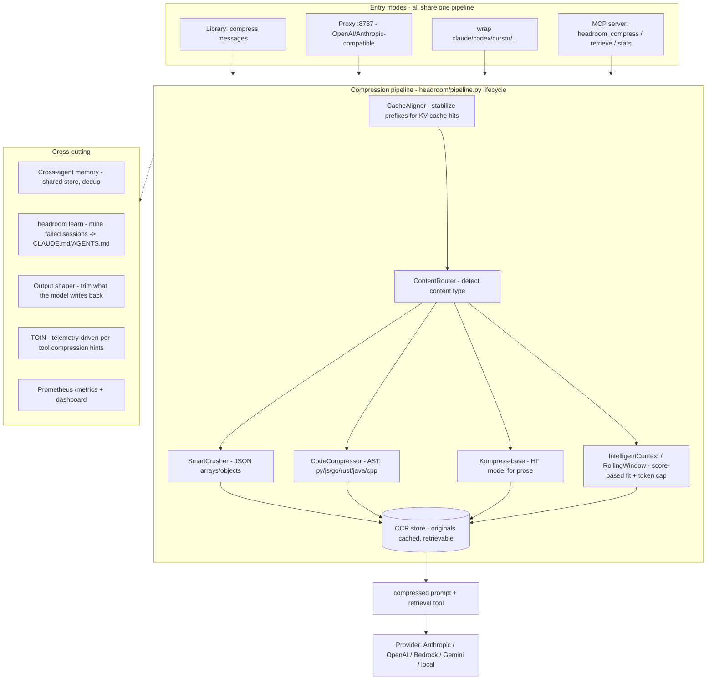

# Headroom — ecosystem note

> Repo inspected: `headroomlabs-ai/headroom` (cloned full from `https://github.com/headroomlabs-ai/headroom.git`, commit `2026-06-22`). The canonical org/owner in-repo is actually `chopratejas/headroom` (badges, install URLs, attribution all point there); `headroomlabs-ai` is a mirror/org fork. Same code.
> All citations below are file paths inside that clone unless noted.

---

## 1. What it is

**Headroom is a local-first *context-compression layer* that shrinks everything an LLM agent reads — tool outputs, logs, RAG chunks, files, conversation history — by 60–95% before it reaches the model, while keeping the originals retrievable on demand.** (`README.md:40`, `gh api repos/headroomlabs-ai/headroom .description`)

**Problem it solves:** agent context windows fill up with low-value bulk (giant JSON tool results, log dumps, repeated code), which is expensive (you pay per token in) and degrades quality (needle-in-haystack). Headroom compresses that bulk losslessly-enough that "same answers" hold on benchmarks, and stores the original so the model can ask for it back (CCR). It is **not** a model router or an orchestrator — it sits *underneath* whatever model you call.

It is delivered in four shapes (`README.md:49-56`, `llms.txt:5`):
- **Library** — `compress(messages)` in Python or TypeScript, inline.
- **Proxy** — `headroom proxy --port 8787`, an OpenAI/Anthropic-compatible HTTP gateway, zero code changes.
- **Agent wrap** — `headroom wrap claude|codex|cursor|aider|copilot` (starts proxy + launches the tool).
- **MCP server** — `headroom_compress`, `headroom_retrieve`, `headroom_stats` tools for any MCP client.

---

## 2. Stack, license, maturity

| Aspect | Detail | Source |
|---|---|---|
| Primary language | **Python** (≥3.10) with a **Rust core** for the hot path + ONNX runtime | `pyproject.toml` (`build-backend = "maturin"`), `crates/headroom-core,-proxy,-py`, `headroom/onnx_runtime.py` |
| Secondary | **TypeScript SDK** (`headroom-ai` on npm), Next.js docs site | `sdk/typescript/`, `docs/` |
| Distribution | PyPI `headroom-ai`, npm `headroom-ai`, Docker `ghcr.io/chopratejas/headroom` | `README.md:302-306` |
| Version | **0.27.0** (Python + TS in lockstep), "Development Status :: 4 - Beta" | `pyproject.toml`, `sdk/typescript/package.json` |
| License | **Apache-2.0** | `LICENSE`, `gh api ... license` |
| Maturity / traction | **~46.7k stars, ~3.2k forks, ~393 open issues**, created 2026-01-07, **last push today**, **1,668 commits** | `gh api`, `git log` |
| Tests | **425 Python `test_*.py`** + **31 TS test files** + extensive `benchmarks/` and `e2e/` suites; CI + codecov badges | `find`, `benchmarks/`, `e2e/` |
| ML model | `kompress-v2-base` on HuggingFace (text compressor, trained on agentic traces) | `README.md:18,269` |

Verdict on maturity: **fast-moving, well-tested, heavily-starred OSS, but pre-1.0 and clearly the work of a small core team** (single maintainer namespace, "Headroom Contributors"). The Rust core + 425 tests + daily commits make it production-*trialable*, not yet a stable API contract.

---

## 3. Architecture & core modules

The whole system is one **compression pipeline** that every entry mode (library / proxy / wrap / MCP) shares (`llms.txt:5`, `docs/spec/002-architecture.md`).



**Module map** (Python package `headroom/`, ~279 files):

- **`pipeline.py`** — the one stable request lifecycle: `Setup → Pre-Start → Post-Start → Input Received → Input Cached → Input Routed → Input Compressed → Input Remembered → Pre-Send → Post-Send → Response Received`. Extensions hook stages via `on_pipeline_event(...)` (`README.md:283-298`, `headroom/pipeline.py`).
- **`compress.py` / `client.py`** — the inline library API and `HeadroomClient`.
- **`proxy/`** (~40 files) — the HTTP gateway. Notable: `server.py`, `semantic_cache.py`, `cost.py`, `rate_limiter.py`, `output_shaper.py` + `verbosity_controller.py` (output-token reduction), `memory_*` (cross-agent memory), `prometheus_metrics.py`, `runtime_env.py` (hot-sync settings to a running proxy). Modes: `AUDIT` (observe), `OPTIMIZE` (transform), `SIMULATE` (plan only) (`docs/spec/002-architecture.md:84-90`).
- **`transforms/`** — the actual compressors: `SmartCrusher` (JSON), `CodeCompressor` (AST), `Kompress-base` (ML prose), `CacheAligner` (prefix stabilization for provider KV-cache hits), `RollingWindow`, `ContentRouter` (`README.md:267-275`).
- **`ccr/`** — **Compress-Cache-Retrieve**: `CompressionStore` (TTL'd original store, default 300s), `ContextTracker`, MCP server. This is what makes compression *reversible* — the model calls `headroom_retrieve` to get an original back (`docs/spec/002-architecture.md:273-294`).
- **`cache/`** — provider-aware caching (`anthropic.py`, `openai.py`, `google.py`), `semantic.py`, `prefix_tracker.py`, `compression_cache.py`, `compression_feedback.py`.
- **`providers/`** — per-tool and per-vendor slices (`claude`, `codex`, `copilot`, `cursor`, `gemini`, `openai.py`, `anthropic.py`, `cohere.py`, `openai_compatible.py`) + `registry.py`. **Note:** this `registry.py` is about *transport/backend dispatch and API-target normalization* (which upstream API to forward to), **not** quality-based model selection — there is no orchestration or routing-for-quality here (`headroom/providers/registry.py` public fns: `resolve_api_targets`, `create_proxy_backend`, `call_client_transport`).
- **`backends/`** — `litellm.py`, `anyllm.py` adapters for multi-provider transport.
- **`learn/`** — `headroom learn`: scanners (`ClaudeScanner`, `CodexScanner`, `CursorScanner`) mine *failed* agent sessions and write corrections into `CLAUDE.md` / `AGENTS.md` / `GEMINI.md` (`README.md:362-368`, `docs/spec/002-architecture.md:246-271`).
- **`telemetry/toin.py`** — **TOIN** (Tool Output Intelligence Network): learns per-tool compression hints (which fields to preserve, how many items to keep) from retrieval telemetry.
- **`shared_context.py`** — `SharedContext().put/.get`: compressed context passing across multi-agent workflows, with agent provenance + auto-dedup.
- **`crates/`** — Rust: `headroom-core`, `headroom-proxy`, `headroom-py` (PyO3 bindings via maturin) — the performance-critical compression path.
- **`sdk/typescript/`** — the npm package: `compress()`, `simulate()`, `HeadroomClient`, framework adapters (`withHeadroom` for OpenAI/Anthropic/Gemini SDKs, `headroomMiddleware()` for Vercel AI SDK), format detection/conversion. **It is a thin client — it requires a running Headroom proxy or Headroom Cloud** (`sdk/typescript/README.md:26`).

**Entry points / public API:** CLI (`headroom proxy|wrap|learn|perf|update|mcp install|output-savings`), HTTP (`/v1/messages`, `/v1/chat/completions`, `/v1/compress`, `/v1/retrieve`, `/v1/embeddings`, `/health`, `/metrics`, `/stats`), MCP tools, and the Python/TS `compress()` + `HeadroomClient`.

**Feature scorecard for our purposes:**
- Model-routing for quality: **No.** (transport dispatch only)
- Caching: **Yes** — semantic cache + provider KV-cache alignment + compression cache.
- Orchestration / multi-agent: **Partial** — only `SharedContext` (compressed handoff) + cross-agent memory; no planner/verifier/critic.
- Observability: **Yes** — Prometheus `/metrics`, dashboard, savings tracker, simulate/dry-run.
- Evals: **Yes** — `python -m headroom.evals suite` + big `benchmarks/` dir, but evals measure *compression fidelity* (GSM8K/TruthfulQA/SQuAD/BFCL accuracy delta), not routing quality.

---

## 4. How you'd actually use it

**Install + proxy (zero code change), the canonical path** (`README.md:89-101`):
```bash
pip install "headroom-ai[all]"     # or: docker run -p 8787:8787 ghcr.io/chopratejas/headroom:latest
headroom proxy --port 8787         # OpenAI/Anthropic-compatible gateway
# point any client at http://127.0.0.1:8787
```

**Inline library (TypeScript)** (`sdk/typescript/README.md:13-24`) — note it still needs a proxy/cloud behind it:
```typescript
import { compress } from 'headroom-ai';
const result = await compress(messages, { model: 'gpt-4o' });
const response = await openai.chat.completions.create({ model: 'gpt-4o', messages: result.messages });
// result.tokensSaved, result.compressionRatio, result.ccrHashes
```

**Vercel AI SDK middleware** (directly relevant to Maestro's stack) (`sdk/typescript/README.md:32-53`):
```typescript
import { wrapLanguageModel } from 'ai';
import { headroomMiddleware } from 'headroom-ai/vercel-ai';
const model = wrapLanguageModel({
  model: openai('gpt-4o'),
  middleware: headroomMiddleware({ baseUrl: 'http://localhost:8787' }),
});
```

**Dry-run / simulate** (no LLM call) — see the compression plan, waste signals, cache-alignment score (`sdk/typescript/README.md:141-153`):
```typescript
const sim = await simulate(messages, { model: 'gpt-4o' });
```

---

## 5. Classification

- **Library + proxy + framework-middleware + MCP server.** Not a router, not an orchestrator, not (primarily) a gateway in the model-selection sense — it's a **compression middleware** that happens to be deployable as a proxy.
- **Self-hostable: yes**, local-first by design ("your data stays here", `README.md:66`). There's also a hosted "Headroom Cloud" option (`HEADROOM_API_KEY`) and an `ENTERPRISE.md`.
- **OpenAI-compatible: yes** (and Anthropic-compatible), so it slots in front of any OpenAI-style client transparently.

---

## 6. How Maestro uses or learns from it

Context: Maestro is a TS/Next.js **orchestrator** — hybrid model pool, pluggable router (15 strategies), planner/executor/verifier/critic/synthesizer agents, budgets, eval harness, OTel/Langfuse tracing (see `docs/MAESTRO-DESIGN.md`). Headroom and Maestro are **complementary, non-overlapping layers**: Maestro decides *which model(s) and how*; Headroom shrinks *what gets sent*. They compose cleanly.

### Could Maestro USE Headroom as a dependency/component?

**Yes — as the context-compression component inside the Executor, behind the router.** It is NOT a substitute for any Maestro core piece (gateway, router, orchestrator, budgets, evals are all Maestro's own). The honest split:

**Use Headroom for (high value):**
- **Tool-output / RAG / log compression before each model call.** This is exactly Maestro's pain: agentic loops with tool execution (the whole Fugu-beating thesis) generate huge tool outputs that blow budgets and context. Headroom's `SmartCrusher`/`CodeCompressor`/CCR is purpose-built for this and is the single most reusable thing here.
- **CCR (reversible compression).** Maestro's verifier/critic sometimes need the full original a prior step compressed away. CCR's "compress now, `headroom_retrieve` later" is a clean fit and hard to reproduce well.
- **Provider KV-cache alignment** (`CacheAligner`) — squeezes provider-side prompt-cache hits, directly lowering Maestro's per-task cost (a first-class Maestro metric).
- **Output-token shaping** (`HEADROOM_OUTPUT_SHAPER`) — trims model *output* (5× input cost on Opus-class), which compounds across a multi-step DAG.

**Learn ideas from (don't necessarily depend on):**
- **`headroom learn`** — mining failed sessions to write corrections is conceptually identical to Maestro's "every fixed bug → fixture" + HITL feedback loop. Good pattern, but Maestro should own its version (it's tied to Maestro's own trace/eval store).
- **TOIN per-tool hints** — a feedback loop from telemetry to compression policy; mirrors Maestro's intended "route by per-board evidence" instinct.
- **`SharedContext`** (compressed multi-agent handoff) — directly parallels Maestro's planned `packages/shared` Task passing; the *compressed* handoff idea is worth stealing into Maestro's typed task schema.
- **`simulate()` / dry-run + Prometheus + savings tracker** — Maestro already plans `/v1/route` dry-run and OTel; Headroom's "estimate-with-confidence-interval, never a made-up number" honesty (`README.md:168-180`) is a good norm to copy into Maestro's eval reporting (which already forbids mock-as-truth).

### What's reusable vs. what we build ourselves

| Concern | Source |
|---|---|
| Gateway, router (15 strategies), planner/verifier/critic/synth, budgets, eval harness with baselines, model+provider registry, tracing UI | **Build (Maestro core)** — Headroom has none of these |
| Tool-output / RAG / log / code compression | **Use Headroom** |
| Reversible compression (CCR) for verifier re-reads | **Use Headroom** |
| Provider prompt-cache alignment | **Use Headroom** (or learn the technique) |
| Output-token trimming | **Use Headroom** (proxy flag) |
| Failed-session learning, compressed inter-agent handoff, telemetry→policy feedback | **Learn the pattern, build Maestro-native** (must integrate with Maestro's trace/eval/task store) |

### Integration sketch

Maestro's `packages/tools` (sandboxed tool execution) and `packages/orchestrator` Executor are the insertion point. Two options:

1. **Library mode (preferred for Maestro's TS stack), but with a caveat:** the npm `headroom-ai` package is a *thin client that requires a running Headroom proxy or Headroom Cloud* (`sdk/typescript/README.md:26`). So even "library mode" means running the Python/Rust proxy as a sidecar. Wire `headroomMiddleware({ baseUrl })` into the Vercel AI SDK calls Maestro already makes — minimal code, but adds a non-TS service to the deployment.

2. **Proxy/sidecar mode:** run `ghcr.io/chopratejas/headroom` as a Docker sidecar (it already has a `docker-compose.yml`) and have Maestro's Executor point provider calls at it. Cleanest separation; Maestro stays pure-TS; Headroom upgrades independently.

Apply compression **selectively**: compress *tool results / RAG chunks / file reads*, but do **not** blindly compress reasoning-critical or short prompts (the eval delta is near-zero on small inputs and CCR adds a round-trip). Gate it on Maestro's budget controller — compress when a task is near its `cost_budget`/context limit, skip otherwise. Keep Headroom's `AUDIT` mode on first to measure savings before flipping to `OPTIMIZE`.

**Watch-outs:** (a) adds a Python+Rust service to an otherwise all-TS deployment; (b) pre-1.0, fast-moving API — pin the version (aligns with Walid's pin-everything policy: `pip install "headroom-ai==0.27.0"`, `npm i headroom-ai@0.27.0`); (c) two runtime assets fetched over TLS (ONNX from `cdn.pyke.io`, the HF model) need allowlisting in locked-down/EU environments — though "compression disabled (pure gateway)" needs neither (`README.md:336-360`); (d) it's CCR-correct only within the configured TTL (default 300s), so long-lived Maestro tasks must tune `store_ttl_seconds`.

### Verdict

**Adopt Headroom as Maestro's context-compression layer (sidecar proxy), not as anything in the orchestration/routing core.** It is the best-in-class OSS answer to a real problem Maestro will hit hard (tool-heavy agentic loops eating budget + context), it's Apache-2.0 and self-hostable (EU-OK, matching Maestro's stance), and it composes orthogonally — Maestro routes/orchestrates/evaluates, Headroom compresses. The cost is operational (a non-TS sidecar + a pre-1.0 dependency). Recommended path: **start in `AUDIT` mode behind the budget controller on tool-output/RAG only, measure the cost delta in Maestro's own eval harness, then promote to `OPTIMIZE`.** Treat `headroom learn`, TOIN, and `SharedContext` as *idea sources* for Maestro-native features rather than dependencies, since those need to live inside Maestro's trace/task store.
