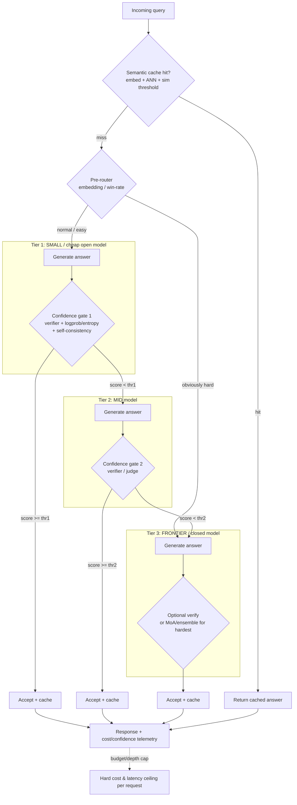

# Multi-Model LLM Orchestration, Routing & Cascades — Ecosystem Survey

> Live research for **Maestro** (open TS/Next.js orchestrator: hybrid pool of closed-frontier + open models, router, agents, verifier, evals, confidence/cost gating).
> Goal: reuse good ideas/libraries rather than reinvent. The driving requirement is **difficulty-aware routing + model cascades** ("fast/cheap for small stuff, escalate to a bigger model for hard stuff").
>
> **Research date:** 2026-06-22. Every tool below was confirmed against a live source (URL + date in the citations section). Maturity / "last seen active" notes are flagged where relevant. Maestro is TS/Next.js; **most routing research and libraries below are Python**, so for many of them the realistic verdict is *pattern-only* (port the idea) rather than a runtime dependency.

---

## 1. Tools at a glance

| Tool | URL | License | Lang | One-line purpose | Routing / cascade mechanism | Reuse in Maestro? |
|---|---|---|---|---|---|---|
| **FrugalGPT** (paper + concept) | arxiv.org/abs/2305.05176 | Research (concept; ref impl varies) | Python (ref) | Cost-cutting via prompt-adaptation, LLM-approximation, **LLM cascade** | Query cheap model first; a learned **DistilBERT scorer** estimates answer reliability; escalate to next model only when score < learned threshold; cascade order + thresholds learned to optimize cost vs accuracy | **Pattern-only** — this is *the* core cascade pattern for Maestro's confidence gate |
| **RouteLLM** (LMSYS) | github.com/lm-sys/RouteLLM | Apache-2.0 | Python | Train/serve **preference-data routers** (strong vs weak model) | Computes predicted "strong-model win-rate" for a prompt; routes to strong if win-rate > cost threshold. 4 routers: `mf` (matrix-factorization, recommended), `bert`, `causal_llm`, `sw_ranking` (similarity-weighted Elo) | **Pattern-only** (+ optionally serve its router behind LiteLLM). Reuse the *win-rate-vs-threshold* router idea; weights are Python-side |
| **Not Diamond** | github.com/Not-Diamond/notdiamond-python | Proprietary SaaS (SDK on PyPI) | Python SDK | Hosted **classifier router**: pick best model per query, no setup or train-your-own | Trained meta-model predicts best model per prompt (quality/cost/latency weighted); call-time API selection. Also maintains `awesome-ai-model-routing` list | **No** (SaaS dependency, not OSS core). Mine `awesome-ai-model-routing` for ideas |
| **Martian** | github.com/withmartian (+ routerbench) | Proprietary SaaS; **RouterBench** OSS | Python | Commercial dynamic model router; published the **RouterBench** benchmark | Real-time routing to "best" LLM per request (proprietary). RouterBench = open eval harness for multi-LLM routing | **No** for the router; **pattern-only** — use RouterBench methodology for Maestro's router evals |
| **Unify** (unify.ai) | unify.ai | Proprietary SaaS | — | Route to best model+provider per prompt, balancing quality/cost/speed | Hosted per-prompt router with user-set quality/cost/speed weights. **Note:** "Unify" the company pivoted toward a GTM platform; treat the routing product as uncertain/de-emphasized | **No** — flag as uncertain direction |
| **semantic-router** (Aurelio Labs) | github.com/aurelio-labs/semantic-router | MIT | Python (Rust core in progress) | Sub-ms **embedding-space decision layer** (route by semantic meaning, not an LLM call) | Define "routes" each anchored by utterance embeddings; an incoming query is embedded and matched by similarity to the nearest route → deterministic, cheap, fast classification | **Pattern-only** for TS (port the embedding-similarity routing); could run as a Python sidecar if you want the lib directly |
| **OptiLLM** | github.com/algorithmicsuperintelligence/optillm | Apache-2.0 | Python | OpenAI-compatible **inference-optimizing proxy** (20+ test-time techniques) | Not a model router — a *technique* router: applies CoT-reflection, MoA, best-of-n, MCTS, etc. at inference to boost accuracy; can be combined with a cascade as the "escalation = more compute" tier | **Pattern-only** — adopt "escalate to more test-time compute" as a cascade tier idea |
| **llm-blender** | (paper 2306.02561 / togethercomputer impl) | Apache-2.0 (impl) | Python | **Ensemble** LLMs: rank candidate outputs then fuse the best | PairRanker scores candidate responses pairwise; GenFuser generates a fused answer from top-K. Ensemble (parallel), not cascade (sequential) | **Pattern-only** — only if Maestro adds an ensemble/verifier-fusion tier; not the default path |
| **Mixture-of-Agents (MoA)** | github.com/togethercomputer/moa (paper 2406.04692) | Apache-2.0 | Python | Layered **multi-agent ensemble**: each layer's agents see prior layer outputs | Multiple "proposer" models per layer; an "aggregator" synthesizes. Strong on AlpacaEval/MT-Bench but **expensive & high-latency**; Self-MoA shows mixing different models can hurt vs best-single-model | **Pattern-only** — reserve for a top "hard" tier or offline; not for latency-sensitive paths |
| **LiteLLM** (BerriAI) | github.com/BerriAI/litellm | MIT (open core) | Python | **Unified gateway/proxy** to 100+ providers (OpenAI-format) + router | Router does load-balancing, retries, **fallback chains** (per-model, context-window-aware), budgets, virtual keys. Semantic caching via Redis integration | **Dependency (as a service)** — run LiteLLM Proxy as Maestro's provider-call + fallback + cost-tracking backend; Maestro calls its OpenAI-compatible endpoint over HTTP |
| **Portkey Gateway** | github.com/portkey-ai/gateway | Apache-2.0 (Gateway 2.0, Mar 2026) | TypeScript | Fast **AI gateway**: route 1,600+ LLMs, guardrails, fallbacks, caching | Config-driven fallbacks, **circuit breakers** (P99 latency / error-rate), conditional routing, **simple + semantic caching** (semantic-at-scale is managed-tier) | **Dependency candidate** — TS-native gateway; strongest alternative to LiteLLM for a TS shop. Self-host the OSS gateway |
| **Helicone** | docs.helicone.ai | OSS (Apache/MIT components) | TS | LLM observability + proxy (caching, basic fallback) | Edge caching on Cloudflare KV (TTL up to 365d, up to 20 variants/bucket), rate limiting, basic provider fallback | **No / cautious** — observability is good but the project was **acquired (Mintlify, Mar 2026) and is in maintenance mode**. Don't build core routing on it |
| **Cloudflare AI Gateway** | developers.cloudflare.com/ai-gateway | Proprietary (CF platform) | — | Managed edge AI gateway: cache, rate-limit, retries, **model fallback** | Caching, retries on transient errors, provider/model fallback, analytics — all at CF edge | **Pattern-only / optional infra** — usable if Maestro deploys on CF, but couples you to CF |
| **GPTCache** (Zilliz) | github.com/zilliztech/GPTCache | MIT | Python | **Semantic cache** for LLM responses | Embeds query → vector-store similarity search → similarity-evaluator (vector distance / ONNX / exact / BM25) decides hit vs miss vs threshold | **Pattern-only** (Python; **last release v0.1.44 Aug 2024 — slowing**). Reimplement the embed→ANN→threshold loop in TS with pgvector/Upstash |
| **llm-d** | github.com/llm-d/llm-d | Apache-2.0 (CNCF Sandbox, Mar 2026) | Go/Python | K8s-native **distributed inference** for self-hosted open models (vLLM) | Disaggregated prefill/decode, KV-cache offload, cache-aware routing — *infra-level* serving, not app routing | **No (unless self-hosting open models at scale)** — relevant only if Maestro's "small/mid" tier runs your own GPUs |
| **Promptfoo** | github.com/promptfoo/promptfoo | MIT | TS/Node | **Eval + red-team** harness for prompts/agents/RAG | Declarative YAML evals, model comparison, CI/CD, LLM-as-judge assertions. (OpenAI acquired it Mar 2026 but it stays OSS/MIT) | **Dependency** — TS-native; ideal for Maestro's router/cascade eval harness + regression gates |
| **DeepEval** | deepeval.com | Apache-2.0 | Python | Pytest-style LLM eval (**50+ scorers**) | Hallucination/faithfulness/relevancy/bias scorers; LLM-as-judge; CI integration | **Pattern-only** (Python) — port metric definitions; or run as offline eval service |
| **Langfuse** | langfuse.com | OSS (MIT core) | TS | **Tracing/observability + evals** for LLM apps | Traces, scores, datasets; integrates with Promptfoo & Phoenix; write judge scores back to traces | **Dependency candidate** — TS-native tracing for Maestro's router decisions + cost/confidence telemetry |
| **RouterBench** (Martian) | github.com/withmartian/routerbench | OSS | Python | Benchmark for **multi-LLM routing systems** | Standard datasets + cost/quality metrics to compare routers | **Pattern-only** — methodology for evaluating Maestro's own router |
| **Thompson-sampling MAB libs** | github.com/erdogant/thompson (+ others) | MIT | Python | Multi-armed bandit (Thompson/UCB) | Maintain posterior over per-model reward; sample to balance explore/exploit on quality-per-cost | **Pattern-only** — adopt bandit *idea* for online router self-tuning; trivial to implement in TS |

---

## 2. Model cascade & difficulty-aware routing (the core of Maestro)

This is the section that directly serves the user's "fast for small, strong for hard" requirement. There are **three distinct families** of "use the right model" techniques. Maestro should combine all three.

### 2.1 The two architectures: **router** vs **cascade**

- **Router (predict-then-route, one call):** A *predictor* looks at the query *before* any generation and sends it to exactly one model. Examples: RouteLLM (win-rate predictor), Not Diamond / Martian / Unify (hosted classifiers), semantic-router (embedding similarity). **Pro:** one model call, lowest latency. **Con:** the predictor can be wrong and you never get a second opinion; needs training data or hand-tuned routes.
- **Cascade (generate-then-verify, escalate-on-doubt):** This is **FrugalGPT**. Call the *cheapest* model, score its answer, and **only escalate** to the next-bigger model if the score is below a threshold. **Pro:** every answer is actually checked; matches GPT-4-class quality at a fraction of the cost on easy queries. **Con:** hard queries pay for multiple calls (cheap+mid+frontier), so the threshold tuning matters; adds the cost of the scorer.

**FrugalGPT result (the headline):** by cascading queries (start cheap, escalate on low confidence) it matched GPT-4 performance with up to ~98% cost reduction on its benchmarks — the empirical basis for Maestro's cost-gate (arxiv.org/abs/2305.05176, paper 2023, re-confirmed via portkey.ai whitepaper 2026-06-22).

**Maestro's design = router + cascade hybrid.** A cheap pre-router (semantic-router / RouteLLM-style win-rate) sends *obviously* easy or *obviously* hard queries straight to the right tier, and a FrugalGPT cascade with a confidence gate handles the ambiguous middle — escalating only when the verifier is unsure.

### 2.2 How to estimate "is this query hard?" (the escalation signal)

Maestro's confidence gate can draw on several signals; combine cheap ones first.

1. **Pre-generation query features (cheapest, predict-then-route):**
   - Embedding-space routing (semantic-router): match the query to known easy/hard route anchors. Sub-millisecond, no LLM call.
   - Learned win-rate predictor (RouteLLM `mf`/`bert`): "what's the probability the frontier model beats the small model on *this* prompt?" Route by threshold.
   - Cheap heuristics: length, presence of code/math, number of constraints, tool-call need, domain keywords.

2. **Post-generation answer scoring (FrugalGPT cascade signal):**
   - **Dedicated scorer model** (FrugalGPT's DistilBERT): a small classifier trained to predict "is this answer reliable?" — the canonical escalation gate.
   - **LLM-as-judge / verifier**: a small-mid model grades the cheap model's answer (correctness, grounding, completeness). This is Maestro's "verifier" component and doubles as the eval judge.
   - **Self-consistency**: sample the cheap model k times; high disagreement → hard → escalate.

3. **Uncertainty / calibration signals (when you control the model or get logprobs):**
   - **Token logprobs / sequence entropy**: low average logprob or high entropy ⇒ low confidence ⇒ escalate. Cheap when the provider returns logprobs (works for open models you host and some APIs).
   - **Verbalized confidence**: ask the model to emit a 0–1 confidence; useful but poorly calibrated — combine with logprobs, don't trust alone (confidence-elicitation literature, 2026).
   - Treat all of these as *features* into the gate, not a single oracle.

### 2.3 Setting escalation thresholds

- **Optimize on a labeled eval set** (FrugalGPT learns thresholds; Maestro should too): sweep the gate threshold and plot the **cost-vs-accuracy Pareto frontier**; pick the point that meets your quality SLO at minimum cost (RouterBench / Promptfoo make this measurable).
- **Per-budget operating points:** expose a single "cost knob" (like RouteLLM's threshold) that shifts how aggressively Maestro escalates — one number for product/finance to tune.
- **Online self-tuning (bandit):** treat each tier as an arm; use Thompson sampling / UCB over observed quality-per-dollar to drift thresholds as model prices and capabilities change. Implement directly in TS — it's a few dozen lines, no Python dep needed.
- **Always cap the cascade depth** (e.g. max 3 tiers) and add a hard cost/latency budget per request so a hard query can't run away.

### 2.4 Mapping to Maestro's components

| FrugalGPT / router concept | Maestro component |
|---|---|
| Cheap-first cascade | **Cost-aware router** (tier ordering: small → mid → frontier) |
| DistilBERT scorer / LLM-judge | **Verifier** + **confidence gate** |
| Learned threshold / cost knob | **Cost/confidence gating** config (one knob per budget) |
| RouteLLM win-rate predictor / semantic-router | **Pre-router** (skip tiers for obvious easy/hard) |
| RouterBench / Promptfoo | **Eval harness** (tune thresholds, regression-gate router changes) |
| Thompson sampling | **Online router self-tuning** |
| GPTCache | **Semantic cache layer** (serve before any tier) |
| LiteLLM / Portkey | **Provider calls + fallback + cost tracking** backend |

### 2.5 Three-tier cascade with confidence gates

---

## 3. Recommendations for Maestro

### Depend on (run as a service / library)
- **Provider calls + fallback + cost tracking → LiteLLM Proxy *or* Portkey Gateway.** Don't reinvent the 100+-provider normalization, retries, fallback chains, virtual keys, and budgets. Since Maestro is **TS/Next.js**, **Portkey Gateway (Apache-2.0, TypeScript, fully OSS as of Gateway 2.0, Mar 2026)** is the more natural in-stack dependency; **LiteLLM (MIT, Python)** is the more battle-tested and broadly adopted, run as a sidecar exposing an OpenAI-compatible endpoint. Pick one as the call/fallback backend; Maestro's router sits *above* it and decides *which model name* to ask for.
- **Eval harness → Promptfoo (MIT, TS-native).** Use it to tune cascade thresholds, build the cost-vs-accuracy Pareto, and regression-gate every router change in CI. This is a clean dependency, no porting needed.
- **Tracing/telemetry → Langfuse (MIT, TS).** Record every router decision, tier used, confidence score, and cost — essential for tuning the gate and for the bandit self-tuner.

### Reimplement in TS (adopt the pattern, not the Python package)
- **Cascade + confidence gate → FrugalGPT pattern.** This is Maestro's heart. Implement cheap-first → verifier-score → escalate-on-threshold yourself; it's straightforward and provider-agnostic.
- **Pre-router → RouteLLM win-rate idea + semantic-router embedding idea.** Reimplement embedding-similarity routing in TS over pgvector/Upstash; optionally call a Python RouteLLM router as a sidecar if you want their trained `mf` weights, but the *threshold-on-win-rate* logic is easy to own.
- **Semantic cache → GPTCache pattern.** GPTCache is Python and its release cadence has slowed (last release Aug 2024 — **flag as not-actively-evolving**). Reimplement the embed → ANN search → similarity-threshold loop in TS with pgvector or Upstash Vector; it's a small, well-understood component.
- **Online tuning → Thompson sampling / UCB.** Trivial to write in TS; lets thresholds adapt as prices/models change.

### Adopt as ideas only / reserve for a top tier
- **OptiLLM** — "escalation = more test-time compute" (CoT-reflection, best-of-n, MCTS) as an alternative/extra Tier-3 lever.
- **MoA / llm-blender** — ensemble fusion **only** for the hardest tier or offline; they are expensive and high-latency, and Self-MoA (2025) shows mixing different models can underperform the best single model. Not the default path.
- **RouterBench** — borrow its methodology for benchmarking Maestro's router quality.

### Do not depend on
- **Not Diamond / Martian / Unify** — proprietary SaaS routers; conflict with Maestro being an *open* orchestrator. Mine Not Diamond's `awesome-ai-model-routing` list for ideas. **Unify's routing direction is uncertain** (company pivoted toward GTM) — flag.
- **Helicone** — acquired by Mintlify (Mar 2026), **maintenance mode**; fine to glance at for observability ideas, don't build core routing on it.
- **Cloudflare AI Gateway** — only if you're already all-in on CF; otherwise it couples Maestro to CF infra.
- **llm-d** — infra-level distributed inference; relevant **only** if Maestro self-hosts open models on GPUs at scale.

---

## 4. Citations (URL + date accessed)

All accessed **2026-06-22** via live web search/fetch.

- FrugalGPT paper — https://arxiv.org/abs/2305.05176 ; PDF https://arxiv.org/pdf/2305.05176 (DistilBERT scorer, learned cascade order/thresholds, ~98% cost reduction)
- FrugalGPT techniques (Portkey whitepaper) — https://portkey.ai/docs/guides/whitepapers/optimizing-llm-costs/frugalgpt-techniques
- "Dynamic Model Routing and Cascading for Efficient LLM Inference: A Survey" (2026) — https://arxiv.org/html/2603.04445v2
- "Is Escalation Worth It? A Decision-Theoretic Characterization of LLM Cascades" (2026) — https://arxiv.org/html/2605.06350
- RouteLLM blog (LMSYS) — https://www.lmsys.org/blog/2024-07-01-routellm/
- RouteLLM repo (Apache-2.0, Python; `mf`/`bert`/`causal_llm`/`sw_ranking`; win-rate-vs-threshold) — https://github.com/lm-sys/RouteLLM
- RouteLLM paper — https://arxiv.org/abs/2406.18665
- Not Diamond Python SDK — https://github.com/Not-Diamond/notdiamond-python ; docs https://docs.notdiamond.ai/docs/quickstart
- Not Diamond `awesome-ai-model-routing` — https://github.com/Not-Diamond/awesome-ai-model-routing
- Martian GitHub org — https://github.com/withmartian ; RouterBench — https://github.com/withmartian/routerbench
- Unify — https://unify.ai/ ; Series B / GTM pivot context — https://www.builtinsf.com/articles/unify-closes-40m-series-b-20250717
- semantic-router (Aurelio Labs, MIT, Python; embedding-similarity routing; last updated May 2026) — https://github.com/aurelio-labs/semantic-router
- OptiLLM (Apache-2.0, Python; 20+ inference techniques) — https://github.com/algorithmicsuperintelligence/optillm
- llm-blender paper — https://arxiv.org/abs/2306.02561
- Mixture-of-Agents paper — https://arxiv.org/abs/2406.04692 ; impl — https://github.com/togethercomputer/moa
- "Rethinking Mixture-of-Agents / Self-MoA" — https://huggingface.co/papers/2502.00674
- Awesome-LLM-Ensemble survey — https://github.com/junchenzhi/Awesome-LLM-Ensemble
- LiteLLM repo (MIT, Python; router/proxy, fallbacks, Redis caching) — https://github.com/BerriAI/litellm ; routing docs — https://docs.litellm.ai/docs/routing ; fallbacks — https://docs.litellm.ai/docs/proxy/reliability
- Portkey Gateway repo (Apache-2.0, TypeScript; fallbacks, circuit breakers, semantic cache) — https://github.com/portkey-ai/gateway ; Gateway 2.0 OSS (Mar 2026) context — https://chatforest.com/reviews/portkey-ai-gateway-review/
- Helicone caching docs — https://docs.helicone.ai/features/advanced-usage/caching ; maintenance-mode / Mintlify acquisition (Mar 2026) — https://chatforest.com/reviews/helicone-llm-observability-gateway/
- Cloudflare AI Gateway features (cache/retries/fallback) — https://developers.cloudflare.com/ai-gateway/features/
- GPTCache (Zilliz, MIT, Python; embed→ANN→similarity-eval; last release v0.1.44 Aug 2024) — https://github.com/zilliztech/GPTCache
- llm-d (Apache-2.0; CNCF Sandbox Mar 2026; disaggregated inference) — https://github.com/llm-d/llm-d ; https://llm-d.ai/
- Promptfoo (MIT, TS; OpenAI acquisition Mar 2026, stays OSS) — https://github.com/promptfoo/promptfoo ; https://www.promptfoo.dev/docs/intro/
- DeepEval (Apache-2.0, Python; 50+ scorers) — https://deepeval.com/
- Langfuse (MIT core, TS; tracing + evals) — https://langfuse.com/
- Thompson-sampling / MAB lib — https://github.com/erdogant/thompson ; "Learning to Route LLMs from Bandit Feedback" (2025) — https://arxiv.org/pdf/2510.07429
- Logprob/uncertainty confidence estimation — https://ericjinks.com/blog/2025/logprobs/ ; confidence elicitation — https://openreview.net/forum?id=gjeQKFxFpZ

---

## 5. One-paragraph summary

For Maestro, the winning architecture is a **router + cascade hybrid**: a cheap pre-router (embedding-similarity à la **semantic-router**, or a **RouteLLM**-style strong-model-win-rate threshold) skips obvious easy/hard queries, while a **FrugalGPT** cascade — cheap model → verifier/confidence gate (LLM-judge + logprob/entropy + self-consistency) → escalate only when the score is below a *learned, budget-tunable threshold* — handles the ambiguous middle and is the literal implementation of the user's "fast for small, strong for hard" (FrugalGPT matched GPT-4 at up to ~98% lower cost). **Depend on** a TS-native gateway (**Portkey**, Apache-2.0) or **LiteLLM** sidecar for provider calls/fallback/cost-tracking, **Promptfoo** (MIT, TS) for the eval harness that tunes thresholds on a cost-vs-accuracy Pareto, and **Langfuse** for decision telemetry. **Reimplement in TS** the cascade gate, the semantic cache (the **GPTCache** embed→ANN→threshold pattern, since GPTCache itself is Python and slowing), and an online Thompson-sampling tuner. **Avoid as dependencies** the proprietary SaaS routers (Not Diamond, Martian, Unify — and Unify's routing direction is uncertain) and **Helicone** (maintenance mode after the Mintlify acquisition); reserve **MoA/llm-blender/OptiLLM** ensembling and extra test-time compute for the hardest tier only, since mixing models can hurt and is costly.
